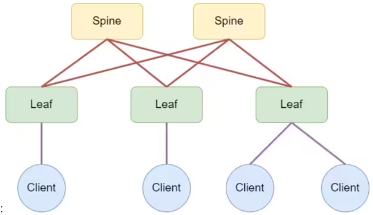
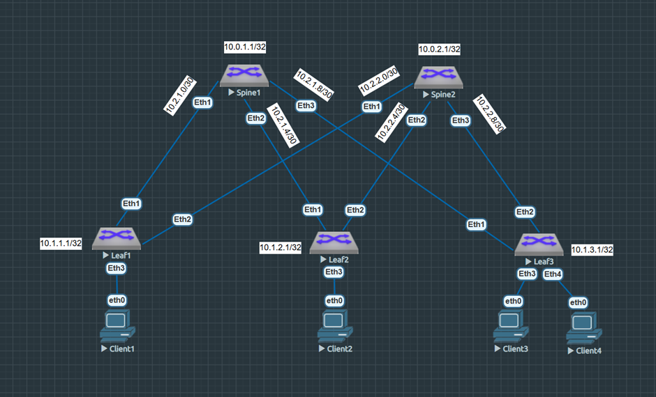

Проектирование адресного пространства
=====================================

### Цель: 

- Собрать схему CLOS
- Распределить адресное пространство

### Реализовать схему

### Введение

Сеть Клоза (иногда сеть Клоса) — вид многокаскадной (по другой терминологии — многоярусной) коммутационной сети, впервые формально описанной Чарльзом Клозом в 1953 году. 

Топология CLOS (Leaf-Spine) — это архитектура, которая используется в сетях центров обработки данных (ЦОД) и крупных корпоративных сетях. Первая версия такой топологии была придумана Чарльзом Клосом в 1952 году для телефонных коммутаторов того времени. 

В современном варианте используются два уровня: 
- Коммутаторы leaf — подключают непосредственно серверы и устройства в стойках.
- Коммутаторы spine — связывают между собой все коммутаторы leaf.

### Ход работы

Вначале придумаем алгоритм, по которому будет происходить адресация.
Выберем сеть для организации связи 10.0.0.0/14
Адреса у нас будут различаться по типам, которые будут зависит от второго октета(Tn), где
0 - Loopback коммутатора типа Spine
1 - Loopback коммутатора типа Leaf
2 - адрес интерфеса для организации p2p соединения
3 - зарезервированный дипазон(например для включения в сеть маршрутизатора)
4 - суммаризирующие маршруты

Таким образом, вид адреса Loopback интерфейса коммутатора типа Spine сделаем таким:
IP = 10.0.Sn.N/32, где:
Sn – номер коммутатора типа Spine,
N – номер адреса по порядку,

Таким образом, вид адреса Loopback интерфейса коммутатора типа Leaf сделаем таким:
IP = 10.1.Ln.N/32, где:
Ln – номер коммутатора типа Leaf,
N – номер адреса по порядку,

При организации адресации p2p линков, мы будем отталкиваться от нумерации коммутаторов типа Spine, к которому подключены коммутаторы типа Leaf.

Таким образом, вид адреса p2p интерфейса коммутатора сделаем таким:
IP = 10.2.Sn.A/30, где:
Sn – номер коммутатора Spine,
A – число обозначающее тип устройства(меньшее - Spine, большее - Leaf),

### Итоговая схема подключения

### Итоговая таблица адресов

|Device|Interface|IP Address|Subnet Mask
|---|---|---|---|
Spine1|lo1|10.0.1.1|255.255.255.255
Spine1|eth1|10.2.1.1|255.255.255.252
Spine1|eth2|10.2.1.5|255.255.255.252
Spine1|eth3|10.2.1.9|255.255.255.252
Spine2|lo1|10.0.2.1|255.255.255.255
Spine2|eth1|10.2.2.1|255.255.255.252
Spine2|eth2|10.2.2.5|255.255.255.252
Spine2|eth3|10.2.2.9|255.255.255.252
Leaf1|lo1|10.1.1.1|255.255.255.255
Leaf1|eth1|10.2.1.2|255.255.255.252
Leaf1|eth2|10.2.2.2|255.255.255.252
Leaf2|lo1|10.1.2.1|255.255.255.255
Leaf2|eth1|10.2.1.6|255.255.255.252
Leaf2|eth2|10.2.2.6|255.255.255.252
Leaf3|lo1|10.1.3.1|255.255.255.255
Leaf3|eth1|10.2.1.10|255.255.255.252
Leaf3|eth2|10.2.2.10|255.255.255.252

