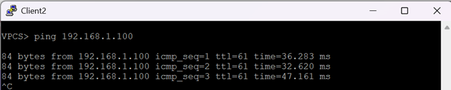
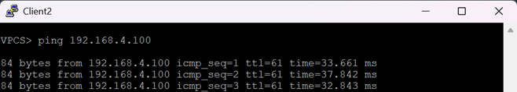

Проектирование адресного пространства
=====================================

### Цель: 

- Собрать схему CLOS
- Распределить адресное пространство

### Настроить OSPF для Underlay сети
### Описание/Пошаговая инструкция выполнения домашнего задания:

В этой самостоятельной работе мы ожидаем, что вы самостоятельно:

- Настроите OSPF в Underlay сети, для IP связанности между всеми сетевыми устройствами.
- Зафиксируете в документации - план работы, адресное пространство, схему сети, конфигурацию устройств.
- Убедитесь в наличии IP связанности между устройствами в OSFP домене.

### Топология сети


### Таблица адресов

|Device|Interface|IP Address|Subnet Mask
|---|---|---|---|
Spine1|lo1|10.0.1.1|255.255.255.255
Spine1|eth1|10.2.1.1|255.255.255.252
Spine1|eth2|10.2.1.5|255.255.255.252
Spine1|eth3|10.2.1.9|255.255.255.252
Spine2|lo1|10.0.2.1|255.255.255.255
Spine2|eth1|10.2.2.1|255.255.255.252
Spine2|eth2|10.2.2.5|255.255.255.252
Spine2|eth3|10.2.2.9|255.255.255.252
Leaf1|lo1|10.1.1.1|255.255.255.255
Leaf1|eth1|10.2.1.2|255.255.255.252
Leaf1|eth2|10.2.2.2|255.255.255.252
Leaf1|eth3|192.168.1.1|255.255.255.0
Leaf2|lo1|10.1.2.1|255.255.255.255
Leaf2|eth1|10.2.1.6|255.255.255.252
Leaf2|eth2|10.2.2.6|255.255.255.252
Leaf2|eth3|192.168.2.1|255.255.255.0
Leaf3|lo1|10.1.3.1|255.255.255.255
Leaf3|eth1|10.2.1.10|255.255.255.252
Leaf3|eth2|10.2.2.10|255.255.255.252
Leaf3|eth3|192.168.3.1|255.255.255.0
Leaf3|eth4|192.168.4.1|255.255.255.0
Client1|eth0|192.168.1.100|255.255.255.0
Client2|eth0|192.168.2.100|255.255.255.0
Client3|eth0|192.168.3.100|255.255.255.0
Client4|eth0|192.168.4.100|255.255.255.0


<details>

<summary> Общая информация </summary>

OSPF (англ. Open Shortest Path First) — протокол динамической маршрутизации, основанный на технологии отслеживания состояния канала (link-state technology) и использующий для нахождения кратчайшего пути алгоритм Дейкстры.
Протокол OSPF был разработан IETF в 1988 году. Последняя версия протокола представлена в RFC 2328 (1998 год). Протокол OSPF представляет собой протокол внутреннего шлюза (Interior Gateway Protocol — IGP). Протокол OSPF распространяет информацию о доступных маршрутах между маршрутизаторами одной автономной системы.

OSPF имеет следующие преимущества:

- Высокая скорость сходимости по сравнению с дистанционно-векторными протоколами маршрутизации;
- Поддержка сетевых масок переменной длины (VLSM);
- Оптимальное использование пропускной способности с построением дерева кратчайших путей.

</details>

### Выполнение:

Произведем начальную настройку коммутаторов, в которой выполним команды конфигурирования адресного пространства:
<details>

<summary> Начальная настройка </summary>
  
#### Spine 1
```
hostname Spine1
!
interface Ethernet1
   no switchport
   ip address 10.2.1.1/30
!
interface Ethernet2
   no switchport
   ip address 10.2.1.5/30
!
interface Ethernet3
   no switchport
   ip address 10.2.1.9/30
!
interface Loopback0
   ip address 10.0.1.1/32
!
```
#### Spine 2
```
hostname Spine2
!
interface Ethernet1
   no switchport
   ip address 10.2.2.1/30
!
interface Ethernet2
   no switchport
   ip address 10.2.2.5/30
!
interface Ethernet3
   no switchport
   ip address 10.2.2.9/30
!
interface Loopback0
   ip address 10.0.2.1/32
!
```
#### Leaf 1
```
hostname Leaf1
!
interface Ethernet1
   no switchport
   ip address 10.2.1.2/30
!
interface Ethernet2
   no switchport
   ip address 10.2.2.2/30
!
interface Ethernet3
   no switchport
   ip address 192.168.1.1/24
!
interface Loopback0
   ip address 10.1.1.1/32
!
```

#### Leaf 2
```
hostname Leaf2
!
interface Ethernet1
   no switchport
   ip address 10.2.1.6/30
!
interface Ethernet2
   no switchport
   ip address 10.2.2.6/30
!
interface Ethernet3
   no switchport
   ip address 192.168.2.1/24
!
interface Loopback0
   ip address 10.1.2.1/32
!
```

#### Leaf 3
```
hostname Leaf3
!
interface Ethernet1
   no switchport
   ip address 10.2.1.10/30
!
interface Ethernet2
   no switchport
   ip address 10.2.2.10/30
!
interface Ethernet3
   no switchport
   ip address 192.168.3.1/24
!
interface Ethernet4
   no switchport
   ip address 192.168.4.1/24
!
interface Loopback0
   ip address 10.1.3.1/32
!
```
#### Client 1
```
VPCS> ip 192.168.1.100 255.255.255.0 192.168.1.1
```
#### Client 2
```
VPCS> ip 192.168.2.100 255.255.255.0 192.168.2.1
```
#### Client 3
```
VPCS> ip 192.168.3.100 255.255.255.0 192.168.3.1
```
#### Client 4
```
VPCS> ip 192.168.4.100 255.255.255.0 192.168.4.1
```
</details>

Нам необходимо настроить сеть таким образом, чтобы Клиенты видели друг друга и могли передавать траффик. Так же предположим для примера в данной лабораторной работе, что нам необходимо защитить паролем линк от Leaf 1 до Spine 1 с помощью аутентификации, для того чтобы исключить возможность подключению сторонних сетевых устройств. 

В данной лабораторной работе будем использовать протокол динамической маршрутизации OSPF.

Протокол OSPF является мультизональным протоколом. Однако в данном случае ограничимся одной зоной(магистральной), в которую поместим все коммутаторы, так как разделения на зоны здесь является избыточным.
```
   ip ospf area 0.0.0.0
```

Протокол OSPF является протоколом типа Link-State с выбором сетевых устройств с ролями DR и BDR, в которых хранится Link State Database (LSDB) — общую базу топологии сети для всей multiaccess-сети (LAN). Без DR каждый роутер устанавливал бы full adjacency со всеми, что перегружает сеть. Поскольку наша зона делится на сегменты сети состоящих из p2p линков, мы можем обойтись без DR и BRD. Обозначим нашу сеть как point-to-point.
```
   ip ospf network point-to-point
```

Так же для избежния конфликтов везде установим mtu равным 1500, а для быстрого обнаружения проблем на линках включим протокол BFD.
```
  ip ospf neighbor bfd
```

На оконечных сетевых интерфейсах линка между Spine1 и Leaf1 настроем аутентифиукацмю по паролю.
```
   ip ospf authentication message-digest
   ip ospf message-digest-key 1 md5 7 f0x3GerlAiU=
```

Таким образом, итоговые конфигурации коммуторов будут выглядеть так:

<details>

<summary> Итоговая конфигурация </summary>
  

#### Spine 1
```
interface Ethernet1
   no switchport
   mtu 1500
   ip address 10.2.1.1/30
   ip ospf neighbor bfd
   ip ospf priority 0
   ip ospf network point-to-point
   ip ospf authentication message-digest
   ip ospf area 0.0.0.0
   ip ospf message-digest-key 1 md5 7 f0x3GerlAiU=
!
interface Ethernet2
   no switchport
   mtu 1500
   ip address 10.2.1.5/30
   ip ospf neighbor bfd
   ip ospf network point-to-point
   ip ospf area 0.0.0.0
!
interface Ethernet3
   no switchport
   mtu 1500
   ip address 10.2.1.9/30
   ip ospf neighbor bfd
   ip ospf network point-to-point
   ip ospf area 0.0.0.0
!
interface Loopback0
   ip address 10.0.1.1/32
   ip ospf area 0.0.0.0
!
ip routing
!
router ospf 1
   router-id 10.0.1.1
   auto-cost reference-bandwidth 40000
   passive-interface default
   no passive-interface Ethernet1
   no passive-interface Ethernet2
   no passive-interface Ethernet3
   log-adjacency-changes
   max-lsa 12000
!
```

#### Spine 2
```
interface Ethernet1
   no switchport
   mtu 1500
   ip address 10.2.2.1/30
   ip ospf neighbor bfd
   ip ospf priority 0
   ip ospf network point-to-point
   ip ospf authentication message-digest
   ip ospf area 0.0.0.0
   ip ospf message-digest-key 1 md5 7 f0x3GerlAiU=
!
interface Ethernet2
   no switchport
   mtu 1500
   ip address 10.2.2.5/30
   ip ospf neighbor bfd
   ip ospf network point-to-point
   ip ospf area 0.0.0.0
!
interface Ethernet3
   no switchport
   mtu 1500
   ip address 10.2.2.9/30
   ip ospf neighbor bfd
   ip ospf network point-to-point
   ip ospf area 0.0.0.0
!
interface Loopback0
   ip address 10.0.2.1/32
   ip ospf area 0.0.0.0
!
ip routing
!
router ospf 1
   router-id 10.0.2.1
   auto-cost reference-bandwidth 40000
   passive-interface default
   no passive-interface Ethernet1
   no passive-interface Ethernet2
   no passive-interface Ethernet3
   log-adjacency-changes
   max-lsa 12000
!
```

#### Leaf 1
```
interface Ethernet1
   no switchport
   mtu 1500
   ip address 10.2.1.2/30
   ip ospf neighbor bfd
   ip ospf network point-to-point
   ip ospf authentication message-digest
   ip ospf area 0.0.0.0
   ip ospf message-digest-key 1 md5 7 f0x3GerlAiU=
!
interface Ethernet2
   no switchport
   mtu 1500
   ip address 10.2.1.2/30
   ip ospf neighbor bfd
   ip ospf network point-to-point
   ip ospf area 0.0.0.0
!
interface Ethernet3
   no switchport
   mtu 1500
   ip address 192.168.1.1/24
   ip ospf neighbor bfd
   ip ospf network point-to-point
   ip ospf area 0.0.0.0
!
interface Loopback0
   ip address 10.1.1.1/32
   ip ospf area 0.0.0.0
!
ip routing
!
router ospf 1
   router-id 10.1.1.1
   auto-cost reference-bandwidth 40000
   passive-interface default
   no passive-interface Ethernet1
   no passive-interface Ethernet2
   log-adjacency-changes
   max-lsa 12000
!
```
#### Leaf 2
```
interface Ethernet1
   no switchport
   mtu 1500
   ip address 10.2.1.6/30
   ip ospf neighbor bfd
   ip ospf network point-to-point
   ip ospf authentication message-digest
   ip ospf area 0.0.0.0
   ip ospf message-digest-key 1 md5 7 f0x3GerlAiU=
!
interface Ethernet2
   no switchport
   mtu 1500
   ip address 10.2.2.6/30
   ip ospf neighbor bfd
   ip ospf network point-to-point
   ip ospf area 0.0.0.0
!
interface Ethernet3
   no switchport
   mtu 1500
   ip address 192.168.2.1/24
   ip ospf neighbor bfd
   ip ospf network point-to-point
   ip ospf area 0.0.0.0
!
interface Loopback0
   ip address 10.1.2.1/32
   ip ospf area 0.0.0.0
!
ip routing
!
router ospf 1
   router-id 10.1.2.1
   auto-cost reference-bandwidth 40000
   passive-interface default
   no passive-interface Ethernet1
   no passive-interface Ethernet2
   log-adjacency-changes
   max-lsa 12000
!
```
#### Leaf 3
```
interface Ethernet1
   no switchport
   mtu 1500
   ip address 10.2.1.10/30
   ip ospf neighbor bfd
   ip ospf network point-to-point
   ip ospf authentication message-digest
   ip ospf area 0.0.0.0
   ip ospf message-digest-key 1 md5 7 f0x3GerlAiU=
!
interface Ethernet2
   no switchport
   mtu 1500
   ip address 10.2.2.10/30
   ip ospf neighbor bfd
   ip ospf network point-to-point
   ip ospf area 0.0.0.0
!
interface Ethernet3
   no switchport
   mtu 1500
   ip address 192.168.3.1/24
   ip ospf neighbor bfd
   ip ospf network point-to-point
   ip ospf area 0.0.0.0
!
interface Ethernet4
   no switchport
   mtu 1500
   ip address 192.168.4.1/24
   ip ospf neighbor bfd
   ip ospf network point-to-point
   ip ospf area 0.0.0.0
!
interface Loopback0
   ip address 10.1.3.1/32
   ip ospf area 0.0.0.0
!
ip routing
!
router ospf 1
   router-id 10.1.3.1
   auto-cost reference-bandwidth 40000
   passive-interface default
   no passive-interface Ethernet1
   no passive-interface Ethernet2
   log-adjacency-changes
   max-lsa 12000
!
```


</details>

После настройки на сетевых устройствах протокола маршрутизации проверим результаты.
 Пробуем ,например, с Client2 "достучаться" до Client1, Client3 и Client4:

 #### Client 2
 
 
 #### Client 3
 
 
 #### Client 4
 
 

 Как видим, Client1 видит других клиентов.

 Далее посмотрим OSPF соседей на спайнах:
 
 #### Spine 1
 
 Spine1#sh ip ospf neighbor
 ```
 Neighbor ID     Instance VRF      Pri State                  Dead Time   Address         Interface
 10.1.1.1        1        default  0   FULL                   00:00:35    10.2.1.2        Ethernet1
 10.1.2.1        1        default  0   FULL                   00:00:31    10.2.1.6        Ethernet2
 10.1.3.1        1        default  0   FULL                   00:00:34    10.2.1.10       Ethernet3
 ```
 
 #### Spine 2
 ```
 Spine2#sh ip ospf neighbor
 Neighbor ID     Instance VRF      Pri State                  Dead Time   Address         Interface
 10.1.1.1        1        default  0   FULL                   00:00:33    10.2.2.2        Ethernet1
 10.1.2.1        1        default  0   FULL                   00:00:37    10.2.2.6        Ethernet2
 10.1.3.1        1        default  0   FULL                   00:00:36    10.2.2.10       Ethernet3
 ```

 Так же проверим Route Table на на спайнах:

 #### Spine 1
 ```
 Spine1#sh ip route

 VRF: default
 Codes: C - connected, S - static, K - kernel,
       O - OSPF, IA - OSPF inter area, E1 - OSPF external type 1,
       E2 - OSPF external type 2, N1 - OSPF NSSA external type 1,
       N2 - OSPF NSSA external type2, B - Other BGP Routes,
       B I - iBGP, B E - eBGP, R - RIP, I L1 - IS-IS level 1,
       I L2 - IS-IS level 2, O3 - OSPFv3, A B - BGP Aggregate,
       A O - OSPF Summary, NG - Nexthop Group Static Route,
       V - VXLAN Control Service, M - Martian,
       DH - DHCP client installed default route,
       DP - Dynamic Policy Route, L - VRF Leaked,
       G  - gRIBI, RC - Route Cache Route

 Gateway of last resort is not set

  C        10.0.1.1/32 is directly connected, Loopback0
  O        10.0.2.1/32 [110/90] via 10.2.1.2, Ethernet1
                               via 10.2.1.6, Ethernet2
                               via 10.2.1.10, Ethernet3
  O        10.1.1.1/32 [110/50] via 10.2.1.2, Ethernet1
  O        10.1.2.1/32 [110/50] via 10.2.1.6, Ethernet2
  O        10.1.3.1/32 [110/50] via 10.2.1.10, Ethernet3
  C        10.2.1.0/30 is directly connected, Ethernet1
  C        10.2.1.4/30 is directly connected, Ethernet2
  C        10.2.1.8/30 is directly connected, Ethernet3
  O        10.2.2.0/30 [110/80] via 10.2.1.2, Ethernet1
  O        10.2.2.4/30 [110/80] via 10.2.1.6, Ethernet2
  O        10.2.2.8/30 [110/80] via 10.2.1.10, Ethernet3
  O        192.168.1.0/24 [110/80] via 10.2.1.2, Ethernet1
  O        192.168.2.0/24 [110/80] via 10.2.1.6, Ethernet2
  O        192.168.3.0/24 [110/80] via 10.2.1.10, Ethernet3
  O        192.168.4.0/24 [110/80] via 10.2.1.10, Ethernet3
 ```
 
 #### Spine 2
 ```
 Spine2#sh ip route

 VRF: default
 Codes: C - connected, S - static, K - kernel,
       O - OSPF, IA - OSPF inter area, E1 - OSPF external type 1,
       E2 - OSPF external type 2, N1 - OSPF NSSA external type 1,
       N2 - OSPF NSSA external type2, B - Other BGP Routes,
       B I - iBGP, B E - eBGP, R - RIP, I L1 - IS-IS level 1,
       I L2 - IS-IS level 2, O3 - OSPFv3, A B - BGP Aggregate,
       A O - OSPF Summary, NG - Nexthop Group Static Route,
       V - VXLAN Control Service, M - Martian,
       DH - DHCP client installed default route,
       DP - Dynamic Policy Route, L - VRF Leaked,
       G  - gRIBI, RC - Route Cache Route

 Gateway of last resort is not set

  O        10.0.1.1/32 [110/90] via 10.2.2.2, Ethernet1
                               via 10.2.2.6, Ethernet2
                               via 10.2.2.10, Ethernet3
  C        10.0.2.1/32 is directly connected, Loopback0
  O        10.1.1.1/32 [110/50] via 10.2.2.2, Ethernet1
  O        10.1.2.1/32 [110/50] via 10.2.2.6, Ethernet2
  O        10.1.3.1/32 [110/50] via 10.2.2.10, Ethernet3
  O        10.2.1.0/30 [110/80] via 10.2.2.2, Ethernet1
  O        10.2.1.4/30 [110/80] via 10.2.2.6, Ethernet2
  O        10.2.1.8/30 [110/80] via 10.2.2.10, Ethernet3
  C        10.2.2.0/30 is directly connected, Ethernet1
  C        10.2.2.4/30 is directly connected, Ethernet2
  C        10.2.2.8/30 is directly connected, Ethernet3
  O        192.168.1.0/24 [110/80] via 10.2.2.2, Ethernet1
  O        192.168.2.0/24 [110/80] via 10.2.2.6, Ethernet2
  O        192.168.3.0/24 [110/80] via 10.2.2.10, Ethernet3
  O        192.168.4.0/24 [110/80] via 10.2.2.10, Ethernet3
 ```
 Как видим, в таблицах маршрутизации присутствуют маршруты, полученные из протокола OSPF.
