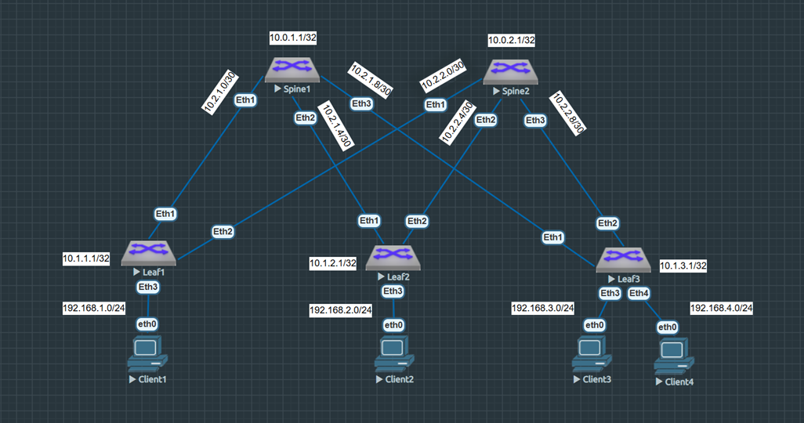

Проектирование адресного пространства
=====================================

### Цель: 

- Собрать схему CLOS
- Распределить адресное пространство

### Настроить IS-IS для Underlay сети
### Описание/Пошаговая инструкция выполнения домашнего задания:

В этой самостоятельной работе мы ожидаем, что вы самостоятельно:

- Настроите IS-IS в Underlay сети, для IP связанности между всеми сетевыми устройствами.
- Зафиксируете в документации - план работы, адресное пространство, схему сети, конфигурацию устройств.
- Убедитесь в наличии IP связанности между устройствами в IS-IS домене.

### Топология сети



### Таблица адресов

|Device|Interface|IP Address|Subnet Mask
|---|---|---|---|
Spine1|lo1|10.0.1.1|255.255.255.255
Spine1|eth1|10.2.1.1|255.255.255.252
Spine1|eth2|10.2.1.5|255.255.255.252
Spine1|eth3|10.2.1.9|255.255.255.252
Spine2|lo1|10.0.2.1|255.255.255.255
Spine2|eth1|10.2.2.1|255.255.255.252
Spine2|eth2|10.2.2.5|255.255.255.252
Spine2|eth3|10.2.2.9|255.255.255.252
Leaf1|lo1|10.1.1.1|255.255.255.255
Leaf1|eth1|10.2.1.2|255.255.255.252
Leaf1|eth2|10.2.2.2|255.255.255.252
Leaf1|eth3|192.168.1.1|255.255.255.0
Leaf2|lo1|10.1.2.1|255.255.255.255
Leaf2|eth1|10.2.1.6|255.255.255.252
Leaf2|eth2|10.2.2.6|255.255.255.252
Leaf2|eth3|192.168.2.1|255.255.255.0
Leaf3|lo1|10.1.3.1|255.255.255.255
Leaf3|eth1|10.2.1.10|255.255.255.252
Leaf3|eth2|10.2.2.10|255.255.255.252
Leaf3|eth3|192.168.3.1|255.255.255.0
Leaf3|eth4|192.168.4.1|255.255.255.0
Client1|eth0|192.168.1.100|255.255.255.0
Client2|eth0|192.168.2.100|255.255.255.0
Client3|eth0|192.168.3.100|255.255.255.0
Client4|eth0|192.168.4.100|255.255.255.0


<details>

<summary> Общая информация </summary>

Протокол маршрутизации промежуточных систем (англ. IS-IS) — протокол динамической маршрутизации, основанный на технологии отслеживания состояния канала (link-state technology) и использующий для нахождения кратчайшего пути алгоритм Дейкстры.</br>
Протокол IS-IS представляет собой протокол внутреннего шлюза (Interior Gateway Protocol — IGP), стандартизированный ISO и использующийся в основном в крупных сетях провайдеров услуг. IS-IS может также использоваться в корпоративных сетях особо крупного масштаба.</br>
IS-IS же работает поверх канального уровня модели OSI[2], поэтому он не привязан к конкретному протоколу сетевого уровня. Также IS-IS не использует протокол IP для доставки сообщений, содержащих информацию о маршрутизации.</br>

OSPF имеет следующие преимущества:

- Высокая скорость сходимости по сравнению с дистанционно-векторными протоколами маршрутизации;
- Поддержка сетевых масок переменной длины (VLSM);
- Оптимальное использование пропускной способности с построением дерева кратчайших путей.
- Быстрая сходимость и отличная масштабируемость. 

</details>

### Выполнение:

Произведем начальную настройку коммутаторов, в которой выполним команды конфигурирования адресного пространства:
<details>

<summary> Начальная настройка </summary>
  
#### Spine 1
```
hostname Spine1
!
interface Ethernet1
   no switchport
   ip address 10.2.1.1/30
!
interface Ethernet2
   no switchport
   ip address 10.2.1.5/30
!
interface Ethernet3
   no switchport
   ip address 10.2.1.9/30
!
interface Loopback0
   ip address 10.0.1.1/32
!
```
#### Spine 2
```
hostname Spine2
!
interface Ethernet1
   no switchport
   ip address 10.2.2.1/30
!
interface Ethernet2
   no switchport
   ip address 10.2.2.5/30
!
interface Ethernet3
   no switchport
   ip address 10.2.2.9/30
!
interface Loopback0
   ip address 10.0.2.1/32
!
```
#### Leaf 1
```
hostname Leaf1
!
interface Ethernet1
   no switchport
   ip address 10.2.1.2/30
!
interface Ethernet2
   no switchport
   ip address 10.2.2.2/30
!
interface Ethernet3
   no switchport
   ip address 192.168.1.1/24
!
interface Loopback0
   ip address 10.1.1.1/32
!
```

#### Leaf 2
```
hostname Leaf2
!
interface Ethernet1
   no switchport
   ip address 10.2.1.6/30
!
interface Ethernet2
   no switchport
   ip address 10.2.2.6/30
!
interface Ethernet3
   no switchport
   ip address 192.168.2.1/24
!
interface Loopback0
   ip address 10.1.2.1/32
!
```

#### Leaf 3
```
hostname Leaf3
!
interface Ethernet1
   no switchport
   ip address 10.2.1.10/30
!
interface Ethernet2
   no switchport
   ip address 10.2.2.10/30
!
interface Ethernet3
   no switchport
   ip address 192.168.3.1/24
!
interface Ethernet4
   no switchport
   ip address 192.168.4.1/24
!
interface Loopback0
   ip address 10.1.3.1/32
!
```
#### Client 1
```
VPCS> ip 192.168.1.100 255.255.255.0 192.168.1.1
```
#### Client 2
```
VPCS> ip 192.168.2.100 255.255.255.0 192.168.2.1
```
#### Client 3
```
VPCS> ip 192.168.3.100 255.255.255.0 192.168.3.1
```
#### Client 4
```
VPCS> ip 192.168.4.100 255.255.255.0 192.168.4.1
```
</details>

Нам необходимо настроить сеть таким образом, чтобы Клиенты видели друг друга и могли передавать траффик. Как и в предыдущей лабораторной работе, предположим, что нам необходимо защитить паролем линк от Leaf 1 до Spine 1 с помощью аутентификации, для того чтобы исключить возможность подключению сторонних сетевых устройств. 

В данной лабораторной работе будем использовать протокол динамической маршрутизации IS-IS.

Протокол IS-IS является мультизональным протоколом. Однако в данном случае ограничимся одной зоной, в которую поместим все коммутаторы, так как разделения на зоны здесь является избыточным. Поскольку маршрутизаторы находятся в одной зоне и имеют полную связанность, установим между ними соседство уровня 1 (L1).
```
   net 49.0001.XXXX.XXXX.XXXX.00
   is-type level-1
```

Протокол IS-IS является протоколом типа Link-State с выбором сетевого устройства с ролью DIS,  который генерирует pseudo-node LSP(виртуальные роутер) для оптимизации топологии и сокращения флуда LSP. Поскольку наша зона делится на сегменты сети состоящих из p2p линков, мы можем обойтись без DIS. Обозначим нашу сеть как point-to-point.
```
   isis network point-to-point
```

Значения параметров hello-interval и hello-multiplier оставим по умолчанию(для избежания лишнего hello флуда), а для быстрого обнаружения проблем на линках включим протокол BFD.
```
  isis bfd
```

На оконечных сетевых интерфейсах Leaf1 настроем аутентифиукацмю по паролю.
```
   isis authentication mode text
   isis authentication key 7 WsZtIQgr6yw=
```

Отфильтруем IP активных интерфейсов и все не используемые IP TLV. Так же включим защиту от спуфинга.
```
   advertise passive-only
   lsp purge origination-identification
```

Таким образом, итоговые конфигурации коммуторов будут выглядеть так:

<details>
<summary> Итоговая конфигурация </summary>
#### Spine 1
```
hostname Spine1
!
interface Ethernet1
   no switchport
   ip address 10.2.1.1/30
   isis enable spine1
   isis network point-to-point
   isis authentication mode text
   isis authentication key 7 6P+LZLHE+zV8Z+TRl+CFvQ==
!
interface Ethernet2
   no switchport
   ip address 10.2.1.5/30
   isis enable spine1
   isis network point-to-point
!
interface Ethernet3
   no switchport
   ip address 10.2.1.9/30
   isis enable spine1
   isis network point-to-point
!
interface Loopback0
   ip address 10.0.1.1/32
   isis enable spine1
   isis passive
!
ip routing
!
router isis spine1
   net 49.0001.0100.0000.1001.00
   router-id ipv4 10.0.1.1
   is-type level-1
   lsp purge origination-identification
   log-adjacency-changes
   advertise passive-only
   !
   address-family ipv4 unicast
      bfd all-interfaces
!
end
```
#### Spine 2
```
hostname Spine2
!
interface Ethernet1
   no switchport
   ip address 10.2.2.1/30
   isis enable spine2
   isis network point-to-point
   isis authentication mode text
   isis authentication key 7 HtjiSx7H7XU=
!
interface Ethernet2
   no switchport
   ip address 10.2.2.5/30
   isis enable spine2
   isis network point-to-point
!
interface Ethernet3
   no switchport
   ip address 10.2.2.9/30
   isis enable spine2
   isis network point-to-point
!
interface Loopback0
   ip address 10.0.2.1/32
   isis enable spine2
   isis passive
!
ip routing
!
router isis spine2
   net 49.0001.0100.0000.2001.00
   router-id ipv4 10.0.2.1
   is-type level-1
   lsp purge origination-identification
   log-adjacency-changes
   advertise passive-only
   !
   address-family ipv4 unicast
      maximum-paths 4
      bfd all-interfaces
!
end
```
#### Leaf 1
```
hostname Leaf1
!
interface Ethernet1
   no switchport
   ip address 10.2.1.2/30
   isis enable leaf1
   isis bfd
   isis network point-to-point
   isis authentication mode text
   isis authentication key 7 726KMReTTFcxpVumsd2Asw==
!
interface Ethernet2
   no switchport
   ip address 10.2.2.2/30
   isis enable leaf1
   isis bfd
   isis network point-to-point
   isis authentication mode text
   isis authentication key 7 WsZtIQgr6yw=
!
interface Ethernet3
   no switchport
   ip address 192.168.1.1/24
   isis enable leaf1
   isis passive
!
interface Loopback0
   ip address 10.1.1.1/32
   isis enable leaf1
   isis passive
!
ip routing
!
router isis leaf1
   net 49.0001.0100.0100.1001.00
   router-id ipv4 10.1.1.1
   is-type level-1
   lsp purge origination-identification
   log-adjacency-changes
   advertise passive-only
   !
   address-family ipv4 unicast
!
end
```
#### Leaf 2
```
hostname Leaf2
!
interface Ethernet1
   no switchport
   ip address 10.2.1.6/30
   isis enable leaf2
   isis bfd
   isis network point-to-point
!
interface Ethernet2
   no switchport
   ip address 10.2.2.6/30
   isis enable leaf2
   isis bfd
   isis network point-to-point
!
interface Ethernet3
   no switchport
   ip address 192.168.2.1/24
   isis enable leaf2
   isis passive
!
interface Loopback0
   ip address 10.1.2.1/32
   isis enable leaf2
   isis passive
!
ip routing
!
router isis leaf2
   net 49.0001.0100.0100.2001.00
   router-id ipv4 10.1.2.1
   is-type level-1
   lsp purge origination-identification
   log-adjacency-changes
   advertise passive-only
   !
   address-family ipv4 unicast
!
end
```
#### Leaf 3
```
hostname Leaf3
!
interface Ethernet1
   no switchport
   ip address 10.2.1.10/30
   isis enable leaf3
   isis bfd
   isis network point-to-point
!
interface Ethernet2
   no switchport
   ip address 10.2.2.10/30
   isis enable leaf3
   isis bfd
   isis network point-to-point
!
interface Ethernet3
   no switchport
   ip address 192.168.3.1/24
   isis enable leaf3
   isis passive
!
interface Ethernet4
   no switchport
   ip address 192.168.4.1/24
   isis enable leaf3
   isis passive
!
interface Loopback0
   ip address 10.1.3.1/32
   isis enable leaf3
   isis passive
!
ip routing
!
router isis leaf3
   net 49.0001.0100.0100.3001.00
   router-id ipv4 10.1.3.1
   is-type level-1
   lsp purge origination-identification
   log-adjacency-changes
   advertise passive-only
   !
   address-family ipv4 unicast
!
end
```
</details>

После настройки на сетевых устройствах протокола маршрутизации проверим результаты.
 Пробуем с Client1 "достучаться" до Client2, Client3 и Client4:

 Как видим Client1 видит других клиентов.

 Далее посмотрим IS-IS соседей на спайнах:
 #### Spine 1
 ```
 Spine1#sh isis neighbors
 Instance  VRF      System Id        Type Interface          SNPA              State Hold time   Circuit Id
 spine1    default  Leaf1            L1   Ethernet1          P2P               UP    20          0E
 spine1    default  Leaf2            L1   Ethernet2          P2P               UP    29          0E
 spine1    default  Leaf3            L1   Ethernet3          P2P               UP    29          0E
 ```
#### Spine 1
 ```
 Spine2#sh isis neighbors

 Instance  VRF      System Id        Type Interface          SNPA              State Hold time   Circuit Id
 spine2    default  Leaf1            L1   Ethernet1          P2P               UP    21          0F
 spine2    default  Leaf2            L1   Ethernet2          P2P               UP    23          0F
 spine2    default  Leaf3            L1   Ethernet3          P2P               UP    23          0F
 ```

 Так же проверим Route Table на каждом коммутаторе:
 <details>
 <summary> Route Table </summary>
 #### Spine 1
 ```
 VRF: default
 Codes: C - connected, S - static, K - kernel,
       O - OSPF, IA - OSPF inter area, E1 - OSPF external type 1,
       E2 - OSPF external type 2, N1 - OSPF NSSA external type 1,
       N2 - OSPF NSSA external type2, B - Other BGP Routes,
       B I - iBGP, B E - eBGP, R - RIP, I L1 - IS-IS level 1,
       I L2 - IS-IS level 2, O3 - OSPFv3, A B - BGP Aggregate,
       A O - OSPF Summary, NG - Nexthop Group Static Route,
       V - VXLAN Control Service, M - Martian,
       DH - DHCP client installed default route,
       DP - Dynamic Policy Route, L - VRF Leaked,
       G  - gRIBI, RC - Route Cache Route

 Gateway of last resort is not set

  C        10.0.1.1/32 is directly connected, Loopback0
  I L1     10.0.2.1/32 [115/30] via 10.2.1.2, Ethernet1
                               via 10.2.1.6, Ethernet2
                               via 10.2.1.10, Ethernet3
  I L1     10.1.1.1/32 [115/20] via 10.2.1.2, Ethernet1
  I L1     10.1.2.1/32 [115/20] via 10.2.1.6, Ethernet2
  I L1     10.1.3.1/32 [115/20] via 10.2.1.10, Ethernet3
  C        10.2.1.0/30 is directly connected, Ethernet1
  C        10.2.1.4/30 is directly connected, Ethernet2
  C        10.2.1.8/30 is directly connected, Ethernet3
  I L1     192.168.1.0/24 [115/20] via 10.2.1.2, Ethernet1
  I L1     192.168.2.0/24 [115/20] via 10.2.1.6, Ethernet2
  I L1     192.168.3.0/24 [115/20] via 10.2.1.10, Ethernet3
  I L1     192.168.4.0/24 [115/20] via 10.2.1.10, Ethernet3
 ```
 #### Spine 2
 ```
 VRF: default
 Codes: C - connected, S - static, K - kernel,
       O - OSPF, IA - OSPF inter area, E1 - OSPF external type 1,
       E2 - OSPF external type 2, N1 - OSPF NSSA external type 1,
       N2 - OSPF NSSA external type2, B - Other BGP Routes,
       B I - iBGP, B E - eBGP, R - RIP, I L1 - IS-IS level 1,
       I L2 - IS-IS level 2, O3 - OSPFv3, A B - BGP Aggregate,
       A O - OSPF Summary, NG - Nexthop Group Static Route,
       V - VXLAN Control Service, M - Martian,
       DH - DHCP client installed default route,
       DP - Dynamic Policy Route, L - VRF Leaked,
       G  - gRIBI, RC - Route Cache Route

 Gateway of last resort is not set

  I L1     10.0.1.1/32 [115/30] via 10.2.2.2, Ethernet1
                               via 10.2.2.6, Ethernet2
                               via 10.2.2.10, Ethernet3
  C        10.0.2.1/32 is directly connected, Loopback0
  I L1     10.1.1.1/32 [115/20] via 10.2.2.2, Ethernet1
  I L1     10.1.2.1/32 [115/20] via 10.2.2.6, Ethernet2
  I L1     10.1.3.1/32 [115/20] via 10.2.2.10, Ethernet3
  C        10.2.2.0/30 is directly connected, Ethernet1
  C        10.2.2.4/30 is directly connected, Ethernet2
  C        10.2.2.8/30 is directly connected, Ethernet3
  I L1     192.168.1.0/24 [115/20] via 10.2.2.2, Ethernet1
  I L1     192.168.2.0/24 [115/20] via 10.2.2.6, Ethernet2
  I L1     192.168.3.0/24 [115/20] via 10.2.2.10, Ethernet3
  I L1     192.168.4.0/24 [115/20] via 10.2.2.10, Ethernet3
 ```
 #### Leaf 1
 ```
 VRF: default
 Codes: C - connected, S - static, K - kernel,
       O - OSPF, IA - OSPF inter area, E1 - OSPF external type 1,
       E2 - OSPF external type 2, N1 - OSPF NSSA external type 1,
       N2 - OSPF NSSA external type2, B - Other BGP Routes,
       B I - iBGP, B E - eBGP, R - RIP, I L1 - IS-IS level 1,
       I L2 - IS-IS level 2, O3 - OSPFv3, A B - BGP Aggregate,
       A O - OSPF Summary, NG - Nexthop Group Static Route,
       V - VXLAN Control Service, M - Martian,
       DH - DHCP client installed default route,
       DP - Dynamic Policy Route, L - VRF Leaked,
       G  - gRIBI, RC - Route Cache Route

 Gateway of last resort is not set

  I L1     10.0.1.1/32 [115/20] via 10.2.1.1, Ethernet1
  I L1     10.0.2.1/32 [115/20] via 10.2.2.1, Ethernet2
  C        10.1.1.1/32 is directly connected, Loopback0
  I L1     10.1.2.1/32 [115/30] via 10.2.1.1, Ethernet1
                               via 10.2.2.1, Ethernet2
  I L1     10.1.3.1/32 [115/30] via 10.2.1.1, Ethernet1
                               via 10.2.2.1, Ethernet2
  C        10.2.1.0/30 is directly connected, Ethernet1
  C        10.2.2.0/30 is directly connected, Ethernet2
  C        192.168.1.0/24 is directly connected, Ethernet3
  I L1     192.168.2.0/24 [115/30] via 10.2.1.1, Ethernet1
                                  via 10.2.2.1, Ethernet2
  I L1     192.168.3.0/24 [115/30] via 10.2.1.1, Ethernet1
                                  via 10.2.2.1, Ethernet2
  I L1     192.168.4.0/24 [115/30] via 10.2.1.1, Ethernet1
                                  via 10.2.2.1, Ethernet2
 ```
 #### Leaf 2
 ```
 VRF: default
 Codes: C - connected, S - static, K - kernel,
       O - OSPF, IA - OSPF inter area, E1 - OSPF external type 1,
       E2 - OSPF external type 2, N1 - OSPF NSSA external type 1,
       N2 - OSPF NSSA external type2, B - Other BGP Routes,
       B I - iBGP, B E - eBGP, R - RIP, I L1 - IS-IS level 1,
       I L2 - IS-IS level 2, O3 - OSPFv3, A B - BGP Aggregate,
       A O - OSPF Summary, NG - Nexthop Group Static Route,
       V - VXLAN Control Service, M - Martian,
       DH - DHCP client installed default route,
       DP - Dynamic Policy Route, L - VRF Leaked,
       G  - gRIBI, RC - Route Cache Route

 Gateway of last resort is not set

  I L1     10.0.1.1/32 [115/20] via 10.2.1.5, Ethernet1
  I L1     10.0.2.1/32 [115/20] via 10.2.2.5, Ethernet2
  I L1     10.1.1.1/32 [115/30] via 10.2.1.5, Ethernet1
                               via 10.2.2.5, Ethernet2
  C        10.1.2.1/32 is directly connected, Loopback0
  I L1     10.1.3.1/32 [115/30] via 10.2.1.5, Ethernet1
                               via 10.2.2.5, Ethernet2
  C        10.2.1.4/30 is directly connected, Ethernet1
  C        10.2.2.4/30 is directly connected, Ethernet2
  I L1     192.168.1.0/24 [115/30] via 10.2.1.5, Ethernet1
                                  via 10.2.2.5, Ethernet2
  C        192.168.2.0/24 is directly connected, Ethernet3
  I L1     192.168.3.0/24 [115/30] via 10.2.1.5, Ethernet1
                                  via 10.2.2.5, Ethernet2
  I L1     192.168.4.0/24 [115/30] via 10.2.1.5, Ethernet1
                                  via 10.2.2.5, Ethernet2

 ```
 #### Leaf 3
 ```
 VRF: default
 Codes: C - connected, S - static, K - kernel,
       O - OSPF, IA - OSPF inter area, E1 - OSPF external type 1,
       E2 - OSPF external type 2, N1 - OSPF NSSA external type 1,
       N2 - OSPF NSSA external type2, B - Other BGP Routes,
       B I - iBGP, B E - eBGP, R - RIP, I L1 - IS-IS level 1,
       I L2 - IS-IS level 2, O3 - OSPFv3, A B - BGP Aggregate,
       A O - OSPF Summary, NG - Nexthop Group Static Route,
       V - VXLAN Control Service, M - Martian,
       DH - DHCP client installed default route,
       DP - Dynamic Policy Route, L - VRF Leaked,
       G  - gRIBI, RC - Route Cache Route

 Gateway of last resort is not set

  I L1     10.0.1.1/32 [115/20] via 10.2.1.9, Ethernet1
  I L1     10.0.2.1/32 [115/20] via 10.2.2.9, Ethernet2
  I L1     10.1.1.1/32 [115/30] via 10.2.1.9, Ethernet1
                               via 10.2.2.9, Ethernet2
  I L1     10.1.2.1/32 [115/30] via 10.2.1.9, Ethernet1
                               via 10.2.2.9, Ethernet2
  C        10.1.3.1/32 is directly connected, Loopback0
  C        10.2.1.8/30 is directly connected, Ethernet1
  C        10.2.2.8/30 is directly connected, Ethernet2
  I L1     192.168.1.0/24 [115/30] via 10.2.1.9, Ethernet1
                                  via 10.2.2.9, Ethernet2
  I L1     192.168.2.0/24 [115/30] via 10.2.1.9, Ethernet1
                                  via 10.2.2.9, Ethernet2
  C        192.168.3.0/24 is directly connected, Ethernet3
  C        192.168.4.0/24 is directly connected, Ethernet4
 ```
</details>
Как видим, в таблицах маршрутизации присутствуют маршруты, полученные из протокола IS-IS.

Так же посмотрим на базу данных протокола:
```
IS-IS Instance: leaf1 VRF: default
  IS-IS Level 1 Link State Database
    LSPID                   Seq Num  Cksum  Life Length IS Flags
    Spine1.00-00                 17  23711   777    119 L1 <>
    Spine2.00-00                 17  39753  1128    119 L1 <>
    Leaf1.00-00                  16  26746   456    115 L1 <>
    Leaf2.00-00                  16  28246   881    115 L1 <>
    Leaf3.00-00                  16  32541  1114    127 L1 <>
```
