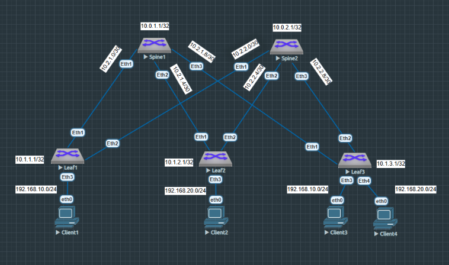

VxLAN. L2 VNI
=====================================

### Цель: 

- Настроить Overlay на основе VxLAN EVPN для L2 связанности между клиентами.

### Описание/Пошаговая инструкция выполнения домашнего задания:

В этой самостоятельной работе мы ожидаем, что вы самостоятельно:

- Настроите BGP peering между Leaf и Spine в AF l2vpn evpn
- Настроите связанность между клиентами в первой зоне и убедитесь в её наличии
- Зафиксируете в документации - план работы, адресное пространство, схему сети, конфигурацию устройств

### Топология сети



### Таблица адресов

|Device|Interface|IP Address|Subnet Mask
|---|---|---|---|
Spine1|lo1|10.0.1.1|255.255.255.255
Spine1|eth1|10.2.1.1|255.255.255.252
Spine1|eth2|10.2.1.5|255.255.255.252
Spine1|eth3|10.2.1.9|255.255.255.252
Spine2|lo1|10.0.2.1|255.255.255.255
Spine2|eth1|10.2.2.1|255.255.255.252
Spine2|eth2|10.2.2.5|255.255.255.252
Spine2|eth3|10.2.2.9|255.255.255.252
Leaf1|lo1|10.1.1.1|255.255.255.255
Leaf1|eth1|10.2.1.2|255.255.255.252
Leaf1|eth2|10.2.2.2|255.255.255.252
Leaf1|eth3|192.168.1.1|255.255.255.0
Leaf2|lo1|10.1.2.1|255.255.255.255
Leaf2|eth1|10.2.1.6|255.255.255.252
Leaf2|eth2|10.2.2.6|255.255.255.252
Leaf2|eth3|192.168.2.1|255.255.255.0
Leaf3|lo1|10.1.3.1|255.255.255.255
Leaf3|eth1|10.2.1.10|255.255.255.252
Leaf3|eth2|10.2.2.10|255.255.255.252
Leaf3|eth3|192.168.3.1|255.255.255.0
Leaf3|eth4|192.168.4.1|255.255.255.0
Client1|eth0|192.168.1.100|255.255.255.0
Client2|eth0|192.168.2.100|255.255.255.0
Client3|eth0|192.168.3.100|255.255.255.0
Client4|eth0|192.168.4.100|255.255.255.0


<details>

<summary> Общая информация </summary>

Virtual Extensible LAN (VXLAN) является технологией сетевой виртуализации, созданной для решения проблем масштабируемости в больших системах облачных вычислений. Она использует схожую с VLAN технику для MAC инкапсуляции Layer 2 Ethernet кадров в UDP-пакеты, порт 4789.</br>
VXLAN является развитием усилий по стандартизации на оверлейном протоколе инкапсуляции. Он увеличивает масштабируемость до 16 миллионов логических сетей и позволяет сетям 2 уровня одновременно сосуществовать по IP-сетям. При этом multicast или unicast (с Head-End Replication) используются для передачи широковещательного трафика (broadcast, multicast и Unicast flood).</br>
Принцип работы:
VXLAN устанавливает логический туннель между устройствами источника и назначения. Процесс инкапсуляции: 

 - VXLAN инкапсулирует оригинальные Ethernet-фреймы, отправленные виртуальной машиной, в UDP-пакеты.
 - Затем инкапсулирует UDP-пакеты с заголовком IP и заголовком Ethernet физической сети в качестве внешних заголовков, что позволяет передавать эти пакеты по сети, как обычные IP-пакеты.</br>
Упаковка и распаковка пакетов производятся конечными устройствами туннеля VXLAN (VTEP).</br>

Пакет протокола VXLAN состоит из следующих компонентов: 

 - Заголовок Ethernet — включает MAC-адрес отправителя, MAC-адрес получателя и тип протокола (например, IPv4, IPv6).
 - Заголовок IP — обеспечивает маршрутизацию пакета через IP-сеть. Поля: IP-адрес отправителя, IP-адрес получателя, другие поля (версия протокола, длина заголовка и т. д.).
 - Заголовок UDP — обеспечивает транспортировку инкапсулированных Ethernet-кадров. Поля: порт отправителя, порт получателя, длина UDP-пакета, контрольная сумма.
 - Заголовок VXLAN — состоит из полей: Flags (8 бит), Reserved1 (24 бит), VXLAN Network Identifier (VNI) (24 бит), Reserved2 (8 бит).
 - Внутренний Ethernet-кадр — содержит оригинальные MAC-адреса отправителя и получателя, а также полезную нагрузку данных.

EVPN (Ethernet Virtual Private Network) — технология, которая обеспечивает связь уровней 2 и 3 между различными сетевыми сегментами.</br>
Некоторые особенности EVPN:

 - Поддержка передачи трафика второго уровня по множественным путям. Для этого достаточно указать точку назначения туннеля в IP заголовке внешнего пакета, и у транзитных коммутаторов появляется возможность использовать все возможные пути.
 - Снижение уровня широковещательного трафика. Коммутаторы EVPN используют программный метод обучения MAC-адресов на базе обмена BGP сообщениями. После появления нового MAC-адреса на порту доступа выполняется синхронизация таблиц коммутации по всей сети.
 - Маршрутизация между сетями в Active-Active режиме. Устройства ведут себя как распределённый маршрутизатор, каждая часть которого имеет один и тот же IP и MAC-адреса.
 - Механизмы обмена не только MAC, но и IP информацией. Поэтому табличные данные и поведение распределённого маршрутизатора будут идентичны на всех его компонентах.
</details>

### Выполнение:


Произведем начальную настройку коммутаторов, в которой выполним команды конфигурирования адресного пространства, а так же настроим протокол динамической маршрутизации eBGP для обеспечения связаности лифов, которые будут анонсировать свой loopback. Первый и третий клиенты у нас находятся в сети 192.168.10.0/24, а второй и четвертый в сети 192.168.10.0/24:
<details>

<summary> Начальная настройка </summary>
  
#### Spine 1
```
hostname Spine1
!
spanning-tree mode mstp
!
interface Ethernet1
   mtu 9000
   no switchport
   ip address 10.2.1.1/30
!
interface Ethernet2
   mtu 9000
   no switchport
   ip address 10.2.1.5/30
!
interface Ethernet3
   mtu 9000
   no switchport
   ip address 10.2.1.9/30
!
interface Ethernet4
!
interface Ethernet5
!
interface Ethernet6
!
interface Ethernet7
!
interface Ethernet8
!
interface Loopback0
   ip address 10.0.1.1/32
!
interface Management1
!
ip routing
!
peer-filter LEAF_PF
   10 match as-range 65001-65003 result accept
!
router bgp 65000
   router-id 10.0.1.1
   maximum-paths 3 ecmp 3
   bgp listen range 10.2.1.0/28 peer-group LEAF_NEIGHBOR peer-filter LEAF_PF
   neighbor LEAF_NEIGHBOR peer group
   neighbor LEAF_NEIGHBOR out-delay 0
   neighbor LEAF_NEIGHBOR bfd
   neighbor LEAF_NEIGHBOR timers 3 9
   !
   address-family ipv4
      neighbor LEAF_NEIGHBOR activate
      network 10.0.1.1/32
!
```
#### Spine 2
```
hostname Spine2
!
spanning-tree mode mstp
!
interface Ethernet1
   mtu 9000
   no switchport
   ip address 10.2.2.1/30
!
interface Ethernet2
   mtu 9000
   no switchport
   ip address 10.2.2.5/30
!
interface Ethernet3
   mtu 9000
   no switchport
   ip address 10.2.2.9/30
!
interface Ethernet4
!
interface Ethernet5
!
interface Ethernet6
!
interface Ethernet7
!
interface Ethernet8
!
interface Loopback0
   ip address 10.0.2.1/32
!
interface Management1
!
ip routing
!
peer-filter LEAF_PF
   10 match as-range 65001-65003 result accept
!
router bgp 65000
   router-id 10.0.2.1
   maximum-paths 3 ecmp 3
   bgp listen range 10.2.2.0/28 peer-group LEAF_NEIGHBOR peer-filter LEAF_PF
   neighbor LEAF_NEIGHBOR peer group
   neighbor LEAF_NEIGHBOR out-delay 0
   neighbor LEAF_NEIGHBOR bfd
   neighbor LEAF_NEIGHBOR timers 3 9
   !
   address-family ipv4
      neighbor LEAF_NEIGHBOR activate
      network 10.0.2.1/32
!
end

```
#### Leaf 1
```
hostname Leaf1
!
interface Ethernet1
   mtu 9000
   no switchport
   ip address 10.2.1.2/30
!
interface Ethernet2
   mtu 9000
   no switchport
   ip address 10.2.2.2/30
!
interface Ethernet3
   mtu 9000
!
interface Loopback0
   ip address 10.1.1.1/32
!
ip routing
!
router bgp 65001
   router-id 10.1.1.1
   maximum-paths 2 ecmp 2
   neighbor SPINE_NEIGHBOR peer group
   neighbor SPINE_NEIGHBOR remote-as 65000
   neighbor SPINE_NEIGHBOR out-delay 0
   neighbor SPINE_NEIGHBOR bfd
   neighbor SPINE_NEIGHBOR timers 3 9
   neighbor 10.2.1.1 peer group SPINE_NEIGHBOR
   neighbor 10.2.2.1 peer group SPINE_NEIGHBOR
   !
   address-family ipv4
      neighbor SPINE_NEIGHBOR activate
      network 10.1.1.1/32
!
```

#### Leaf 2
```
hostname Leaf2
!
interface Ethernet1
   mtu 9000
   no switchport
   ip address 10.2.1.6/30
!
interface Ethernet2
   mtu 9000
   no switchport
   ip address 10.2.2.6/30
!
interface Ethernet3
   mtu 9000
!
interface Loopback0
   ip address 10.1.2.1/32
!
ip routing
!
router bgp 65002
   router-id 10.1.2.1
   maximum-paths 2 ecmp 2
   neighbor SPINE_NEIGHBOR peer group
   neighbor SPINE_NEIGHBOR remote-as 65000
   neighbor SPINE_NEIGHBOR out-delay 0
   neighbor SPINE_NEIGHBOR bfd
   neighbor SPINE_NEIGHBOR timers 3 9
   neighbor 10.2.1.5 peer group SPINE_NEIGHBOR
   neighbor 10.2.2.5 peer group SPINE_NEIGHBOR
   !
   address-family ipv4
      neighbor SPINE_NEIGHBOR activate
      network 10.1.2.1/32
!
```

#### Leaf 3
```
hostname Leaf3
!
interface Ethernet1
   mtu 9000
   no switchport
   ip address 10.2.1.10/30
!
interface Ethernet2
   mtu 9000
   no switchport
   ip address 10.2.2.10/30
!
interface Ethernet3
   mtu 9000
!
interface Ethernet4
   mtu 9000
!
interface Loopback0
   ip address 10.1.3.1/32
!
ip routing
!
router bgp 65003
   router-id 10.1.3.1
   maximum-paths 2 ecmp 2
   neighbor SPINE_NEIGHBOR peer group
   neighbor SPINE_NEIGHBOR remote-as 65000
   neighbor SPINE_NEIGHBOR out-delay 0
   neighbor SPINE_NEIGHBOR bfd
   neighbor SPINE_NEIGHBOR timers 3 9
   neighbor 10.2.1.9 peer group SPINE_NEIGHBOR
   neighbor 10.2.2.9 peer group SPINE_NEIGHBOR
   !
   address-family ipv4
      neighbor SPINE_NEIGHBOR activate
      network 10.1.3.1/32
!
```
#### Client 1
```
VPCS> ip 192.168.10.101 255.255.255.0 192.168.1.1
```
#### Client 2
```
VPCS> ip 192.168.20.102 255.255.255.0 192.168.2.1
```
#### Client 3
```
VPCS> ip 192.168.10.103 255.255.255.0 192.168.3.1
```
#### Client 4
```
VPCS> ip 192.168.20.104 255.255.255.0 192.168.4.1
```
</details>

Нам необходимо настроить сеть таким образом, чтобы клиенты находились в разных L2 сегментах, и клиенты в одном VLAN видели друг друга и могли передавать траффик. 

Определим Client 1 и Client 3 во влан VLAN 10, в Client 2 и Client 4 во VLAN 20. Для этого определи назначенные порты коммутатора в соответствующие VLAN:

```
switchport access vlan 10
switchport access vlan 20
```

Теперь настроим интерфейс VXLAN. Здесь мы указываем, что VTEP Source IP-адрес нужно брать с интерфейса Loopback0. Этот IP-адрес будет использоваться как внешний Source IP в VXLAN-пакетах. Далее мы задаем соответствие VLAN 10 к VNI 10010, а VLAN 20 к VNI 10020. Трафик из VLAN при выходе из VXLAN-интерфейса должен инкапсулироваться в VNI и наоборот, при получении пакета из overlay-сети, мы декапсулируем его из VXLAN и направляем в порты VLAN'ов. Так же блокируем data-plane обучение VTEP от любых IP-адресов, кроме тех что разрешены EVPN control-plane (BGP).
```
interface Vxlan1
   vxlan source-interface Loopback0
   vxlan udp-port 4789
   vxlan vlan ХХ vni 100ХХ
   vxlan learn-restrict any
!
```

Отдельных нейборов для BGP-сессий для EVPN, в отличии от IPv4-BGP-сессий для underlay, где нейборы были определены по адресам интерфейсов линковочных сетей, мы прописывать будем исходя из loopback интерфейсов коммутаnоров(будем использовать peer группы). Здесь же разрешим отсылку расширенных комьюнити:
```
   neighbor ХХХ_NEIGHBOR_VXLAN update-source Loopback0
   neighbor ХХХ_NEIGHBOR_VXLAN ebgp-multihop 3
   neighbor ХХХ_NEIGHBOR_VXLAN send-community extended
```

Теперьв глобальных настройках включим режим multi-agent, а так же включим AF EVPN в настройках процесса BGP:
```
service routing protocols model multi-agent
   address-family evpn
      neighbor ХХХ_NEIGHBOR_VXLAN activate
   !
```

Далее настроим описание VLANы в протоколе eBGP.
Значение RD (Route Distinguisher) нужно установить для того, чтобы сделать уникальными маршруты к одному и тому же префиксу, но которые принадлежат разным VRF(чтобы BGP не пытался выбрать какой-то один из них как best path). Route Distinguisher зададим как auto (LoopbackIP:VID).

Route target'ы нужно настроить для того, чтобы принимающий VTEP знал, в какой VRF установить ту или иную маршрутную информацию. Политика экспорта из VRF на анонсирующем VTEP должна совпадать с политикой импорта в VRF назначения на принимающем VTEP. Зададим route-target как 100:100 (как на импорт, так и на экспорт). Так же настроим распространение в EVPN информацию о всех изученных локально хостах в данных VLANах.:
```
  vlan ХХ
      rd auto
      route-target both ХХ:100ХХ
      redistribute learned
   !
```

Таким образом, итоговые конфигурации коммутаторов будут выглядеть так:

<details>
<summary> Итоговая конфигурация </summary>
  
#### Spine 1
```
service routing protocols model multi-agent
!
hostname Spine1
!
spanning-tree mode mstp
!
interface Ethernet1
   mtu 9000
   no switchport
   ip address 10.2.1.1/30
!
interface Ethernet2
   mtu 9000
   no switchport
   ip address 10.2.1.5/30
!
interface Ethernet3
   mtu 9000
   no switchport
   ip address 10.2.1.9/30
!
interface Loopback0
   ip address 10.0.1.1/32
!
ip routing
!
peer-filter LEAF_PF
   10 match as-range 65001-65003 result accept
!
router bgp 65000
   router-id 10.0.1.1
   maximum-paths 3 ecmp 3
   bgp listen range 10.2.1.0/28 peer-group LEAF_NEIGHBOR peer-filter LEAF_PF
   bgp listen range 10.1.0.0/22 peer-group LEAF_NEIGHBOR_VXLAN peer-filter LEAF_PF
   neighbor LEAF_NEIGHBOR peer group
   neighbor LEAF_NEIGHBOR out-delay 0
   neighbor LEAF_NEIGHBOR bfd
   neighbor LEAF_NEIGHBOR timers 3 9
   neighbor LEAF_NEIGHBOR_VXLAN peer group
   neighbor LEAF_NEIGHBOR_VXLAN next-hop-unchanged
   neighbor LEAF_NEIGHBOR_VXLAN update-source Loopback0
   neighbor LEAF_NEIGHBOR_VXLAN ebgp-multihop 3
   neighbor LEAF_NEIGHBOR_VXLAN send-community extended
   !
   address-family evpn
      neighbor LEAF_NEIGHBOR_VXLAN activate
   !
   address-family ipv4
      neighbor LEAF_NEIGHBOR activate
      network 10.0.1.1/32
!
end

```
  
#### Spine 2
```
service routing protocols model multi-agent
!
hostname Spine2
!
spanning-tree mode mstp
!
interface Ethernet1
   mtu 9000
   no switchport
   ip address 10.2.2.1/30
!
interface Ethernet2
   mtu 9000
   no switchport
   ip address 10.2.2.5/30
!
interface Ethernet3
   mtu 9000
   no switchport
   ip address 10.2.2.9/30
!
interface Loopback0
   ip address 10.0.2.1/32
!
ip routing
!
peer-filter LEAF_PF
   10 match as-range 65001-65003 result accept
!
router bgp 65000
   router-id 10.0.2.1
   maximum-paths 3 ecmp 3
   bgp listen range 10.2.2.0/28 peer-group LEAF_NEIGHBOR peer-filter LEAF_PF
   bgp listen range 10.1.0.0/22 peer-group LEAF_NEIGHBOR_VXLAN peer-filter LEAF_PF
   neighbor LEAF_NEIGHBOR peer group
   neighbor LEAF_NEIGHBOR out-delay 0
   neighbor LEAF_NEIGHBOR bfd
   neighbor LEAF_NEIGHBOR timers 3 9
   neighbor LEAF_NEIGHBOR_VXLAN peer group
   neighbor LEAF_NEIGHBOR_VXLAN next-hop-unchanged
   neighbor LEAF_NEIGHBOR_VXLAN update-source Loopback0
   neighbor LEAF_NEIGHBOR_VXLAN ebgp-multihop 3
   neighbor LEAF_NEIGHBOR_VXLAN send-community extended
   !
   address-family evpn
      neighbor LEAF_NEIGHBOR_VXLAN activate
   !
   address-family ipv4
      neighbor LEAF_NEIGHBOR activate
      network 10.0.2.1/32
!
end


```
  
#### Leaf 1
```

service routing protocols model multi-agent
!
hostname Leaf1
!
spanning-tree mode mstp
!
vlan 10
   name L2_NET1
!
interface Ethernet1
   mtu 9000
   no switchport
   ip address 10.2.1.2/30
!
interface Ethernet2
   mtu 9000
   no switchport
   ip address 10.2.2.2/30
!
interface Ethernet3
   mtu 9000
   switchport access vlan 10
   !
!
interface Loopback0
   ip address 10.1.1.1/32
!
interface Vlan10
!
interface Vxlan1
   vxlan source-interface Loopback0
   vxlan udp-port 4789
   vxlan vlan 10 vni 10010
   vxlan learn-restrict any
!
ip routing
!
router bgp 65001
   router-id 10.1.1.1
   maximum-paths 2 ecmp 2
   neighbor SPINE_NEIGHBOR peer group
   neighbor SPINE_NEIGHBOR remote-as 65000
   neighbor SPINE_NEIGHBOR out-delay 0
   neighbor SPINE_NEIGHBOR bfd
   neighbor SPINE_NEIGHBOR timers 3 9
   neighbor SPINE_NEIGHBOR_VXLAN peer group
   neighbor SPINE_NEIGHBOR_VXLAN remote-as 65000
   neighbor SPINE_NEIGHBOR_VXLAN update-source Loopback0
   neighbor SPINE_NEIGHBOR_VXLAN ebgp-multihop 3
   neighbor SPINE_NEIGHBOR_VXLAN send-community extended
   neighbor 10.0.1.1 peer group SPINE_NEIGHBOR_VXLAN
   neighbor 10.0.2.1 peer group SPINE_NEIGHBOR_VXLAN
   neighbor 10.2.1.1 peer group SPINE_NEIGHBOR
   neighbor 10.2.2.1 peer group SPINE_NEIGHBOR
   !
   vlan 10
      rd auto
      route-target both 10:10010
      redistribute learned
   !
   address-family evpn
      neighbor SPINE_NEIGHBOR_VXLAN activate
   !
   address-family ipv4
      neighbor SPINE_NEIGHBOR activate
      network 10.1.1.1/32
!
end


```

#### Leaf 2
```

service routing protocols model multi-agent
!
hostname Leaf2
!
spanning-tree mode mstp
!
vlan 20
   name L2_NET2
!
interface Ethernet1
   mtu 9000
   no switchport
   ip address 10.2.1.6/30
!
interface Ethernet2
   mtu 9000
   no switchport
   ip address 10.2.2.6/30
!
interface Ethernet3
   mtu 9000
   switchport access vlan 20
!
interface Loopback0
   ip address 10.1.2.1/32
!
interface Vxlan1
   vxlan source-interface Loopback0
   vxlan udp-port 4789
   vxlan vlan 20 vni 10020
   vxlan learn-restrict any
!
ip routing
!
router bgp 65002
   router-id 10.1.2.1
   maximum-paths 2 ecmp 2
   neighbor SPINE_NEIGHBOR peer group
   neighbor SPINE_NEIGHBOR remote-as 65000
   neighbor SPINE_NEIGHBOR out-delay 0
   neighbor SPINE_NEIGHBOR bfd
   neighbor SPINE_NEIGHBOR timers 3 9
   neighbor SPINE_NEIGHBOR_VXLAN peer group
   neighbor SPINE_NEIGHBOR_VXLAN remote-as 65000
   neighbor SPINE_NEIGHBOR_VXLAN update-source Loopback0
   neighbor SPINE_NEIGHBOR_VXLAN ebgp-multihop 3
   neighbor SPINE_NEIGHBOR_VXLAN send-community extended
   neighbor 10.0.1.1 peer group SPINE_NEIGHBOR_VXLAN
   neighbor 10.0.2.1 peer group SPINE_NEIGHBOR_VXLAN
   neighbor 10.2.1.5 peer group SPINE_NEIGHBOR
   neighbor 10.2.2.5 peer group SPINE_NEIGHBOR
   !
   vlan 20
      rd auto
      route-target both 20:10020
      redistribute learned
   !
   address-family evpn
      neighbor SPINE_NEIGHBOR_VXLAN activate
   !
   address-family ipv4
      neighbor SPINE_NEIGHBOR activate
      network 10.1.2.1/32
!
end

```

#### Leaf 3
```
service routing protocols model multi-agent
!
hostname Leaf3
!
spanning-tree mode mstp
!
vlan 10
   name L2_NET1
!
vlan 20
   name L2_NET2
!
interface Ethernet1
   mtu 9000
   no switchport
   ip address 10.2.1.10/30
!
interface Ethernet2
   mtu 9000
   no switchport
   ip address 10.2.2.10/30
!
interface Ethernet3
   mtu 9000
   switchport access vlan 10
!
interface Ethernet4
   mtu 9000
   switchport access vlan 20
!
interface Loopback0
   ip address 10.1.3.1/32
!
interface Vxlan1
   vxlan source-interface Loopback0
   vxlan udp-port 4789
   vxlan vlan 10 vni 10010
   vxlan vlan 20 vni 10020
   vxlan learn-restrict any
!
ip routing
!
router bgp 65003
   router-id 10.1.3.1
   maximum-paths 2 ecmp 2
   neighbor SPINE_NEIGHBOR peer group
   neighbor SPINE_NEIGHBOR remote-as 65000
   neighbor SPINE_NEIGHBOR out-delay 0
   neighbor SPINE_NEIGHBOR bfd
   neighbor SPINE_NEIGHBOR timers 3 9
   neighbor SPINE_NEIGHBOR_VXLAN peer group
   neighbor SPINE_NEIGHBOR_VXLAN remote-as 65000
   neighbor SPINE_NEIGHBOR_VXLAN update-source Loopback0
   neighbor SPINE_NEIGHBOR_VXLAN ebgp-multihop 3
   neighbor SPINE_NEIGHBOR_VXLAN send-community extended
   neighbor 10.0.1.1 peer group SPINE_NEIGHBOR_VXLAN
   neighbor 10.0.2.1 peer group SPINE_NEIGHBOR_VXLAN
   neighbor 10.2.1.9 peer group SPINE_NEIGHBOR
   neighbor 10.2.2.9 peer group SPINE_NEIGHBOR
   !
   vlan 10
      rd auto
      route-target both 10:10010
      redistribute learned
   !
   vlan 20
      rd auto
      route-target both 20:10020
      redistribute learned
   !
   address-family evpn
      neighbor SPINE_NEIGHBOR_VXLAN activate
   !
   address-family ipv4
      neighbor SPINE_NEIGHBOR activate
      network 10.1.3.1/32
!
end

```
</details>

После настройки на сетевых устройствах протокола маршрутизации проверим результаты.

 Пробуем с Client1 "достучаться" до Client3(VLA10),а с Client2 до Client4(VLAN20):
 #### Clients
 
 
 Как видим Client1 видит других клиентов.


 Далее посмотрим eBGP соседей на спайнах:
<details>
<summary> Neighbors </summary>
  
 #### Spine 1
 ```
BGP neighbor is 10.2.1.2, remote AS 65001, external link
  BGP version 4, remote router ID 10.1.1.1, VRF default
  Inherits configuration from and member of peer-group LEAF_NEIGHBOR
  Negotiated BGP version 4
  Member of update group 2
  Last read never, last write never
  Hold time is 3, keepalive interval is 1 seconds
  Configured hold time is 3, keepalive interval is 1 seconds
  Connect timer is inactive
  Idle-restart timer is inactive
  BGP state is Established, up for 02:45:38
  Number of transitions to established: 1
  Last state was OpenConfirm
  Last event was RecvKeepAlive
  Neighbor Capabilities:
    Multiprotocol IPv4 Unicast: advertised and received and negotiated
    Four Octet ASN: advertised and received and negotiated
    Route Refresh: advertised and received and negotiated
    Send End-of-RIB messages: advertised and received and negotiated
    Additional-paths recv capability:
      IPv4 Unicast: advertised
    Additional-paths send capability:
      IPv4 Unicast: received
  Restart timer is inactive
  End of rib timer is inactive
  Message Statistics:
    InQ depth is 0
    OutQ depth is 0
                         Sent      Rcvd
    Opens:                  1         1
    Notifications:          0         0
    Updates:                8         3
    Keepalives:          9939      9940
    Route-Refresh:          0         0
    Total messages:      9948      9944
  Prefix Statistics:
                         Sent      Rcvd     Best Paths     Best ECMP Paths
    IPv4 Unicast:           6         2              2                   0
    IPv6 Unicast:           0         0              0                   0
    IPv4 SR-TE:             0         0              0                   0
    IPv6 SR-TE:             0         0              0                   0
  Inbound updates dropped by reason:
    AS path loop detection: 1
    Enforced First AS: 0
    Originator ID matches local router ID: 0
    Nexthop matches local IP address: 0
    Unexpected IPv6 nexthop for IPv4 routes: 0
    Nexthop invalid for single hop eBGP: 0
  Inbound updates with attribute errors:
    Resulting in removal of all paths in update (treat-as-withdraw): 0
    Resulting in AFI/SAFI disable: 0
    Resulting in attribute ignore: 0
  Inbound paths dropped by reason:
    IPv4 labeled-unicast NLRIs dropped due to excessive labels: 0
    IPv6 labeled-unicast NLRIs dropped due to excessive labels: 0
  Outbound paths dropped by reason:
    IPv4 local address not available: 0
    IPv6 local address not available: 0
    Inbound policy
    Outbound policy
Local AS is 65000, local router ID 10.0.1.1
TTL is 1
Local TCP address is 10.2.1.1, local port is 179
Remote TCP address is 10.2.1.2, remote port is 35251
Auto-Local-Addr is disabled
Bfd is enabled and state is Up
Private AS numbers removed from outbound updates to this neighbor if only privat
TCP Socket Information:
  TCP state is ESTABLISHED
  Recv-Q: 0/32768
  Send-Q: 0/32768
  Outgoing Maximum Segment Size (MSS): 8948
  Total Number of TCP retransmissions: 2
  Options:
    Timestamps enabled: yes
    Selective Acknowledgments enabled: yes
    Window Scale enabled: yes
    Explicit Congestion Notification (ECN) enabled: no
  Socket Statistics:
    Window Scale (wscale): 7,7
    Retransmission Timeout (rto): 216.0ms
    Round-trip Time (rtt/rtvar): 14.5ms/1.8ms
    Delayed Ack Timeout (ato): 40.0ms
    Congestion Window (cwnd): 10
    TCP Throughput: 49.46 Mbps
    Recv Round-trip Time (rcv_rtt): 199795.2ms
    Advertised Recv Window (rcv_space): 65219


BGP neighbor is 10.2.1.6, remote AS 65002, external link
  BGP version 4, remote router ID 10.1.2.1, VRF default
  Inherits configuration from and member of peer-group LEAF_NEIGHBOR
  Negotiated BGP version 4
  Member of update group 2
  Last read never, last write 00:00:01
  Hold time is 3, keepalive interval is 1 seconds
  Configured hold time is 3, keepalive interval is 1 seconds
  Connect timer is inactive
  Idle-restart timer is inactive
  BGP state is Established, up for 02:44:15
  Number of transitions to established: 1
  Last state was OpenConfirm
  Last event was RecvKeepAlive
  Neighbor Capabilities:
    Multiprotocol IPv4 Unicast: advertised and received and negotiated
    Four Octet ASN: advertised and received and negotiated
    Route Refresh: advertised and received and negotiated
    Send End-of-RIB messages: advertised and received and negotiated
    Additional-paths recv capability:
      IPv4 Unicast: advertised
    Additional-paths send capability:
      IPv4 Unicast: received
  Restart timer is inactive
  End of rib timer is inactive
  Message Statistics:
    InQ depth is 0
    OutQ depth is 0
                         Sent      Rcvd
    Opens:                  1         1
    Notifications:          0         0
    Updates:                6         3
    Keepalives:          9856      9857
    Route-Refresh:          0         0
    Total messages:      9863      9861
  Prefix Statistics:
                         Sent      Rcvd     Best Paths     Best ECMP Paths
    IPv4 Unicast:           6         2              2                   0
    IPv6 Unicast:           0         0              0                   0
    IPv4 SR-TE:             0         0              0                   0
    IPv6 SR-TE:             0         0              0                   0
  Inbound updates dropped by reason:
    AS path loop detection: 1
    Enforced First AS: 0
    Originator ID matches local router ID: 0
    Nexthop matches local IP address: 0
    Unexpected IPv6 nexthop for IPv4 routes: 0
    Nexthop invalid for single hop eBGP: 0
  Inbound updates with attribute errors:
    Resulting in removal of all paths in update (treat-as-withdraw): 0
    Resulting in AFI/SAFI disable: 0
    Resulting in attribute ignore: 0
  Inbound paths dropped by reason:
    IPv4 labeled-unicast NLRIs dropped due to excessive labels: 0
    IPv6 labeled-unicast NLRIs dropped due to excessive labels: 0
  Outbound paths dropped by reason:
    IPv4 local address not available: 0
    IPv6 local address not available: 0
    Inbound policy
    Outbound policy
Local AS is 65000, local router ID 10.0.1.1
TTL is 1
Local TCP address is 10.2.1.5, local port is 179
Remote TCP address is 10.2.1.6, remote port is 44159
Auto-Local-Addr is disabled
Bfd is enabled and state is Up
Private AS numbers removed from outbound updates to this neighbor if only privat
TCP Socket Information:
  TCP state is ESTABLISHED
  Recv-Q: 0/32768
  Send-Q: 0/32768
  Outgoing Maximum Segment Size (MSS): 1448
  Total Number of TCP retransmissions: 0
  Options:
    Timestamps enabled: yes
    Selective Acknowledgments enabled: yes
    Window Scale enabled: yes
    Explicit Congestion Notification (ECN) enabled: no
  Socket Statistics:
    Window Scale (wscale): 7,7
    Retransmission Timeout (rto): 220.0ms
    Round-trip Time (rtt/rtvar): 18.3ms/9.8ms
    Delayed Ack Timeout (ato): 40.0ms
    Congestion Window (cwnd): 10
    TCP Throughput: 6.33 Mbps
    Recv Round-trip Time (rcv_rtt): 199797.7ms
    Advertised Recv Window (rcv_space): 65219


BGP neighbor is 10.2.1.10, remote AS 65003, external link
  BGP version 4, remote router ID 10.1.3.1, VRF default
  Inherits configuration from and member of peer-group LEAF_NEIGHBOR
  Negotiated BGP version 4
  Member of update group 2
  Last read 00:00:01, last write never
  Hold time is 3, keepalive interval is 1 seconds
  Configured hold time is 3, keepalive interval is 1 seconds
  Connect timer is inactive
  Idle-restart timer is inactive
  BGP state is Established, up for 02:40:11
  Number of transitions to established: 1
  Last state was OpenConfirm
  Last event was RecvKeepAlive
  Neighbor Capabilities:
    Multiprotocol IPv4 Unicast: advertised and received and negotiated
    Four Octet ASN: advertised and received and negotiated
    Route Refresh: advertised and received and negotiated
    Send End-of-RIB messages: advertised and received and negotiated
    Additional-paths recv capability:
      IPv4 Unicast: advertised
    Additional-paths send capability:
      IPv4 Unicast: received
  Restart timer is inactive
  End of rib timer is inactive
  Message Statistics:
    InQ depth is 0
    OutQ depth is 0
                         Sent      Rcvd
    Opens:                  1         1
    Notifications:          0         0
    Updates:                4         3
    Keepalives:          9613      9612
    Route-Refresh:          0         0
    Total messages:      9618      9616
  Prefix Statistics:
                         Sent      Rcvd     Best Paths     Best ECMP Paths
    IPv4 Unicast:           5         3              3                   0
    IPv6 Unicast:           0         0              0                   0
    IPv4 SR-TE:             0         0              0                   0
    IPv6 SR-TE:             0         0              0                   0
  Inbound updates dropped by reason:
    AS path loop detection: 1
    Enforced First AS: 0
    Originator ID matches local router ID: 0
    Nexthop matches local IP address: 0
    Unexpected IPv6 nexthop for IPv4 routes: 0
    Nexthop invalid for single hop eBGP: 0
  Inbound updates with attribute errors:
    Resulting in removal of all paths in update (treat-as-withdraw): 0
    Resulting in AFI/SAFI disable: 0
    Resulting in attribute ignore: 0
  Inbound paths dropped by reason:
    IPv4 labeled-unicast NLRIs dropped due to excessive labels: 0
    IPv6 labeled-unicast NLRIs dropped due to excessive labels: 0
  Outbound paths dropped by reason:
    IPv4 local address not available: 0
    IPv6 local address not available: 0
    Inbound policy
    Outbound policy
Local AS is 65000, local router ID 10.0.1.1
TTL is 1
Local TCP address is 10.2.1.9, local port is 179
Remote TCP address is 10.2.1.10, remote port is 43183
Auto-Local-Addr is disabled
Bfd is enabled and state is Up
Private AS numbers removed from outbound updates to this neighbor if only privat
TCP Socket Information:
  TCP state is ESTABLISHED
  Recv-Q: 0/32768
  Send-Q: 0/32768
  Outgoing Maximum Segment Size (MSS): 1448
  Total Number of TCP retransmissions: 1
  Options:
    Timestamps enabled: yes
    Selective Acknowledgments enabled: yes
    Window Scale enabled: yes
    Explicit Congestion Notification (ECN) enabled: no
  Socket Statistics:
    Window Scale (wscale): 7,7
    Retransmission Timeout (rto): 228.0ms
    Round-trip Time (rtt/rtvar): 26.1ms/19.6ms
    Delayed Ack Timeout (ato): 40.0ms
    Congestion Window (cwnd): 10
    TCP Throughput: 4.43 Mbps
    Recv Round-trip Time (rcv_rtt): 199814.9ms
    Advertised Recv Window (rcv_space): 65223


 ```
 #### Spine 2
 ```
BGP neighbor is 10.2.2.2, remote AS 65001, external link
  BGP version 4, remote router ID 10.1.1.1, VRF default
  Inherits configuration from and member of peer-group LEAF_NEIGHBOR
  Negotiated BGP version 4
  Member of update group 2
  Last read never, last write never
  Hold time is 3, keepalive interval is 1 seconds
  Configured hold time is 3, keepalive interval is 1 seconds
  Connect timer is inactive
  Idle-restart timer is inactive
  BGP state is Established, up for 02:46:00
  Number of transitions to established: 1
  Last state was OpenConfirm
  Last event was RecvKeepAlive
  Neighbor Capabilities:
    Multiprotocol IPv4 Unicast: advertised and received and negotiated
    Four Octet ASN: advertised and received and negotiated
    Route Refresh: advertised and received and negotiated
    Send End-of-RIB messages: advertised and received and negotiated
    Additional-paths recv capability:
      IPv4 Unicast: advertised
    Additional-paths send capability:
      IPv4 Unicast: received
  Restart timer is inactive
  End of rib timer is inactive
  Message Statistics:
    InQ depth is 0
    OutQ depth is 0
                         Sent      Rcvd
    Opens:                  1         1
    Notifications:          0         0
    Updates:                8         9
    Keepalives:          9963      9962
    Route-Refresh:          0         0
    Total messages:      9972      9972
  Prefix Statistics:
                         Sent      Rcvd     Best Paths     Best ECMP Paths
    IPv4 Unicast:           6         2              2                   0
    IPv6 Unicast:           0         0              0                   0
    IPv4 SR-TE:             0         0              0                   0
    IPv6 SR-TE:             0         0              0                   0
  Inbound updates dropped by reason:
    AS path loop detection: 5
    Enforced First AS: 0
    Originator ID matches local router ID: 0
    Nexthop matches local IP address: 0
    Unexpected IPv6 nexthop for IPv4 routes: 0
    Nexthop invalid for single hop eBGP: 0
  Inbound updates with attribute errors:
    Resulting in removal of all paths in update (treat-as-withdraw): 0
    Resulting in AFI/SAFI disable: 0
    Resulting in attribute ignore: 0
  Inbound paths dropped by reason:
    IPv4 labeled-unicast NLRIs dropped due to excessive labels: 0
    IPv6 labeled-unicast NLRIs dropped due to excessive labels: 0
  Outbound paths dropped by reason:
    IPv4 local address not available: 0
    IPv6 local address not available: 0
    Inbound policy
    Outbound policy
Local AS is 65000, local router ID 10.0.2.1
TTL is 1
Local TCP address is 10.2.2.1, local port is 179
Remote TCP address is 10.2.2.2, remote port is 38575
Auto-Local-Addr is disabled
Bfd is enabled and state is Up
Private AS numbers removed from outbound updates to this neighbor if only privat
TCP Socket Information:
  TCP state is ESTABLISHED
  Recv-Q: 0/32768
  Send-Q: 19/32768
  Outgoing Maximum Segment Size (MSS): 8948
  Total Number of TCP retransmissions: 1
  Options:
    Timestamps enabled: yes
    Selective Acknowledgments enabled: yes
    Window Scale enabled: yes
    Explicit Congestion Notification (ECN) enabled: no
  Socket Statistics:
    Window Scale (wscale): 7,7
    Retransmission Timeout (rto): 220.0ms
    Round-trip Time (rtt/rtvar): 16.5ms/7.8ms
    Delayed Ack Timeout (ato): 40.0ms
    Congestion Window (cwnd): 10
    TCP Throughput: 43.42 Mbps
    Recv Round-trip Time (rcv_rtt): 183798.8ms
    Advertised Recv Window (rcv_space): 65231


BGP neighbor is 10.2.2.6, remote AS 65002, external link
  BGP version 4, remote router ID 10.1.2.1, VRF default
  Inherits configuration from and member of peer-group LEAF_NEIGHBOR
  Negotiated BGP version 4
  Member of update group 2
  Last read never, last write never
  Hold time is 3, keepalive interval is 1 seconds
  Configured hold time is 3, keepalive interval is 1 seconds
  Connect timer is inactive
  Idle-restart timer is inactive
  BGP state is Established, up for 02:45:06
  Number of transitions to established: 1
  Last state was OpenConfirm
  Last event was RecvKeepAlive
  Neighbor Capabilities:
    Multiprotocol IPv4 Unicast: advertised and received and negotiated
    Four Octet ASN: advertised and received and negotiated
    Route Refresh: advertised and received and negotiated
    Send End-of-RIB messages: advertised and received and negotiated
    Additional-paths recv capability:
      IPv4 Unicast: advertised
    Additional-paths send capability:
      IPv4 Unicast: received
  Restart timer is inactive
  End of rib timer is inactive
  Message Statistics:
    InQ depth is 0
    OutQ depth is 0
                         Sent      Rcvd
    Opens:                  1         1
    Notifications:          0         0
    Updates:                6         7
    Keepalives:          9908      9908
    Route-Refresh:          0         0
    Total messages:      9915      9916
  Prefix Statistics:
                         Sent      Rcvd     Best Paths     Best ECMP Paths
    IPv4 Unicast:           6         2              2                   0
    IPv6 Unicast:           0         0              0                   0
    IPv4 SR-TE:             0         0              0                   0
    IPv6 SR-TE:             0         0              0                   0
  Inbound updates dropped by reason:
    AS path loop detection: 4
    Enforced First AS: 0
    Originator ID matches local router ID: 0
    Nexthop matches local IP address: 0
    Unexpected IPv6 nexthop for IPv4 routes: 0
    Nexthop invalid for single hop eBGP: 0
  Inbound updates with attribute errors:
    Resulting in removal of all paths in update (treat-as-withdraw): 0
    Resulting in AFI/SAFI disable: 0
    Resulting in attribute ignore: 0
  Inbound paths dropped by reason:
    IPv4 labeled-unicast NLRIs dropped due to excessive labels: 0
    IPv6 labeled-unicast NLRIs dropped due to excessive labels: 0
  Outbound paths dropped by reason:
    IPv4 local address not available: 0
    IPv6 local address not available: 0
    Inbound policy
    Outbound policy
Local AS is 65000, local router ID 10.0.2.1
TTL is 1
Local TCP address is 10.2.2.5, local port is 179
Remote TCP address is 10.2.2.6, remote port is 36047
Auto-Local-Addr is disabled
Bfd is enabled and state is Up
Private AS numbers removed from outbound updates to this neighbor if only privat
TCP Socket Information:
  TCP state is ESTABLISHED
  Recv-Q: 0/32768
  Send-Q: 0/32768
  Outgoing Maximum Segment Size (MSS): 1448
  Total Number of TCP retransmissions: 0
  Options:
    Timestamps enabled: yes
    Selective Acknowledgments enabled: yes
    Window Scale enabled: yes
    Explicit Congestion Notification (ECN) enabled: no
  Socket Statistics:
    Window Scale (wscale): 7,7
    Retransmission Timeout (rto): 224.0ms
    Round-trip Time (rtt/rtvar): 21.3ms/3.0ms
    Delayed Ack Timeout (ato): 40.0ms
    Congestion Window (cwnd): 10
    TCP Throughput: 5.43 Mbps
    Recv Round-trip Time (rcv_rtt): 187798.5ms
    Advertised Recv Window (rcv_space): 65215


BGP neighbor is 10.2.2.10, remote AS 65003, external link
  BGP version 4, remote router ID 10.1.3.1, VRF default
  Inherits configuration from and member of peer-group LEAF_NEIGHBOR
  Negotiated BGP version 4
  Member of update group 2
  Last read never, last write never
  Hold time is 3, keepalive interval is 1 seconds
  Configured hold time is 3, keepalive interval is 1 seconds
  Connect timer is inactive
  Idle-restart timer is inactive
  BGP state is Established, up for 02:41:01
  Number of transitions to established: 1
  Last state was OpenConfirm
  Last event was RecvKeepAlive
  Neighbor Capabilities:
    Multiprotocol IPv4 Unicast: advertised and received and negotiated
    Four Octet ASN: advertised and received and negotiated
    Route Refresh: advertised and received and negotiated
    Send End-of-RIB messages: advertised and received and negotiated
    Additional-paths recv capability:
      IPv4 Unicast: advertised
    Additional-paths send capability:
      IPv4 Unicast: received
  Restart timer is inactive
  End of rib timer is inactive
  Message Statistics:
    InQ depth is 0
    OutQ depth is 0
                         Sent      Rcvd
    Opens:                  1         1
    Notifications:          0         0
    Updates:                4         5
    Keepalives:          9663      9663
    Route-Refresh:          0         0
    Total messages:      9668      9669
  Prefix Statistics:
                         Sent      Rcvd     Best Paths     Best ECMP Paths
    IPv4 Unicast:           5         3              3                   0
    IPv6 Unicast:           0         0              0                   0
    IPv4 SR-TE:             0         0              0                   0
    IPv6 SR-TE:             0         0              0                   0
  Inbound updates dropped by reason:
    AS path loop detection: 3
    Enforced First AS: 0
    Originator ID matches local router ID: 0
    Nexthop matches local IP address: 0
    Unexpected IPv6 nexthop for IPv4 routes: 0
    Nexthop invalid for single hop eBGP: 0
  Inbound updates with attribute errors:
    Resulting in removal of all paths in update (treat-as-withdraw): 0
    Resulting in AFI/SAFI disable: 0
    Resulting in attribute ignore: 0
  Inbound paths dropped by reason:
    IPv4 labeled-unicast NLRIs dropped due to excessive labels: 0
    IPv6 labeled-unicast NLRIs dropped due to excessive labels: 0
  Outbound paths dropped by reason:
    IPv4 local address not available: 0
    IPv6 local address not available: 0
    Inbound policy
    Outbound policy
Local AS is 65000, local router ID 10.0.2.1
TTL is 1
Local TCP address is 10.2.2.9, local port is 179
Remote TCP address is 10.2.2.10, remote port is 40581
Auto-Local-Addr is disabled
Bfd is enabled and state is Up
Private AS numbers removed from outbound updates to this neighbor if only privat
TCP Socket Information:
  TCP state is ESTABLISHED
  Recv-Q: 0/32768
  Send-Q: 0/32768
  Outgoing Maximum Segment Size (MSS): 1448
  Total Number of TCP retransmissions: 1
  Options:
    Timestamps enabled: yes
    Selective Acknowledgments enabled: yes
    Window Scale enabled: yes
    Explicit Congestion Notification (ECN) enabled: no
  Socket Statistics:
    Window Scale (wscale): 7,7
    Retransmission Timeout (rto): 220.0ms
    Round-trip Time (rtt/rtvar): 17.8ms/0.8ms
    Delayed Ack Timeout (ato): 40.0ms
    Congestion Window (cwnd): 10
    TCP Throughput: 6.52 Mbps
    Recv Round-trip Time (rcv_rtt): 193806.4ms
    Advertised Recv Window (rcv_space): 65229

 ```
 </details>

 
 Так же проверим Route Table на каждом коммутаторе:
 
 <details>
 <summary> Route Table </summary>
   
 #### Spine 1
 ```

VRF: default
Codes: C - connected, S - static, K - kernel,
       O - OSPF, IA - OSPF inter area, E1 - OSPF external type 1,
       E2 - OSPF external type 2, N1 - OSPF NSSA external type 1,
       N2 - OSPF NSSA external type2, B - Other BGP Routes,
       B I - iBGP, B E - eBGP, R - RIP, I L1 - IS-IS level 1,
       I L2 - IS-IS level 2, O3 - OSPFv3, A B - BGP Aggregate,
       A O - OSPF Summary, NG - Nexthop Group Static Route,
       V - VXLAN Control Service, M - Martian,
       DH - DHCP client installed default route,
       DP - Dynamic Policy Route, L - VRF Leaked,
       G  - gRIBI, RC - Route Cache Route

Gateway of last resort is not set

 C        10.0.1.1/32 is directly connected, Loopback0
 B E      10.1.1.1/32 [200/0] via 10.2.1.2, Ethernet1
 B E      10.1.2.1/32 [200/0] via 10.2.1.6, Ethernet2
 B E      10.1.3.1/32 [200/0] via 10.2.1.10, Ethernet3
 C        10.2.1.0/30 is directly connected, Ethernet1
 C        10.2.1.4/30 is directly connected, Ethernet2
 C        10.2.1.8/30 is directly connected, Ethernet3
 B E      192.168.1.0/24 [200/0] via 10.2.1.2, Ethernet1
 B E      192.168.2.0/24 [200/0] via 10.2.1.6, Ethernet2
 B E      192.168.3.0/24 [200/0] via 10.2.1.10, Ethernet3
 B E      192.168.4.0/24 [200/0] via 10.2.1.10, Ethernet3


 ```

 #### Spine 2
 ```

VRF: default
Codes: C - connected, S - static, K - kernel,
       O - OSPF, IA - OSPF inter area, E1 - OSPF external type 1,
       E2 - OSPF external type 2, N1 - OSPF NSSA external type 1,
       N2 - OSPF NSSA external type2, B - Other BGP Routes,
       B I - iBGP, B E - eBGP, R - RIP, I L1 - IS-IS level 1,
       I L2 - IS-IS level 2, O3 - OSPFv3, A B - BGP Aggregate,
       A O - OSPF Summary, NG - Nexthop Group Static Route,
       V - VXLAN Control Service, M - Martian,
       DH - DHCP client installed default route,
       DP - Dynamic Policy Route, L - VRF Leaked,
       G  - gRIBI, RC - Route Cache Route

Gateway of last resort is not set

 C        10.0.2.1/32 is directly connected, Loopback0
 B E      10.1.1.1/32 [200/0] via 10.2.2.2, Ethernet1
 B E      10.1.2.1/32 [200/0] via 10.2.2.6, Ethernet2
 B E      10.1.3.1/32 [200/0] via 10.2.2.10, Ethernet3
 C        10.2.2.0/30 is directly connected, Ethernet1
 C        10.2.2.4/30 is directly connected, Ethernet2
 C        10.2.2.8/30 is directly connected, Ethernet3
 B E      192.168.1.0/24 [200/0] via 10.2.2.2, Ethernet1
 B E      192.168.2.0/24 [200/0] via 10.2.2.6, Ethernet2
 B E      192.168.3.0/24 [200/0] via 10.2.2.10, Ethernet3
 B E      192.168.4.0/24 [200/0] via 10.2.2.10, Ethernet3


 ```

 #### Leaf 1
 ```

VRF: default
Codes: C - connected, S - static, K - kernel,
       O - OSPF, IA - OSPF inter area, E1 - OSPF external type 1,
       E2 - OSPF external type 2, N1 - OSPF NSSA external type 1,
       N2 - OSPF NSSA external type2, B - Other BGP Routes,
       B I - iBGP, B E - eBGP, R - RIP, I L1 - IS-IS level 1,
       I L2 - IS-IS level 2, O3 - OSPFv3, A B - BGP Aggregate,
       A O - OSPF Summary, NG - Nexthop Group Static Route,
       V - VXLAN Control Service, M - Martian,
       DH - DHCP client installed default route,
       DP - Dynamic Policy Route, L - VRF Leaked,
       G  - gRIBI, RC - Route Cache Route

Gateway of last resort is not set

 B E      10.0.1.1/32 [200/0] via 10.2.1.1, Ethernet1
 B E      10.0.2.1/32 [200/0] via 10.2.2.1, Ethernet2
 C        10.1.1.1/32 is directly connected, Loopback0
 B E      10.1.2.1/32 [200/0] via 10.2.1.1, Ethernet1
                              via 10.2.2.1, Ethernet2
 B E      10.1.3.1/32 [200/0] via 10.2.1.1, Ethernet1
                              via 10.2.2.1, Ethernet2
 C        10.2.1.0/30 is directly connected, Ethernet1
 C        10.2.2.0/30 is directly connected, Ethernet2
 C        192.168.1.0/24 is directly connected, Ethernet3
 B E      192.168.2.0/24 [200/0] via 10.2.1.1, Ethernet1
                                 via 10.2.2.1, Ethernet2
 B E      192.168.3.0/24 [200/0] via 10.2.1.1, Ethernet1
                                 via 10.2.2.1, Ethernet2
 B E      192.168.4.0/24 [200/0] via 10.2.1.1, Ethernet1
                                 via 10.2.2.1, Ethernet2


 ```

 #### Leaf 2
 ```

VRF: default
Codes: C - connected, S - static, K - kernel,
       O - OSPF, IA - OSPF inter area, E1 - OSPF external type 1,
       E2 - OSPF external type 2, N1 - OSPF NSSA external type 1,
       N2 - OSPF NSSA external type2, B - Other BGP Routes,
       B I - iBGP, B E - eBGP, R - RIP, I L1 - IS-IS level 1,
       I L2 - IS-IS level 2, O3 - OSPFv3, A B - BGP Aggregate,
       A O - OSPF Summary, NG - Nexthop Group Static Route,
       V - VXLAN Control Service, M - Martian,
       DH - DHCP client installed default route,
       DP - Dynamic Policy Route, L - VRF Leaked,
       G  - gRIBI, RC - Route Cache Route

Gateway of last resort is not set

 B E      10.0.1.1/32 [200/0] via 10.2.1.5, Ethernet1
 B E      10.0.2.1/32 [200/0] via 10.2.2.5, Ethernet2
 B E      10.1.1.1/32 [200/0] via 10.2.1.5, Ethernet1
                              via 10.2.2.5, Ethernet2
 C        10.1.2.1/32 is directly connected, Loopback0
 B E      10.1.3.1/32 [200/0] via 10.2.1.5, Ethernet1
                              via 10.2.2.5, Ethernet2
 C        10.2.1.4/30 is directly connected, Ethernet1
 C        10.2.2.4/30 is directly connected, Ethernet2
 B E      192.168.1.0/24 [200/0] via 10.2.1.5, Ethernet1
                                 via 10.2.2.5, Ethernet2
 C        192.168.2.0/24 is directly connected, Ethernet3
 B E      192.168.3.0/24 [200/0] via 10.2.1.5, Ethernet1
                                 via 10.2.2.5, Ethernet2
 B E      192.168.4.0/24 [200/0] via 10.2.1.5, Ethernet1
                                 via 10.2.2.5, Ethernet2


 ```

 #### Leaf 3
 ```

VRF: default
Codes: C - connected, S - static, K - kernel,
       O - OSPF, IA - OSPF inter area, E1 - OSPF external type 1,
       E2 - OSPF external type 2, N1 - OSPF NSSA external type 1,
       N2 - OSPF NSSA external type2, B - Other BGP Routes,
       B I - iBGP, B E - eBGP, R - RIP, I L1 - IS-IS level 1,
       I L2 - IS-IS level 2, O3 - OSPFv3, A B - BGP Aggregate,
       A O - OSPF Summary, NG - Nexthop Group Static Route,
       V - VXLAN Control Service, M - Martian,
       DH - DHCP client installed default route,
       DP - Dynamic Policy Route, L - VRF Leaked,
       G  - gRIBI, RC - Route Cache Route

Gateway of last resort is not set

 B E      10.0.1.1/32 [200/0] via 10.2.1.9, Ethernet1
 B E      10.0.2.1/32 [200/0] via 10.2.2.9, Ethernet2
 B E      10.1.1.1/32 [200/0] via 10.2.1.9, Ethernet1
                              via 10.2.2.9, Ethernet2
 B E      10.1.2.1/32 [200/0] via 10.2.1.9, Ethernet1
                              via 10.2.2.9, Ethernet2
 C        10.1.3.1/32 is directly connected, Loopback0
 C        10.2.1.8/30 is directly connected, Ethernet1
 C        10.2.2.8/30 is directly connected, Ethernet2
 B E      192.168.1.0/24 [200/0] via 10.2.1.9, Ethernet1
                                 via 10.2.2.9, Ethernet2
 B E      192.168.2.0/24 [200/0] via 10.2.1.9, Ethernet1
                                 via 10.2.2.9, Ethernet2
 C        192.168.3.0/24 is directly connected, Ethernet3
 C        192.168.4.0/24 is directly connected, Ethernet4


 ```
</details>
Как видим, в таблицах маршрутизации присутствуют маршруты, полученные из протокола eBGP.</br>
</br>
Проверим состояние подключения лифов к спайнам:

 #### Leaf 1
 ```
BGP summary information for VRF default
Router identifier 10.1.1.1, local AS number 65001
Neighbor Status Codes: m - Under maintenance
  Neighbor         V  AS           MsgRcvd   MsgSent  InQ OutQ  Up/Down State   PfxRcd PfxAcc
  10.2.1.1         4  65000          14664     14667    0    0 00:26:11 Estab   6      6
  10.2.2.1         4  65000          14663     14671    0    0 00:26:09 Estab   6      6
 ```
 #### Leaf 2
 ```
BGP summary information for VRF default
Router identifier 10.1.2.1, local AS number 65002
Neighbor Status Codes: m - Under maintenance
  Neighbor         V  AS           MsgRcvd   MsgSent  InQ OutQ  Up/Down State   PfxRcd PfxAcc
  10.2.1.5         4  65000          13691     13691    0    0 00:36:48 Estab   6      6
  10.2.2.5         4  65000          13691     13695    0    0 00:36:04 Estab   6      6
 ```
 #### Leaf 3
 ```
BGP summary information for VRF default
Router identifier 10.1.3.1, local AS number 65003
Neighbor Status Codes: m - Under maintenance
  Neighbor         V  AS           MsgRcvd   MsgSent  InQ OutQ  Up/Down State   PfxRcd PfxAcc
  10.2.1.9         4  65000          13470     13471    0    0 00:37:13 Estab   5      5
  10.2.2.9         4  65000          13469     13472    0    0 00:36:29 Estab   5      5

 ```

Как видим, все соединения в состоянии established.


Так же посмотрим на работу протокола ECMP:

 #### Leaf 1
 ```
BGP routing table information for VRF default
Router identifier 10.1.1.1, local AS number 65001
Route status codes: * - valid, > - active, # - not installed, E - ECMP head, e - ECMP
                    S - Stale, c - Contributing to ECMP, b - backup, L - labeled-unicast
Origin codes: i - IGP, e - EGP, ? - incomplete
AS Path Attributes: Or-ID - Originator ID, C-LST - Cluster List, LL Nexthop - Link Local Nexthop

         Network                Next Hop            Metric  LocPref Weight  Path
 * >     10.0.1.1/32            10.2.1.1              0       100     0       65000 i
 * >     10.0.2.1/32            10.2.2.1              0       100     0       65000 i
 * >     10.1.1.1/32            -                     0       0       -       i
 * >Ec   10.1.2.1/32            10.2.1.1              0       100     0       65000 65002 i
 *  ec   10.1.2.1/32            10.2.2.1              0       100     0       65000 65002 i
 * >Ec   10.1.3.1/32            10.2.1.1              0       100     0       65000 65003 i
 *  ec   10.1.3.1/32            10.2.2.1              0       100     0       65000 65003 i
 * >     192.168.1.0/24         -                     1       0       -       i
 * >Ec   192.168.2.0/24         10.2.1.1              0       100     0       65000 65002 i
 *  ec   192.168.2.0/24         10.2.2.1              0       100     0       65000 65002 i
 * >Ec   192.168.3.0/24         10.2.1.1              0       100     0       65000 65003 i
 *  ec   192.168.3.0/24         10.2.2.1              0       100     0       65000 65003 i
 * >Ec   192.168.4.0/24         10.2.1.1              0       100     0       65000 65003 i
 *  ec   192.168.4.0/24         10.2.2.1              0       100     0       65000 65003 i

 ```

 #### Leaf 2
 ```
BGP routing table information for VRF default
Router identifier 10.1.2.1, local AS number 65002
Route status codes: * - valid, > - active, # - not installed, E - ECMP head, e - ECMP
                    S - Stale, c - Contributing to ECMP, b - backup, L - labeled-unicast
Origin codes: i - IGP, e - EGP, ? - incomplete
AS Path Attributes: Or-ID - Originator ID, C-LST - Cluster List, LL Nexthop - Link Local Nexthop

         Network                Next Hop            Metric  LocPref Weight  Path
 * >     10.0.1.1/32            10.2.1.5              0       100     0       65000 i
 * >     10.0.2.1/32            10.2.2.5              0       100     0       65000 i
 * >Ec   10.1.1.1/32            10.2.1.5              0       100     0       65000 65001 i
 *  ec   10.1.1.1/32            10.2.2.5              0       100     0       65000 65001 i
 * >     10.1.2.1/32            -                     0       0       -       i
 * >Ec   10.1.3.1/32            10.2.1.5              0       100     0       65000 65003 i
 *  ec   10.1.3.1/32            10.2.2.5              0       100     0       65000 65003 i
 * >Ec   192.168.1.0/24         10.2.1.5              0       100     0       65000 65001 i
 *  ec   192.168.1.0/24         10.2.2.5              0       100     0       65000 65001 i
 * >     192.168.2.0/24         -                     1       0       -       i
 * >Ec   192.168.3.0/24         10.2.1.5              0       100     0       65000 65003 i
 *  ec   192.168.3.0/24         10.2.2.5              0       100     0       65000 65003 i
 * >Ec   192.168.4.0/24         10.2.1.5              0       100     0       65000 65003 i
 *  ec   192.168.4.0/24         10.2.2.5              0       100     0       65000 65003 i

 ```

 #### Leaf 3
 ```
BGP routing table information for VRF default
Router identifier 10.1.3.1, local AS number 65003
Route status codes: * - valid, > - active, # - not installed, E - ECMP head, e P
                    S - Stale, c - Contributing to ECMP, b - backup, L - labelet
Origin codes: i - IGP, e - EGP, ? - incomplete
AS Path Attributes: Or-ID - Originator ID, C-LST - Cluster List, LL Nexthop - Lp

         Network                Next Hop            Metric  LocPref Weight  Path
 * >     10.0.1.1/32            10.2.1.9              0       100     0       6i
 * >     10.0.2.1/32            10.2.2.9              0       100     0       6i
 * >Ec   10.1.1.1/32            10.2.1.9              0       100     0       6i
 *  ec   10.1.1.1/32            10.2.2.9              0       100     0       6i
 * >Ec   10.1.2.1/32            10.2.1.9              0       100     0       6i
 *  ec   10.1.2.1/32            10.2.2.9              0       100     0       6i
 * >     10.1.3.1/32            -                     0       0       -       i
 * >Ec   192.168.1.0/24         10.2.1.9              0       100     0       6i
 *  ec   192.168.1.0/24         10.2.2.9              0       100     0       6i
 * >Ec   192.168.2.0/24         10.2.1.9              0       100     0       6i
 *  ec   192.168.2.0/24         10.2.2.9              0       100     0       6i
 * >     192.168.3.0/24         -                     1       0       -       i
 * >     192.168.4.0/24         -                     1       0       -       i

 ```

Как видим, ECMP отрабатывает корректно.
