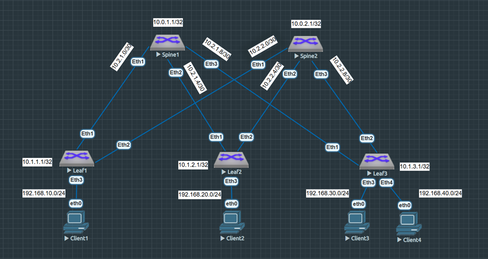

VxLAN. L3 VNI
=====================================

### Цель: 

- Настроить маршрутизацию в рамках Overlay между клиентами.

### Описание/Пошаговая инструкция выполнения домашнего задания:

В этой самостоятельной работе мы ожидаем, что вы самостоятельно:

- Настроите каждого клиента в своем VNI
- Настроите маршрутизацию между клиентами
- Зафиксируете в документации - план работы, адресное пространство, схему сети, конфигурацию устройств

### Топология сети



### Таблица адресов

|Device|Interface|IP Address|Subnet Mask
|---|---|---|---|
Spine1|lo1|10.0.1.1|255.255.255.255
Spine1|eth1|10.2.1.1|255.255.255.252
Spine1|eth2|10.2.1.5|255.255.255.252
Spine1|eth3|10.2.1.9|255.255.255.252
Spine2|lo1|10.0.2.1|255.255.255.255
Spine2|eth1|10.2.2.1|255.255.255.252
Spine2|eth2|10.2.2.5|255.255.255.252
Spine2|eth3|10.2.2.9|255.255.255.252
Leaf1|lo1|10.1.1.1|255.255.255.255
Leaf1|eth1|10.2.1.2|255.255.255.252
Leaf1|eth2|10.2.2.2|255.255.255.252
Leaf1|vlan10|192.168.10.201|255.255.255.0
Leaf1|vlan10_any|192.168.10.254|255.255.255.0
Leaf2|lo1|10.1.2.1|255.255.255.255
Leaf2|eth1|10.2.1.6|255.255.255.252
Leaf2|eth2|10.2.2.6|255.255.255.252
Leaf2|vlan20|192.168.20.202|255.255.255.0
Leaf2|vlan20_any|192.168.20.254|255.255.255.0
Leaf3|lo1|10.1.3.1|255.255.255.255
Leaf3|eth1|10.2.1.10|255.255.255.252
Leaf3|eth2|10.2.2.10|255.255.255.252
Leaf3|vlan30|192.168.30.203|255.255.255.0
Leaf3|vlan30_any|192.168.30.254|255.255.255.0
Leaf3|vlan40|192.168.40.204|255.255.255.0
Leaf3|vlan40_any|192.168.40.254|255.255.255.0
Client1|eth0|192.168.10.101|255.255.255.0
Client2|eth0|192.168.20.102|255.255.255.0
Client3|eth0|192.168.30.103|255.255.255.0
Client4|eth0|192.168.40.104|255.255.255.0


<details>

<summary> Общая информация </summary>

Virtual Extensible LAN (VXLAN) является технологией сетевой виртуализации, созданной для решения проблем масштабируемости в больших системах облачных вычислений. Она использует схожую с VLAN технику для MAC инкапсуляции Layer 2 Ethernet кадров в UDP-пакеты, порт 4789.</br>
VXLAN является развитием усилий по стандартизации на оверлейном протоколе инкапсуляции. Он увеличивает масштабируемость до 16 миллионов логических сетей и позволяет сетям 2 уровня одновременно сосуществовать по IP-сетям. При этом multicast или unicast (с Head-End Replication) используются для передачи широковещательного трафика (broadcast, multicast и Unicast flood).</br>
Принцип работы:
VXLAN устанавливает логический туннель между устройствами источника и назначения. Процесс инкапсуляции: 

 - VXLAN инкапсулирует оригинальные Ethernet-фреймы, отправленные виртуальной машиной, в UDP-пакеты.
 - Затем инкапсулирует UDP-пакеты с заголовком IP и заголовком Ethernet физической сети в качестве внешних заголовков, что позволяет передавать эти пакеты по сети, как обычные IP-пакеты.</br>
Упаковка и распаковка пакетов производятся конечными устройствами туннеля VXLAN (VTEP).</br>

Пакет протокола VXLAN состоит из следующих компонентов: 

 - Заголовок Ethernet — включает MAC-адрес отправителя, MAC-адрес получателя и тип протокола (например, IPv4, IPv6).
 - Заголовок IP — обеспечивает маршрутизацию пакета через IP-сеть. Поля: IP-адрес отправителя, IP-адрес получателя, другие поля (версия протокола, длина заголовка и т. д.).
 - Заголовок UDP — обеспечивает транспортировку инкапсулированных Ethernet-кадров. Поля: порт отправителя, порт получателя, длина UDP-пакета, контрольная сумма.
 - Заголовок VXLAN — состоит из полей: Flags (8 бит), Reserved1 (24 бит), VXLAN Network Identifier (VNI) (24 бит), Reserved2 (8 бит).
 - Внутренний Ethernet-кадр — содержит оригинальные MAC-адреса отправителя и получателя, а также полезную нагрузку данных.

EVPN (Ethernet Virtual Private Network) — технология, которая обеспечивает связь уровней 2 и 3 между различными сетевыми сегментами.</br>
Некоторые особенности EVPN:

 - Поддержка передачи трафика второго уровня по множественным путям. Для этого достаточно указать точку назначения туннеля в IP заголовке внешнего пакета, и у транзитных коммутаторов появляется возможность использовать все возможные пути.
 - Снижение уровня широковещательного трафика. Коммутаторы EVPN используют программный метод обучения MAC-адресов на базе обмена BGP сообщениями. После появления нового MAC-адреса на порту доступа выполняется синхронизация таблиц коммутации по всей сети.
 - Маршрутизация между сетями в Active-Active режиме. Устройства ведут себя как распределённый маршрутизатор, каждая часть которого имеет один и тот же IP и MAC-адреса.
 - Механизмы обмена не только MAC, но и IP информацией. Поэтому табличные данные и поведение распределённого маршрутизатора будут идентичны на всех его компонентах.
</details>

### Выполнение:


Произведем начальную настройку коммутаторов, в которой выполним команды конфигурирования адресного пространства, а так же настроим протокол динамической маршрутизации eBGP для обеспечения связаности лифов, которые будут анонсировать свой loopback. Первый клиент у нас находятся в сети 192.168.10.0/24, второй в сети 192.168.20.0/24, третий в сети 192.168.30.0/24, а четвертый в сети 192.168.40.0/24:
<details>

<summary> Начальная настройка </summary>
  
#### Spine 1
```
hostname Spine1
!
spanning-tree mode mstp
!
interface Ethernet1
   mtu 9000
   no switchport
   ip address 10.2.1.1/30
!
interface Ethernet2
   mtu 9000
   no switchport
   ip address 10.2.1.5/30
!
interface Ethernet3
   mtu 9000
   no switchport
   ip address 10.2.1.9/30
!
interface Ethernet4
!
interface Ethernet5
!
interface Ethernet6
!
interface Ethernet7
!
interface Ethernet8
!
interface Loopback0
   ip address 10.0.1.1/32
!
interface Management1
!
ip routing
!
peer-filter LEAF_PF
   10 match as-range 65001-65003 result accept
!
router bgp 65000
   router-id 10.0.1.1
   maximum-paths 3 ecmp 3
   bgp listen range 10.2.1.0/28 peer-group LEAF_NEIGHBOR peer-filter LEAF_PF
   neighbor LEAF_NEIGHBOR peer group
   neighbor LEAF_NEIGHBOR out-delay 0
   neighbor LEAF_NEIGHBOR bfd
   neighbor LEAF_NEIGHBOR timers 3 9
   !
   address-family ipv4
      neighbor LEAF_NEIGHBOR activate
      network 10.0.1.1/32
!
```
#### Spine 2
```
hostname Spine2
!
spanning-tree mode mstp
!
interface Ethernet1
   mtu 9000
   no switchport
   ip address 10.2.2.1/30
!
interface Ethernet2
   mtu 9000
   no switchport
   ip address 10.2.2.5/30
!
interface Ethernet3
   mtu 9000
   no switchport
   ip address 10.2.2.9/30
!
interface Ethernet4
!
interface Ethernet5
!
interface Ethernet6
!
interface Ethernet7
!
interface Ethernet8
!
interface Loopback0
   ip address 10.0.2.1/32
!
interface Management1
!
ip routing
!
peer-filter LEAF_PF
   10 match as-range 65001-65003 result accept
!
router bgp 65000
   router-id 10.0.2.1
   maximum-paths 3 ecmp 3
   bgp listen range 10.2.2.0/28 peer-group LEAF_NEIGHBOR peer-filter LEAF_PF
   neighbor LEAF_NEIGHBOR peer group
   neighbor LEAF_NEIGHBOR out-delay 0
   neighbor LEAF_NEIGHBOR bfd
   neighbor LEAF_NEIGHBOR timers 3 9
   !
   address-family ipv4
      neighbor LEAF_NEIGHBOR activate
      network 10.0.2.1/32
!
end

```
#### Leaf 1
```
hostname Leaf1
!
interface Ethernet1
   mtu 9000
   no switchport
   ip address 10.2.1.2/30
!
interface Ethernet2
   mtu 9000
   no switchport
   ip address 10.2.2.2/30
!
interface Ethernet3
   mtu 9000
!
interface Loopback0
   ip address 10.1.1.1/32
!
ip routing
!
router bgp 65001
   router-id 10.1.1.1
   maximum-paths 2 ecmp 2
   neighbor SPINE_NEIGHBOR peer group
   neighbor SPINE_NEIGHBOR remote-as 65000
   neighbor SPINE_NEIGHBOR out-delay 0
   neighbor SPINE_NEIGHBOR bfd
   neighbor SPINE_NEIGHBOR timers 3 9
   neighbor 10.2.1.1 peer group SPINE_NEIGHBOR
   neighbor 10.2.2.1 peer group SPINE_NEIGHBOR
   !
   address-family ipv4
      neighbor SPINE_NEIGHBOR activate
      network 10.1.1.1/32
!
```

#### Leaf 2
```
hostname Leaf2
!
interface Ethernet1
   mtu 9000
   no switchport
   ip address 10.2.1.6/30
!
interface Ethernet2
   mtu 9000
   no switchport
   ip address 10.2.2.6/30
!
interface Ethernet3
   mtu 9000
!
interface Loopback0
   ip address 10.1.2.1/32
!
ip routing
!
router bgp 65002
   router-id 10.1.2.1
   maximum-paths 2 ecmp 2
   neighbor SPINE_NEIGHBOR peer group
   neighbor SPINE_NEIGHBOR remote-as 65000
   neighbor SPINE_NEIGHBOR out-delay 0
   neighbor SPINE_NEIGHBOR bfd
   neighbor SPINE_NEIGHBOR timers 3 9
   neighbor 10.2.1.5 peer group SPINE_NEIGHBOR
   neighbor 10.2.2.5 peer group SPINE_NEIGHBOR
   !
   address-family ipv4
      neighbor SPINE_NEIGHBOR activate
      network 10.1.2.1/32
!
```

#### Leaf 3
```
hostname Leaf3
!
interface Ethernet1
   mtu 9000
   no switchport
   ip address 10.2.1.10/30
!
interface Ethernet2
   mtu 9000
   no switchport
   ip address 10.2.2.10/30
!
interface Ethernet3
   mtu 9000
!
interface Ethernet4
   mtu 9000
!
interface Loopback0
   ip address 10.1.3.1/32
!
ip routing
!
router bgp 65003
   router-id 10.1.3.1
   maximum-paths 2 ecmp 2
   neighbor SPINE_NEIGHBOR peer group
   neighbor SPINE_NEIGHBOR remote-as 65000
   neighbor SPINE_NEIGHBOR out-delay 0
   neighbor SPINE_NEIGHBOR bfd
   neighbor SPINE_NEIGHBOR timers 3 9
   neighbor 10.2.1.9 peer group SPINE_NEIGHBOR
   neighbor 10.2.2.9 peer group SPINE_NEIGHBOR
   !
   address-family ipv4
      neighbor SPINE_NEIGHBOR activate
      network 10.1.3.1/32
!
```
#### Client 1
```
VPCS> ip 192.168.10.101 255.255.255.0 192.168.10.254
```
#### Client 2
```
VPCS> ip 192.168.20.102 255.255.255.0 192.168.20.254
```
#### Client 3
```
VPCS> ip 192.168.30.103 255.255.255.0 192.168.30.254
```
#### Client 4
```
VPCS> ip 192.168.40.104 255.255.255.0 192.168.40.254
```
</details>

Нам необходимо настроить сеть таким образом, чтобы клиенты находились в разных L2 сегментах(VLAN), но при этом могли обмениваться траффиком с клиентами из другого VLAN. Просто так покинуть VNI мы не можем - для этого нам нужна маршрутизация, которая в EVPN носит название "Integrated Routing and Bridging".

Есть две IRB-модели, которые мы можем использовать для организации взаимодействия между VNI: асимметричная и симметричная. Мы будем использовамть симметричную, так как он позволяет не прописывать все VNI на каждом коммутаторе и, таким образом, гораздо лучше масштабируется.

Определим Client 1  во влан VLAN 10, в Client 2 во VLAN 20, Client 3 во влан VLAN 30 и Client 4 во влан VLAN 40. Так же создадим VRF для транзитного VNI и включим в нем роутинг: 

```
switchport access vlan Х0
vxlan vrf CON_VRF vni 10100
```

Теперь настроим интерфейс VXLAN. Здесь мы указываем, что VTEP Source IP-адрес нужно брать с интерфейса Loopback0. Этот IP-адрес будет использоваться как внешний Source IP в VXLAN-пакетах. Далее мы задаем соответствие VLAN 10 к VNI 10010, VLAN 20 к VNI 10020, VLAN 30 к VNI 10030, а VLAN 40 к VNI 10040. Затем введем транзитный VNI 10100 и привяжем его к созданному VRF. Так же блокируем data-plane обучение VTEP от любых IP-адресов, кроме тех что разрешены EVPN control-plane (BGP).
```
interface Vxlan1
   vxlan source-interface Loopback0
   vxlan udp-port 4789
   vxlan vlan ХХ vni 100ХХ
   vxlan learn-restrict any
!
```

В качестве шлюзов по умолчанию будут использоваться статические anycast-шлюзы(SAG), то есть на каждом Leaf'е в каждом VNI будет создан интерфейс и назначен IP-адрес(SVI для каждого VLAN), который будет служить адресом шлюза по умолчанию для локально подключенных клиентов. Для этого мы настраиваем одинаковый IP адрес на каждом IRB-интерфейсе конкретного VNI, а так же одинаковый MAC адрес:
```
ip virtual-router address 192.168.Х0.254/24
ip virtual-router mac-address 12:00:00:00:00:00
!
```

Далее включим режим multi-agent и настроим описание VLANы и VRF в протоколе eBGP.
Значение RD (Route Distinguisher) нужно установить для того, чтобы сделать уникальными маршруты к одному и тому же префиксу, но которые принадлежат разным VLANам. Политика экспорта из VLAN на анонсирующем VTEP должна совпадать с политикой импорта в VLAN назначения на принимающем VTEP. Зададим route-target как хх:100хх (как на импорт, так и на экспорт). Так же настроим распространение в EVPN информацию о всех изученных локально хостах в данных VLANах. В описании VRF так же настроим RD и RT, но с учетом того, что здесь надо уточнить семейство EVPN:
```
service routing protocols model multi-agent
!
  vlan ХХ
      rd auto
      route-target both ХХ:100ХХ
      redistribute learned
   !
   vrf CON_VRF
      rd 10.1.X.1:100
      route-target import evpn 100:10100
      route-target export evpn 100:10100
   !   
```

Таким образом, итоговые конфигурации коммутаторов будут выглядеть так:

<details>
<summary> Итоговая конфигурация </summary>
  
#### Spine 1
```
service routing protocols model multi-agent
!
hostname Spine1
!
spanning-tree mode mstp
!
interface Ethernet1
   mtu 9000
   no switchport
   ip address 10.2.1.1/30
!
interface Ethernet2
   mtu 9000
   no switchport
   ip address 10.2.1.5/30
!
interface Ethernet3
   mtu 9000
   no switchport
   ip address 10.2.1.9/30
!
interface Loopback0
   ip address 10.0.1.1/32
!
ip routing
!
peer-filter LEAF_PF
   10 match as-range 65001-65003 result accept
!
router bgp 65000
   router-id 10.0.1.1
   maximum-paths 3 ecmp 3
   bgp listen range 10.2.1.0/28 peer-group LEAF_NEIGHBOR peer-filter LEAF_PF
   bgp listen range 10.1.0.0/22 peer-group LEAF_NEIGHBOR_VXLAN peer-filter LEAF_PF
   neighbor LEAF_NEIGHBOR peer group
   neighbor LEAF_NEIGHBOR out-delay 0
   neighbor LEAF_NEIGHBOR bfd
   neighbor LEAF_NEIGHBOR timers 3 9
   neighbor LEAF_NEIGHBOR_VXLAN peer group
   neighbor LEAF_NEIGHBOR_VXLAN next-hop-unchanged
   neighbor LEAF_NEIGHBOR_VXLAN update-source Loopback0
   neighbor LEAF_NEIGHBOR_VXLAN ebgp-multihop 3
   neighbor LEAF_NEIGHBOR_VXLAN send-community extended
   !
   address-family evpn
      neighbor LEAF_NEIGHBOR_VXLAN activate
   !
   address-family ipv4
      neighbor LEAF_NEIGHBOR activate
      network 10.0.1.1/32
!
end

```
  
#### Spine 2
```
service routing protocols model multi-agent
!
hostname Spine2
!
spanning-tree mode mstp
!
interface Ethernet1
   mtu 9000
   no switchport
   ip address 10.2.2.1/30
!
interface Ethernet2
   mtu 9000
   no switchport
   ip address 10.2.2.5/30
!
interface Ethernet3
   mtu 9000
   no switchport
   ip address 10.2.2.9/30
!
interface Loopback0
   ip address 10.0.2.1/32
!
ip routing
!
peer-filter LEAF_PF
   10 match as-range 65001-65003 result accept
!
router bgp 65000
   router-id 10.0.2.1
   maximum-paths 3 ecmp 3
   bgp listen range 10.2.2.0/28 peer-group LEAF_NEIGHBOR peer-filter LEAF_PF
   bgp listen range 10.1.0.0/22 peer-group LEAF_NEIGHBOR_VXLAN peer-filter LEAF_PF
   neighbor LEAF_NEIGHBOR peer group
   neighbor LEAF_NEIGHBOR out-delay 0
   neighbor LEAF_NEIGHBOR bfd
   neighbor LEAF_NEIGHBOR timers 3 9
   neighbor LEAF_NEIGHBOR_VXLAN peer group
   neighbor LEAF_NEIGHBOR_VXLAN next-hop-unchanged
   neighbor LEAF_NEIGHBOR_VXLAN update-source Loopback0
   neighbor LEAF_NEIGHBOR_VXLAN ebgp-multihop 3
   neighbor LEAF_NEIGHBOR_VXLAN send-community extended
   !
   address-family evpn
      neighbor LEAF_NEIGHBOR_VXLAN activate
   !
   address-family ipv4
      neighbor LEAF_NEIGHBOR activate
      network 10.0.2.1/32
!
end


```
  
#### Leaf 1
```

service routing protocols model multi-agent
!
hostname Leaf1
!
spanning-tree mode mstp
!
vlan 10
   name L3_NET1
!
vrf instance CON_VRF
!
interface Ethernet1
   mtu 9000
   no switchport
   ip address 10.2.1.2/30
!
interface Ethernet2
   mtu 9000
   no switchport
   ip address 10.2.2.2/30
!
interface Ethernet3
   mtu 9000
   switchport access vlan 10
   !
!
interface Ethernet4
!
interface Ethernet5
!
interface Ethernet6
!
interface Ethernet7
!
interface Ethernet8
!
interface Loopback0
   ip address 10.1.1.1/32
!
interface Management1
!
interface Vxlan1
   vxlan source-interface Loopback0
   vxlan udp-port 4789
   vxlan vlan 10 vni 10010
   vxlan vrf CON_VRF vni 10100
   vxlan learn-restrict any
!
interface Vlan10
   vrf CON_VRF
   ip address 192.168.10.201/24
   ip virtual-router address 192.168.10.254/24
!
ip routing
!
ip routing vrf CON_VRF
!
ip virtual-router mac-address 12:00:00:00:00:00
!
router bgp 65001
   router-id 10.1.1.1
   maximum-paths 2 ecmp 2
   neighbor SPINE_NEIGHBOR peer group
   neighbor SPINE_NEIGHBOR remote-as 65000
   neighbor SPINE_NEIGHBOR out-delay 0
   neighbor SPINE_NEIGHBOR bfd
   neighbor SPINE_NEIGHBOR timers 3 9
   neighbor SPINE_NEIGHBOR_VXLAN peer group
   neighbor SPINE_NEIGHBOR_VXLAN remote-as 65000
   neighbor SPINE_NEIGHBOR_VXLAN update-source Loopback0
   neighbor SPINE_NEIGHBOR_VXLAN ebgp-multihop 3
   neighbor SPINE_NEIGHBOR_VXLAN send-community extended
   neighbor 10.0.1.1 peer group SPINE_NEIGHBOR_VXLAN
   neighbor 10.0.2.1 peer group SPINE_NEIGHBOR_VXLAN
   neighbor 10.2.1.1 peer group SPINE_NEIGHBOR
   neighbor 10.2.2.1 peer group SPINE_NEIGHBOR
   !
   vlan 10
      rd auto
      route-target both 10:10010
      redistribute learned
   !
   vrf CON_VRF
    rd 10.1.1.1:100
    route-target import evpn 100:10100
    route-target export evpn 100:10100
   !   
   address-family evpn
      neighbor SPINE_NEIGHBOR_VXLAN activate
   !
   address-family ipv4
      neighbor SPINE_NEIGHBOR activate
      network 10.1.1.1/32
!
end


```

#### Leaf 2
```

service routing protocols model multi-agent
!
hostname Leaf2
!
spanning-tree mode mstp
!
vlan 20
   name L3_NET2
!
vrf instance CON_VRF
!
interface Ethernet1
   mtu 9000
   no switchport
   ip address 10.2.1.6/30
!
interface Ethernet2
   mtu 9000
   no switchport
   ip address 10.2.2.6/30
!
interface Ethernet3
   mtu 9000
   switchport access vlan 20
!
interface Ethernet4
!
interface Ethernet5
!
interface Ethernet6
!
interface Ethernet7
!
interface Ethernet8
!
interface Loopback0
   ip address 10.1.2.1/32
!
interface Management1
!
interface Vxlan1
   vxlan source-interface Loopback0
   vxlan udp-port 4789
   vxlan vlan 20 vni 10020
   vxlan vrf CON_VRF vni 10100
   vxlan learn-restrict any
!
interface Vlan20
   vrf CON_VRF
   ip address 192.168.20.202/24
   ip virtual-router address 192.168.20.254/24
!
ip routing
!
ip routing vrf CON_VRF
!
ip virtual-router mac-address 12:00:00:00:00:00
!
router bgp 65002
   router-id 10.1.2.1
   maximum-paths 2 ecmp 2
   neighbor SPINE_NEIGHBOR peer group
   neighbor SPINE_NEIGHBOR remote-as 65000
   neighbor SPINE_NEIGHBOR out-delay 0
   neighbor SPINE_NEIGHBOR bfd
   neighbor SPINE_NEIGHBOR timers 3 9
   neighbor SPINE_NEIGHBOR_VXLAN peer group
   neighbor SPINE_NEIGHBOR_VXLAN remote-as 65000
   neighbor SPINE_NEIGHBOR_VXLAN update-source Loopback0
   neighbor SPINE_NEIGHBOR_VXLAN ebgp-multihop 3
   neighbor SPINE_NEIGHBOR_VXLAN send-community extended
   neighbor 10.0.1.1 peer group SPINE_NEIGHBOR_VXLAN
   neighbor 10.0.2.1 peer group SPINE_NEIGHBOR_VXLAN
   neighbor 10.2.1.5 peer group SPINE_NEIGHBOR
   neighbor 10.2.2.5 peer group SPINE_NEIGHBOR
   !
   vlan 20
      rd auto
      route-target both 20:10020
      redistribute learned
   !
   vrf CON_VRF
    rd 10.1.2.1:100
    route-target import evpn 100:10100
    route-target export evpn 100:10100
   !   
   address-family evpn
      neighbor SPINE_NEIGHBOR_VXLAN activate
   !
   address-family ipv4
      neighbor SPINE_NEIGHBOR activate
      network 10.1.2.1/32
!
end

```

#### Leaf 3
```
service routing protocols model multi-agent
!
hostname Leaf3
!
spanning-tree mode mstp
!
vlan 30
   name L3_NET3
!
vlan 40
   name L3_NET4
!
vrf instance CON_VRF
!
interface Ethernet1
   mtu 9000
   no switchport
   ip address 10.2.1.10/30
!
interface Ethernet2
   mtu 9000
   no switchport
   ip address 10.2.2.10/30
!
interface Ethernet3
   mtu 9000
   switchport access vlan 30
!
interface Ethernet4
   mtu 9000
   switchport access vlan 40
!
interface Ethernet4
!
interface Ethernet5
!
interface Ethernet6
!
interface Ethernet7
!
interface Ethernet8
!
interface Loopback0
   ip address 10.1.3.1/32
!
interface Management1
!
interface Vxlan1
   vxlan source-interface Loopback0
   vxlan udp-port 4789
   vxlan vlan 30 vni 10030
   vxlan vlan 40 vni 10040
   vxlan vrf CON_VRF vni 10100
   vxlan learn-restrict any
!
interface Vlan30
   vrf CON_VRF
   ip address 192.168.30.203/24
   ip virtual-router address 192.168.30.254/24
!
interface Vlan40
   vrf CON_VRF
   ip address 192.168.40.204/24
   ip virtual-router address 192.168.40.254/24
!
ip routing
!
ip routing vrf CON_VRF
!
ip virtual-router mac-address 12:00:00:00:00:00
!
router bgp 65003
   router-id 10.1.3.1
   maximum-paths 2 ecmp 2
   neighbor SPINE_NEIGHBOR peer group
   neighbor SPINE_NEIGHBOR remote-as 65000
   neighbor SPINE_NEIGHBOR out-delay 0
   neighbor SPINE_NEIGHBOR bfd
   neighbor SPINE_NEIGHBOR timers 3 9
   neighbor SPINE_NEIGHBOR_VXLAN peer group
   neighbor SPINE_NEIGHBOR_VXLAN remote-as 65000
   neighbor SPINE_NEIGHBOR_VXLAN update-source Loopback0
   neighbor SPINE_NEIGHBOR_VXLAN ebgp-multihop 3
   neighbor SPINE_NEIGHBOR_VXLAN send-community extended
   neighbor 10.0.1.1 peer group SPINE_NEIGHBOR_VXLAN
   neighbor 10.0.2.1 peer group SPINE_NEIGHBOR_VXLAN
   neighbor 10.2.1.9 peer group SPINE_NEIGHBOR
   neighbor 10.2.2.9 peer group SPINE_NEIGHBOR
   !
   vlan 30
      rd auto
      route-target both 30:10030
      redistribute learned
   !
   vlan 40
      rd auto
      route-target both 40:10040
      redistribute learned
   !
   vrf CON_VRF
    rd 10.1.3.1:100
    route-target import evpn 100:10100
    route-target export evpn 100:10100
   !   
   address-family evpn
      neighbor SPINE_NEIGHBOR_VXLAN activate
   !
   address-family ipv4
      neighbor SPINE_NEIGHBOR activate
      network 10.1.3.1/32
!
end

```
</details>

После настройки на сетевых устройствах протокола маршрутизации проверим результаты.

 Пробуем с Client1 "достучаться" до Client2(VLA20), Client3(VLA30) и до Client4(VLAN40):
 #### Clients
 

 Как видим Client1 видит Client2, Client3, а так же Client4.


 Далее посмотрим eBGP соседей на спайнах, а так же состояние сессий:
<details>
<summary> Neighbors </summary>
  
 #### Spine 1
 ```

Spine1#sh bgp sum
BGP summary information for VRF default
Router identifier 10.0.1.1, local AS number 65000
Neighbor           AS Session State AFI/SAFI                AFI/SAFI State   NLRI Rcd   NLRI Acc
--------- ----------- ------------- ----------------------- -------------- ---------- ----------
10.1.1.1        65001 Established   IPv4 Unicast            Negotiated              1          1
10.1.1.1        65001 Established   L2VPN EVPN              Negotiated              1          1
10.1.2.1        65002 Established   IPv4 Unicast            Negotiated              1          1
10.1.2.1        65002 Established   L2VPN EVPN              Negotiated              1          1
10.1.3.1        65003 Established   IPv4 Unicast            Negotiated              1          1
10.1.3.1        65003 Established   L2VPN EVPN              Negotiated              2          2
10.2.1.2        65001 Established   IPv4 Unicast            Negotiated              1          1
10.2.1.6        65002 Established   IPv4 Unicast            Negotiated              1          1
10.2.1.10       65003 Established   IPv4 Unicast            Negotiated              1          1

 ```
 #### Spine 2
 ```
Spine2#sh bgp sum
BGP summary information for VRF default
Router identifier 10.0.2.1, local AS number 65000
Neighbor           AS Session State AFI/SAFI                AFI/SAFI State   NLRI Rcd   NLRI Acc
--------- ----------- ------------- ----------------------- -------------- ---------- ----------
10.1.1.1        65001 Established   IPv4 Unicast            Negotiated              1          1
10.1.1.1        65001 Established   L2VPN EVPN              Negotiated              1          1
10.1.2.1        65002 Established   IPv4 Unicast            Negotiated              1          1
10.1.2.1        65002 Established   L2VPN EVPN              Negotiated              1          1
10.1.3.1        65003 Established   IPv4 Unicast            Negotiated              1          1
10.1.3.1        65003 Established   L2VPN EVPN              Negotiated              2          2
10.2.2.2        65001 Established   IPv4 Unicast            Negotiated              1          1
10.2.2.6        65002 Established   IPv4 Unicast            Negotiated              1          1
10.2.2.10       65003 Established   IPv4 Unicast            Negotiated              1          1

 ```
 </details>

Как видим - IPv4 и EVPN соседи активны.
 
 Так же посмотрим EVPN маршруты типа 2 и 3 на каждом leaf-коммутаторе:
 
 <details>
 <summary> Type 2,3 </summary>
 

 #### Leaf 1
 ```

Leaf1#sh bgp evpn
BGP routing table information for VRF default
Router identifier 10.1.1.1, local AS number 65001
Route status codes: * - valid, > - active, S - Stale, E - ECMP head, e - ECMP
                    c - Contributing to ECMP, % - Pending BGP convergence
Origin codes: i - IGP, e - EGP, ? - incomplete
AS Path Attributes: Or-ID - Originator ID, C-LST - Cluster List, LL Nexthop - Link Local Nexthop

          Network                Next Hop              Metric  LocPref Weight  Path
 * >      RD: 10.1.1.1:10 mac-ip 0050.7966.6806
                                 -                     -       -       0       i
 * >      RD: 10.1.1.1:10 mac-ip 0050.7966.6806 192.168.10.101
                                 -                     -       -       0       i
 * >Ec    RD: 10.1.2.1:20 mac-ip 0050.7966.6807
                                 10.1.2.1              -       100     0       65000 65002 i
 *  ec    RD: 10.1.2.1:20 mac-ip 0050.7966.6807
                                 10.1.2.1              -       100     0       65000 65002 i
 * >Ec    RD: 10.1.2.1:20 mac-ip 0050.7966.6807 192.168.20.102
                                 10.1.2.1              -       100     0       65000 65002 i
 *  ec    RD: 10.1.2.1:20 mac-ip 0050.7966.6807 192.168.20.102
                                 10.1.2.1              -       100     0       65000 65002 i
 * >Ec    RD: 10.1.3.1:30 mac-ip 0050.7966.6808
                                 10.1.3.1              -       100     0       65000 65003 i
 *  ec    RD: 10.1.3.1:30 mac-ip 0050.7966.6808
                                 10.1.3.1              -       100     0       65000 65003 i
 * >Ec    RD: 10.1.3.1:30 mac-ip 0050.7966.6808 192.168.30.103
                                 10.1.3.1              -       100     0       65000 65003 i
 *  ec    RD: 10.1.3.1:30 mac-ip 0050.7966.6808 192.168.30.103
                                 10.1.3.1              -       100     0       65000 65003 i
 * >Ec    RD: 10.1.3.1:40 mac-ip 0050.7966.6809
                                 10.1.3.1              -       100     0       65000 65003 i
 *  ec    RD: 10.1.3.1:40 mac-ip 0050.7966.6809
                                 10.1.3.1              -       100     0       65000 65003 i
 * >Ec    RD: 10.1.3.1:40 mac-ip 0050.7966.6809 192.168.40.104
                                 10.1.3.1              -       100     0       65000 65003 i
 *  ec    RD: 10.1.3.1:40 mac-ip 0050.7966.6809 192.168.40.104
                                 10.1.3.1              -       100     0       65000 65003 i
 * >      RD: 10.1.1.1:10 imet 10.1.1.1
                                 -                     -       -       0       i
 * >Ec    RD: 10.1.2.1:20 imet 10.1.2.1
                                 10.1.2.1              -       100     0       65000 65002 i
 *  ec    RD: 10.1.2.1:20 imet 10.1.2.1
                                 10.1.2.1              -       100     0       65000 65002 i
 * >Ec    RD: 10.1.3.1:30 imet 10.1.3.1
                                 10.1.3.1              -       100     0       65000 65003 i
 *  ec    RD: 10.1.3.1:30 imet 10.1.3.1
                                 10.1.3.1              -       100     0       65000 65003 i
 * >Ec    RD: 10.1.3.1:40 imet 10.1.3.1
                                 10.1.3.1              -       100     0       65000 65003 i
 *  ec    RD: 10.1.3.1:40 imet 10.1.3.1
                                 10.1.3.1              -       100     0       65000 65003 i

 ```

 #### Leaf 2
 ```

Leaf2#sh bgp evpn
BGP routing table information for VRF default
Router identifier 10.1.2.1, local AS number 65002
Route status codes: * - valid, > - active, S - Stale, E - ECMP head, e - ECMP
                    c - Contributing to ECMP, % - Pending BGP convergence
Origin codes: i - IGP, e - EGP, ? - incomplete
AS Path Attributes: Or-ID - Originator ID, C-LST - Cluster List, LL Nexthop - Link Local Nexthop

          Network                Next Hop              Metric  LocPref Weight  Path
 * >Ec    RD: 10.1.1.1:10 mac-ip 0050.7966.6806
                                 10.1.1.1              -       100     0       65000 65001 i
 *  ec    RD: 10.1.1.1:10 mac-ip 0050.7966.6806
                                 10.1.1.1              -       100     0       65000 65001 i
 * >Ec    RD: 10.1.1.1:10 mac-ip 0050.7966.6806 192.168.10.101
                                 10.1.1.1              -       100     0       65000 65001 i
 *  ec    RD: 10.1.1.1:10 mac-ip 0050.7966.6806 192.168.10.101
                                 10.1.1.1              -       100     0       65000 65001 i
 * >      RD: 10.1.2.1:20 mac-ip 0050.7966.6807
                                 -                     -       -       0       i
 * >      RD: 10.1.2.1:20 mac-ip 0050.7966.6807 192.168.20.102
                                 -                     -       -       0       i
 * >Ec    RD: 10.1.3.1:30 mac-ip 0050.7966.6808
                                 10.1.3.1              -       100     0       65000 65003 i
 *  ec    RD: 10.1.3.1:30 mac-ip 0050.7966.6808
                                 10.1.3.1              -       100     0       65000 65003 i
 * >Ec    RD: 10.1.3.1:30 mac-ip 0050.7966.6808 192.168.30.103
                                 10.1.3.1              -       100     0       65000 65003 i
 *  ec    RD: 10.1.3.1:30 mac-ip 0050.7966.6808 192.168.30.103
                                 10.1.3.1              -       100     0       65000 65003 i
 * >Ec    RD: 10.1.3.1:40 mac-ip 0050.7966.6809
                                 10.1.3.1              -       100     0       65000 65003 i
 *  ec    RD: 10.1.3.1:40 mac-ip 0050.7966.6809
                                 10.1.3.1              -       100     0       65000 65003 i
 * >Ec    RD: 10.1.3.1:40 mac-ip 0050.7966.6809 192.168.40.104
                                 10.1.3.1              -       100     0       65000 65003 i
 *  ec    RD: 10.1.3.1:40 mac-ip 0050.7966.6809 192.168.40.104
                                 10.1.3.1              -       100     0       65000 65003 i
 * >Ec    RD: 10.1.1.1:10 imet 10.1.1.1
                                 10.1.1.1              -       100     0       65000 65001 i
 *  ec    RD: 10.1.1.1:10 imet 10.1.1.1
                                 10.1.1.1              -       100     0       65000 65001 i
 * >      RD: 10.1.2.1:20 imet 10.1.2.1
                                 -                     -       -       0       i
 * >Ec    RD: 10.1.3.1:30 imet 10.1.3.1
                                 10.1.3.1              -       100     0       65000 65003 i
 *  ec    RD: 10.1.3.1:30 imet 10.1.3.1
                                 10.1.3.1              -       100     0       65000 65003 i
 * >Ec    RD: 10.1.3.1:40 imet 10.1.3.1
                                 10.1.3.1              -       100     0       65000 65003 i
 *  ec    RD: 10.1.3.1:40 imet 10.1.3.1
                                 10.1.3.1              -       100     0       65000 65003 i

 #### Leaf 3
 ```

Leaf3#sh bgp evpn
BGP routing table information for VRF default
Router identifier 10.1.3.1, local AS number 65003
Route status codes: * - valid, > - active, S - Stale, E - ECMP head, e - ECMP
                    c - Contributing to ECMP, % - Pending BGP convergence
Origin codes: i - IGP, e - EGP, ? - incomplete
AS Path Attributes: Or-ID - Originator ID, C-LST - Cluster List, LL Nexthop - Link Local Nexthop

          Network                Next Hop              Metric  LocPref Weight  Path
 * >Ec    RD: 10.1.1.1:10 mac-ip 0050.7966.6806
                                 10.1.1.1              -       100     0       65000 65001 i
 *  ec    RD: 10.1.1.1:10 mac-ip 0050.7966.6806
                                 10.1.1.1              -       100     0       65000 65001 i
 * >Ec    RD: 10.1.1.1:10 mac-ip 0050.7966.6806 192.168.10.101
                                 10.1.1.1              -       100     0       65000 65001 i
 *  ec    RD: 10.1.1.1:10 mac-ip 0050.7966.6806 192.168.10.101
                                 10.1.1.1              -       100     0       65000 65001 i
 * >Ec    RD: 10.1.2.1:20 mac-ip 0050.7966.6807
                                 10.1.2.1              -       100     0       65000 65002 i
 *  ec    RD: 10.1.2.1:20 mac-ip 0050.7966.6807
                                 10.1.2.1              -       100     0       65000 65002 i
 * >Ec    RD: 10.1.2.1:20 mac-ip 0050.7966.6807 192.168.20.102
                                 10.1.2.1              -       100     0       65000 65002 i
 *  ec    RD: 10.1.2.1:20 mac-ip 0050.7966.6807 192.168.20.102
                                 10.1.2.1              -       100     0       65000 65002 i
 * >      RD: 10.1.3.1:30 mac-ip 0050.7966.6808
                                 -                     -       -       0       i
 * >      RD: 10.1.3.1:30 mac-ip 0050.7966.6808 192.168.30.103
                                 -                     -       -       0       i
 * >      RD: 10.1.3.1:40 mac-ip 0050.7966.6809
                                 -                     -       -       0       i
 * >      RD: 10.1.3.1:40 mac-ip 0050.7966.6809 192.168.40.104
                                 -                     -       -       0       i
 * >Ec    RD: 10.1.1.1:10 imet 10.1.1.1
                                 10.1.1.1              -       100     0       65000 65001 i
 *  ec    RD: 10.1.1.1:10 imet 10.1.1.1
                                 10.1.1.1              -       100     0       65000 65001 i
 * >Ec    RD: 10.1.2.1:20 imet 10.1.2.1
                                 10.1.2.1              -       100     0       65000 65002 i
 *  ec    RD: 10.1.2.1:20 imet 10.1.2.1
                                 10.1.2.1              -       100     0       65000 65002 i
 * >      RD: 10.1.3.1:30 imet 10.1.3.1
                                 -                     -       -       0       i
 * >      RD: 10.1.3.1:40 imet 10.1.3.1
                                 -                     -       -       0       i
 ```
</details>
Как видим, достигается полная связность с использованием протокола ECMP: любой хост → любой хост по VXLAN.</br>
</br>
Проверим таблицы мак адресов:

 #### Leaf 1
 ```
Leaf1#show bgp evpn instance
EVPN instance: VLAN 10
  Route distinguisher: 0:0
  Route target import: Route-Target-AS:10:10010
  Route target export: Route-Target-AS:10:10010
  Service interface: VLAN-based
  Local VXLAN IP address: 10.1.1.1
  VXLAN: enabled
  MPLS: disabled
Leaf1#show vxlan vni
VNI to VLAN Mapping for Vxlan1
VNI         VLAN       Source       Interface       802.1Q Tag
----------- ---------- ------------ --------------- ----------
10010       10         static       Ethernet3       untagged
                                    Vxlan1          10

VNI to dynamic VLAN Mapping for Vxlan1
VNI         VLAN       VRF           Source
----------- ---------- ------------- ------------
10100       4094       CON_VRF       evpn


 ```
 #### Leaf 2
 ```
Leaf2#show bgp evpn instance
EVPN instance: VLAN 20
  Route distinguisher: 0:0
  Route target import: Route-Target-AS:20:10020
  Route target export: Route-Target-AS:20:10020
  Service interface: VLAN-based
  Local VXLAN IP address: 10.1.2.1
  VXLAN: enabled
  MPLS: disabled
Leaf2#show vxlan vni
VNI to VLAN Mapping for Vxlan1
VNI         VLAN       Source       Interface       802.1Q Tag
----------- ---------- ------------ --------------- ----------
10020       20         static       Ethernet3       untagged
                                    Vxlan1          20

VNI to dynamic VLAN Mapping for Vxlan1
VNI         VLAN       VRF           Source
----------- ---------- ------------- ------------
10100       4094       CON_VRF       evpn

 ```
 #### Leaf 3
 ```
Leaf3#show bgp evpn instance
EVPN instance: VLAN 30
  Route distinguisher: 0:0
  Route target import: Route-Target-AS:30:10030
  Route target export: Route-Target-AS:30:10030
  Service interface: VLAN-based
  Local VXLAN IP address: 10.1.3.1
  VXLAN: enabled
  MPLS: disabled
EVPN instance: VLAN 40
  Route distinguisher: 0:0
  Route target import: Route-Target-AS:40:10040
  Route target export: Route-Target-AS:40:10040
  Service interface: VLAN-based
  Local VXLAN IP address: 10.1.3.1
  VXLAN: enabled
  MPLS: disabled
Leaf3#show vxlan vni
VNI to VLAN Mapping for Vxlan1
VNI         VLAN       Source       Interface       802.1Q Tag
----------- ---------- ------------ --------------- ----------
10030       30         static       Ethernet3       untagged
                                    Vxlan1          30
10040       40         static       Ethernet4       untagged
                                    Vxlan1          40

VNI to dynamic VLAN Mapping for Vxlan1
VNI         VLAN       VRF           Source
----------- ---------- ------------- ------------
10100       4094       CON_VRF       evpn


 ```

Как видим, все mac адреса корректно изучаются на всех лифах.


      show ip route vrf CON_VRF

VRF: CON_VRF
Codes: C - connected, S - static, K - kernel,
       O - OSPF, IA - OSPF inter area, E1 - OSPF external type 1,
       E2 - OSPF external type 2, N1 - OSPF NSSA external type 1,
       N2 - OSPF NSSA external type2, B - Other BGP Routes,
       B I - iBGP, B E - eBGP, R - RIP, I L1 - IS-IS level 1,
       I L2 - IS-IS level 2, O3 - OSPFv3, A B - BGP Aggregate,
       A O - OSPF Summary, NG - Nexthop Group Static Route,
       V - VXLAN Control Service, M - Martian,
       DH - DHCP client installed default route,
       DP - Dynamic Policy Route, L - VRF Leaked,
       G  - gRIBI, RC - Route Cache Route

Gateway of last resort is not set

 C        192.168.10.0/24 is directly connected, Vlan10
 B E      192.168.20.102/32 [200/0] via VTEP 10.1.2.1 VNI 10100 router-mac 50:00:00:d5:5d:c0 local-interface Vxlan1
 B E      192.168.30.103/32 [200/0] via VTEP 10.1.3.1 VNI 10100 router-mac 50:00:00:15:f4:e8 local-interface Vxlan1
 B E      192.168.40.104/32 [200/0] via VTEP 10.1.3.1 VNI 10100 router-mac 50:00:00:15:f4:e8 local-interface Vxlan1


show ip route vrf CON_VRF

VRF: CON_VRF
Codes: C - connected, S - static, K - kernel,
       O - OSPF, IA - OSPF inter area, E1 - OSPF external type 1,
       E2 - OSPF external type 2, N1 - OSPF NSSA external type 1,
       N2 - OSPF NSSA external type2, B - Other BGP Routes,
       B I - iBGP, B E - eBGP, R - RIP, I L1 - IS-IS level 1,
       I L2 - IS-IS level 2, O3 - OSPFv3, A B - BGP Aggregate,
       A O - OSPF Summary, NG - Nexthop Group Static Route,
       V - VXLAN Control Service, M - Martian,
       DH - DHCP client installed default route,
       DP - Dynamic Policy Route, L - VRF Leaked,
       G  - gRIBI, RC - Route Cache Route

Gateway of last resort is not set

 B E      192.168.10.101/32 [200/0] via VTEP 10.1.1.1 VNI 10100 router-mac 50:00:00:d7:ee:0b local-interface Vxlan1
 C        192.168.20.0/24 is directly connected, Vlan20
 B E      192.168.30.103/32 [200/0] via VTEP 10.1.3.1 VNI 10100 router-mac 50:00:00:15:f4:e8 local-interface Vxlan1
 B E      192.168.40.104/32 [200/0] via VTEP 10.1.3.1 VNI 10100 router-mac 50:00:00:15:f4:e8 local-interface Vxlan1


Leaf3#show ip route vrf CON_VRF

VRF: CON_VRF
Codes: C - connected, S - static, K - kernel,
       O - OSPF, IA - OSPF inter area, E1 - OSPF external type 1,
       E2 - OSPF external type 2, N1 - OSPF NSSA external type 1,
       N2 - OSPF NSSA external type2, B - Other BGP Routes,
       B I - iBGP, B E - eBGP, R - RIP, I L1 - IS-IS level 1,
       I L2 - IS-IS level 2, O3 - OSPFv3, A B - BGP Aggregate,
       A O - OSPF Summary, NG - Nexthop Group Static Route,
       V - VXLAN Control Service, M - Martian,
       DH - DHCP client installed default route,
       DP - Dynamic Policy Route, L - VRF Leaked,
       G  - gRIBI, RC - Route Cache Route

Gateway of last resort is not set

 B E      192.168.10.101/32 [200/0] via VTEP 10.1.1.1 VNI 10100 router-mac 50:00:00:d7:ee:0b local-interface Vxlan1
 B E      192.168.20.102/32 [200/0] via VTEP 10.1.2.1 VNI 10100 router-mac 50:00:00:d5:5d:c0 local-interface Vxlan1
 C        192.168.30.0/24 is directly connected, Vlan30
 C        192.168.40.0/24 is directly connected, Vlan40


