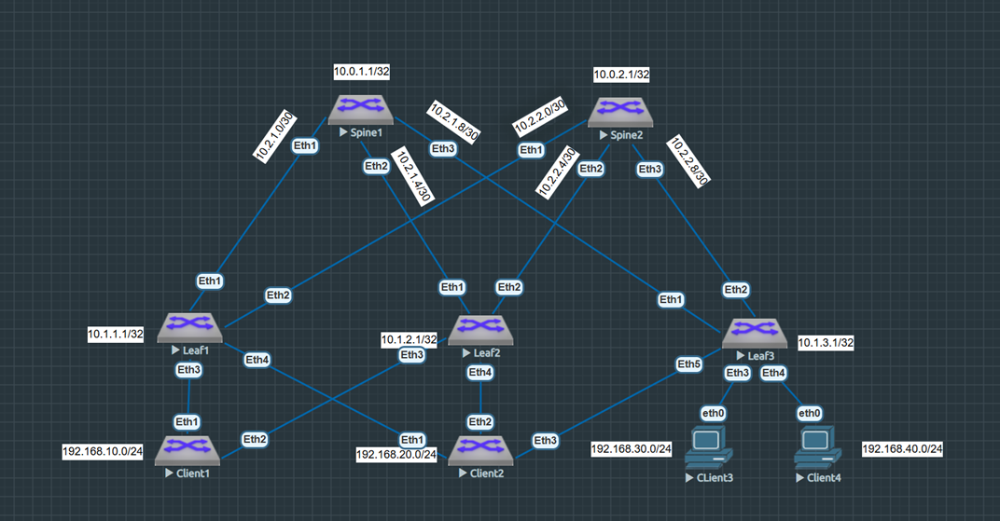
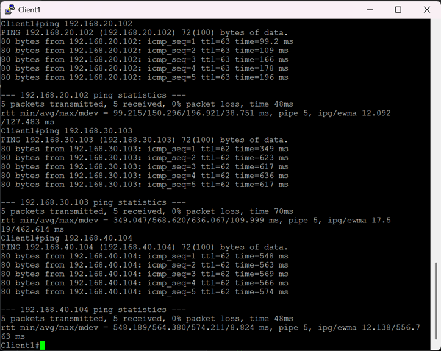

VXLAN. Multihoming
=====================================

### Цель: 

- Настроить отказоустойчивое подключение клиентов с использованием EVPN Multihoming.

### Описание/Пошаговая инструкция выполнения домашнего задания:

В этой самостоятельной работе мы ожидаем, что вы самостоятельно:

- Подключите клиентов 2-я линками к различным Leaf
- Настроите агрегированный канал со стороны клиента
- Настроите multihoming для работы в Overlay сети. Если используете Cisco NXOS - vPC, если иной вендор - то ESI LAG (либо MC-LAG с поддержкой VXLAN)
- Зафиксируете в документации - план работы, адресное пространство, схему сети, конфигурацию устройств
- Опционально - протестировать отказоустойчивость - убедиться, что связнность не теряется при отключении одного из линков

### Топология сети



### Таблица адресов

|Device|Interface|IP Address|Subnet Mask
|---|---|---|---|
Spine1|lo1|10.0.1.1|255.255.255.255
Spine1|eth1|10.2.1.1|255.255.255.252
Spine1|eth2|10.2.1.5|255.255.255.252
Spine1|eth3|10.2.1.9|255.255.255.252
Spine2|lo1|10.0.2.1|255.255.255.255
Spine2|eth1|10.2.2.1|255.255.255.252
Spine2|eth2|10.2.2.5|255.255.255.252
Spine2|eth3|10.2.2.9|255.255.255.252
Leaf1|lo1|10.1.1.1|255.255.255.255
Leaf1|eth1|10.2.1.2|255.255.255.252
Leaf1|eth2|10.2.2.2|255.255.255.252
Leaf1|vlan10|192.168.10.254|255.255.255.0
Leaf2|lo1|10.1.2.1|255.255.255.255
Leaf2|eth1|10.2.1.6|255.255.255.252
Leaf2|eth2|10.2.2.6|255.255.255.252
Leaf2|vlan20|192.168.20.254|255.255.255.0
Leaf3|lo1|10.1.3.1|255.255.255.255
Leaf3|eth1|10.2.1.10|255.255.255.252
Leaf3|eth2|10.2.2.10|255.255.255.252
Leaf3|vlan30|192.168.30.254|255.255.255.0
Leaf3|vlan40|192.168.40.254|255.255.255.0
Client1|eth0|192.168.10.101|255.255.255.0
Client2|eth0|192.168.20.102|255.255.255.0
Client3|eth0|192.168.30.103|255.255.255.0
Client4|eth0|192.168.40.104|255.255.255.0


<details>

<summary> Общая информация </summary>

Multihoming — практика подключения хоста или компьютерной сети к нескольким сетям. Это делается для повышения надёжности или производительности. 

Некоторые преимущества Multihoming:
Повышение надёжности. Если одно соединение выходит из строя, пакеты можно направить по другому.
Улучшение производительности. Данные можно передавать и получать через несколько соединений одновременно, что увеличивает пропускную способность.</br>

Группа агрегации каналов на нескольких шасси ( MLAG или MC-LAG ) — это тип группы агрегации каналов (LAG), в состав которой входят порты, подключенные к отдельным шасси, главным образом для обеспечения резервирования в случае отказа одного из шасси. Стандарт IEEE 802.1AX-2008 для агрегации каналов не упоминает MC-LAG, но и не исключает его.

EVPN Multihoming может работать как в режиме All-Active (все линки могут быть активны и передавать unicast-трафик одновременно) или в режиме Single-Active, когда активен только один линк, а второй находится в горячем резерве.

В отличие от проприетатных решений на основе MLAG, EVPN Multihoming не требует отдельного peer-link и не накладывает жесткого ограничения на максимальное количество PE-устройств, обслуживающих multihomed-систему (хотя количество поддерживаемых устройств для организации резервируемого подключения зависит от реализации у конкретного вендора). 
</details>

### Выполнение:


Произведем начальную настройку коммутаторов, в которой выполним команды конфигурирования адресного пространства, а так же настроим протокол динамической маршрутизации eBGP для обеспечения связаности лифов, которые будут анонсировать свой loopback. Первый клиент у нас находятся в сети 192.168.10.0/24, второй в сети 192.168.20.0/24, третий в сети 192.168.30.0/24, а четвертый в сети 192.168.40.0/24:
<details>

<summary> Начальная настройка </summary>
  
#### Spine 1
```
service routing protocols model multi-agent
!
hostname Spine1
!
spanning-tree mode mstp
!
interface Ethernet1
   mtu 9000
   no switchport
   ip address 10.2.1.1/30
!
interface Ethernet2
   mtu 9000
   no switchport
   ip address 10.2.1.5/30
!
interface Ethernet3
   mtu 9000
   no switchport
   ip address 10.2.1.9/30
!
interface Loopback0
   ip address 10.0.1.1/32
!
ip routing
!
peer-filter LEAF_PF
   10 match as-range 65001-65003 result accept
!
router bgp 65000
   router-id 10.0.1.1
   maximum-paths 3 ecmp 3
   bgp listen range 10.2.1.0/28 peer-group LEAF_NEIGHBOR peer-filter LEAF_PF
   bgp listen range 10.1.0.0/22 peer-group LEAF_NEIGHBOR_VXLAN peer-filter LEAF_PF
   neighbor LEAF_NEIGHBOR peer group
   neighbor LEAF_NEIGHBOR out-delay 0
   neighbor LEAF_NEIGHBOR bfd
   neighbor LEAF_NEIGHBOR timers 3 9
   neighbor LEAF_NEIGHBOR_VXLAN peer group
   neighbor LEAF_NEIGHBOR_VXLAN next-hop-unchanged
   neighbor LEAF_NEIGHBOR_VXLAN update-source Loopback0
   neighbor LEAF_NEIGHBOR_VXLAN ebgp-multihop 3
   neighbor LEAF_NEIGHBOR_VXLAN send-community extended
   !
   address-family evpn
      neighbor LEAF_NEIGHBOR_VXLAN activate
   !
   address-family ipv4
      neighbor LEAF_NEIGHBOR activate
      network 10.0.1.1/32
!
end

```
  
#### Spine 2
```
service routing protocols model multi-agent
!
hostname Spine2
!
spanning-tree mode mstp
!
interface Ethernet1
   mtu 9000
   no switchport
   ip address 10.2.2.1/30
!
interface Ethernet2
   mtu 9000
   no switchport
   ip address 10.2.2.5/30
!
interface Ethernet3
   mtu 9000
   no switchport
   ip address 10.2.2.9/30
!
interface Loopback0
   ip address 10.0.2.1/32
!
ip routing
!
peer-filter LEAF_PF
   10 match as-range 65001-65003 result accept
!
router bgp 65000
   router-id 10.0.2.1
   maximum-paths 3 ecmp 3
   bgp listen range 10.2.2.0/28 peer-group LEAF_NEIGHBOR peer-filter LEAF_PF
   bgp listen range 10.1.0.0/22 peer-group LEAF_NEIGHBOR_VXLAN peer-filter LEAF_PF
   neighbor LEAF_NEIGHBOR peer group
   neighbor LEAF_NEIGHBOR out-delay 0
   neighbor LEAF_NEIGHBOR bfd
   neighbor LEAF_NEIGHBOR timers 3 9
   neighbor LEAF_NEIGHBOR_VXLAN peer group
   neighbor LEAF_NEIGHBOR_VXLAN next-hop-unchanged
   neighbor LEAF_NEIGHBOR_VXLAN update-source Loopback0
   neighbor LEAF_NEIGHBOR_VXLAN ebgp-multihop 3
   neighbor LEAF_NEIGHBOR_VXLAN send-community extended
   !
   address-family evpn
      neighbor LEAF_NEIGHBOR_VXLAN activate
   !
   address-family ipv4
      neighbor LEAF_NEIGHBOR activate
      network 10.0.2.1/32
!
end


```
  
#### Leaf 1
```

service routing protocols model multi-agent
!
hostname Leaf1
!
spanning-tree mode mstp
!
vlan 10
   name L3_NET1
!
vrf instance CON_VRF
!
interface Ethernet1
   mtu 9000
   no switchport
   ip address 10.2.1.2/30
!
interface Ethernet2
   mtu 9000
   no switchport
   ip address 10.2.2.2/30
!
interface Ethernet3
   mtu 9000
   switchport access vlan 10
   !
!
interface Ethernet4
!
interface Ethernet5
!
interface Ethernet6
!
interface Ethernet7
!
interface Ethernet8
!
interface Loopback0
   ip address 10.1.1.1/32
!
interface Management1
!
interface Vxlan1
   vxlan source-interface Loopback0
   vxlan udp-port 4789
   vxlan vlan 10 vni 10010
   vxlan vrf CON_VRF vni 10100
   vxlan learn-restrict any
!
interface Vlan10
   vrf CON_VRF
   ip address 192.168.10.201/24
   ip virtual-router address 192.168.10.254/24
!
ip routing
!
ip routing vrf CON_VRF
!
ip virtual-router mac-address 12:00:00:00:00:00
!
router bgp 65001
   router-id 10.1.1.1
   maximum-paths 2 ecmp 2
   neighbor SPINE_NEIGHBOR peer group
   neighbor SPINE_NEIGHBOR remote-as 65000
   neighbor SPINE_NEIGHBOR out-delay 0
   neighbor SPINE_NEIGHBOR bfd
   neighbor SPINE_NEIGHBOR timers 3 9
   neighbor SPINE_NEIGHBOR_VXLAN peer group
   neighbor SPINE_NEIGHBOR_VXLAN remote-as 65000
   neighbor SPINE_NEIGHBOR_VXLAN update-source Loopback0
   neighbor SPINE_NEIGHBOR_VXLAN ebgp-multihop 3
   neighbor SPINE_NEIGHBOR_VXLAN send-community extended
   neighbor 10.0.1.1 peer group SPINE_NEIGHBOR_VXLAN
   neighbor 10.0.2.1 peer group SPINE_NEIGHBOR_VXLAN
   neighbor 10.2.1.1 peer group SPINE_NEIGHBOR
   neighbor 10.2.2.1 peer group SPINE_NEIGHBOR
   !
   vlan 10
      rd auto
      route-target both 10:10010
      redistribute learned
   !
   vrf CON_VRF
    rd 10.1.1.1:100
    route-target import evpn 100:10100
    route-target export evpn 100:10100
   !   
   address-family evpn
      neighbor SPINE_NEIGHBOR_VXLAN activate
   !
   address-family ipv4
      neighbor SPINE_NEIGHBOR activate
      network 10.1.1.1/32
!
end


```

#### Leaf 2
```

service routing protocols model multi-agent
!
hostname Leaf2
!
spanning-tree mode mstp
!
vlan 20
   name L3_NET2
!
vrf instance CON_VRF
!
interface Ethernet1
   mtu 9000
   no switchport
   ip address 10.2.1.6/30
!
interface Ethernet2
   mtu 9000
   no switchport
   ip address 10.2.2.6/30
!
interface Ethernet3
   mtu 9000
   switchport access vlan 20
!
interface Ethernet4
!
interface Ethernet5
!
interface Ethernet6
!
interface Ethernet7
!
interface Ethernet8
!
interface Loopback0
   ip address 10.1.2.1/32
!
interface Management1
!
interface Vxlan1
   vxlan source-interface Loopback0
   vxlan udp-port 4789
   vxlan vlan 20 vni 10020
   vxlan vrf CON_VRF vni 10100
   vxlan learn-restrict any
!
interface Vlan20
   vrf CON_VRF
   ip address 192.168.20.202/24
   ip virtual-router address 192.168.20.254/24
!
ip routing
!
ip routing vrf CON_VRF
!
ip virtual-router mac-address 12:00:00:00:00:00
!
router bgp 65002
   router-id 10.1.2.1
   maximum-paths 2 ecmp 2
   neighbor SPINE_NEIGHBOR peer group
   neighbor SPINE_NEIGHBOR remote-as 65000
   neighbor SPINE_NEIGHBOR out-delay 0
   neighbor SPINE_NEIGHBOR bfd
   neighbor SPINE_NEIGHBOR timers 3 9
   neighbor SPINE_NEIGHBOR_VXLAN peer group
   neighbor SPINE_NEIGHBOR_VXLAN remote-as 65000
   neighbor SPINE_NEIGHBOR_VXLAN update-source Loopback0
   neighbor SPINE_NEIGHBOR_VXLAN ebgp-multihop 3
   neighbor SPINE_NEIGHBOR_VXLAN send-community extended
   neighbor 10.0.1.1 peer group SPINE_NEIGHBOR_VXLAN
   neighbor 10.0.2.1 peer group SPINE_NEIGHBOR_VXLAN
   neighbor 10.2.1.5 peer group SPINE_NEIGHBOR
   neighbor 10.2.2.5 peer group SPINE_NEIGHBOR
   !
   vlan 20
      rd auto
      route-target both 20:10020
      redistribute learned
   !
   vrf CON_VRF
    rd 10.1.2.1:100
    route-target import evpn 100:10100
    route-target export evpn 100:10100
   !   
   address-family evpn
      neighbor SPINE_NEIGHBOR_VXLAN activate
   !
   address-family ipv4
      neighbor SPINE_NEIGHBOR activate
      network 10.1.2.1/32
!
end

```

#### Leaf 3
```
service routing protocols model multi-agent
!
hostname Leaf3
!
spanning-tree mode mstp
!
vlan 30
   name L3_NET3
!
vlan 40
   name L3_NET4
!
vrf instance CON_VRF
!
interface Ethernet1
   mtu 9000
   no switchport
   ip address 10.2.1.10/30
!
interface Ethernet2
   mtu 9000
   no switchport
   ip address 10.2.2.10/30
!
interface Ethernet3
   mtu 9000
   switchport access vlan 30
!
interface Ethernet4
   mtu 9000
   switchport access vlan 40
!
interface Ethernet4
!
interface Ethernet5
!
interface Ethernet6
!
interface Ethernet7
!
interface Ethernet8
!
interface Loopback0
   ip address 10.1.3.1/32
!
interface Management1
!
interface Vxlan1
   vxlan source-interface Loopback0
   vxlan udp-port 4789
   vxlan vlan 30 vni 10030
   vxlan vlan 40 vni 10040
   vxlan vrf CON_VRF vni 10100
   vxlan learn-restrict any
!
interface Vlan30
   vrf CON_VRF
   ip address 192.168.30.203/24
   ip virtual-router address 192.168.30.254/24
!
interface Vlan40
   vrf CON_VRF
   ip address 192.168.40.204/24
   ip virtual-router address 192.168.40.254/24
!
ip routing
!
ip routing vrf CON_VRF
!
ip virtual-router mac-address 12:00:00:00:00:00
!
router bgp 65003
   router-id 10.1.3.1
   maximum-paths 2 ecmp 2
   neighbor SPINE_NEIGHBOR peer group
   neighbor SPINE_NEIGHBOR remote-as 65000
   neighbor SPINE_NEIGHBOR out-delay 0
   neighbor SPINE_NEIGHBOR bfd
   neighbor SPINE_NEIGHBOR timers 3 9
   neighbor SPINE_NEIGHBOR_VXLAN peer group
   neighbor SPINE_NEIGHBOR_VXLAN remote-as 65000
   neighbor SPINE_NEIGHBOR_VXLAN update-source Loopback0
   neighbor SPINE_NEIGHBOR_VXLAN ebgp-multihop 3
   neighbor SPINE_NEIGHBOR_VXLAN send-community extended
   neighbor 10.0.1.1 peer group SPINE_NEIGHBOR_VXLAN
   neighbor 10.0.2.1 peer group SPINE_NEIGHBOR_VXLAN
   neighbor 10.2.1.9 peer group SPINE_NEIGHBOR
   neighbor 10.2.2.9 peer group SPINE_NEIGHBOR
   !
   vlan 30
      rd auto
      route-target both 30:10030
      redistribute learned
   !
   vlan 40
      rd auto
      route-target both 40:10040
      redistribute learned
   !
   vrf CON_VRF
    rd 10.1.3.1:100
    route-target import evpn 100:10100
    route-target export evpn 100:10100
   !   
   address-family evpn
      neighbor SPINE_NEIGHBOR_VXLAN activate
   !
   address-family ipv4
      neighbor SPINE_NEIGHBOR activate
      network 10.1.3.1/32
!
end
```
#### Client 1
```
hostname Client1
!
vlan 10
!
interface Vlan10
   ip address 192.168.10.101/24
!
ip route 0.0.0.0/0 192.168.10.254
!
end
```
#### Client 2
```
hostname Client1
!
vlan 20
!
interface Vlan20
   ip address 192.168.20.102/24
!
ip route 0.0.0.0/0 192.168.20.254
!
end
```
#### Client 3
```
VPCS> ip 192.168.30.103 255.255.255.0 192.168.30.254
```
#### Client 4
```
VPCS> ip 192.168.40.104 255.255.255.0 192.168.40.254
```
</details>

Предположим, что за  Leaf 1 и 2 находятся важные сервисы, которые нам необходимо зарезервировать(клиенты 3 и 4 не будем резервировать из-за ограничения мощностей). При том, мы для этой лабораторной работы представим, что за Leaf 2 находится критически важный сервис, который мы ходим максимально зарезервировать(через все лифы). Таким образом, нам необходимо настроить сеть таким образом, чтобы первый клиент был подключен к EVPN+VXLAN фабрике с помощью LACP к первому и второму лифу, а второй клиент - к первому, второму и третьему.

Вначале, соберем активный агрегированный линк на клиенте 1 и клиенте 2:

```
interface Port-Channelx0
   switchport access vlan x0
!
interface Ethernetx
   channel-group x0 mode active
!

```

Далее на лифах опишем недостающие вланы и VNI, то есть донастроим плоскость данных VXLAN. На LEAF 1 - VLAN 20(VNI 10020), на LEAF 2 - VLAN 10(VNI 10010), а на LEAF 3 - VLAN 20(VNI 10020). Затем привяжем  VLANы к соответствующим Port-Channel, и включим в Port-Channel интерфейсы: 

```
vlan х0
!
interface Port-Channelх0
   switchport access vlan х0
!
interface Ethernetх
   channel-group х0 mode active
!
interface Vxlan1
   vxlan vlan х0 vni 100х0
!
interface Vlanх0
   vrf CON_VRF
   ip address 192.168.20.20х/24
   ip virtual-router address 192.168.х0.254/24
!
```

Затем настроим Multihoming-сегмент(для генерации маршрута RT-1 (Ethernet Auto-Discovery Route)).

Зададим произвольный MAC-адрес LACP-канала с помощью команды lacp system-id, который должен быть одинаковым на всех лифах, входящих в Port-Channel. Также зададим идентификатор сегмента ESI(для информирования VTEP, что линк обозначенен как часть глобально уникального набора линков ведущих к одной и той же клиентской Multihoming-системе) и Route target сегмента(благодаря этому комьюнити VTEP'ы, подключенные к одному сегменту, будут импортировать маршруты RT-4, относящиеся к этому ESI).

```
evpn ethernet-segment х0
   identifier 0000:0000:0000:0000:00х0
   route-target import 00:00:00:00:00:х0
   lacp system-id х0aa.aaaa.00х0
!
```

Так же сделаем описание добавленных VLAN в секции динамического протокола протокола BGP:
```
router bgp 6500х
   vlan х0
      rd auto
      route-target both х0:100х0
      redistribute learned
   !
!
```

Таким образом, итоговые конфигурации коммутаторов будут выглядеть так:

<details>
<summary> Итоговая конфигурация </summary>
  
#### Spine 1
```
service routing protocols model multi-agent
!
hostname Spine1
!
spanning-tree mode mstp
!
interface Ethernet1
   mtu 9000
   no switchport
   ip address 10.2.1.1/30
!
interface Ethernet2
   mtu 9000
   no switchport
   ip address 10.2.1.5/30
!
interface Ethernet3
   mtu 9000
   no switchport
   ip address 10.2.1.9/30
!
interface Loopback0
   ip address 10.0.1.1/32
!
ip routing
!
peer-filter LEAF_PF
   10 match as-range 65001-65003 result accept
!
router bgp 65000
   router-id 10.0.1.1
   maximum-paths 3 ecmp 3
   bgp listen range 10.2.1.0/28 peer-group LEAF_NEIGHBOR peer-filter LEAF_PF
   bgp listen range 10.1.0.0/22 peer-group LEAF_NEIGHBOR_VXLAN peer-filter LEAF_PF
   neighbor LEAF_NEIGHBOR peer group
   neighbor LEAF_NEIGHBOR out-delay 0
   neighbor LEAF_NEIGHBOR bfd
   neighbor LEAF_NEIGHBOR timers 3 9
   neighbor LEAF_NEIGHBOR_VXLAN peer group
   neighbor LEAF_NEIGHBOR_VXLAN next-hop-unchanged
   neighbor LEAF_NEIGHBOR_VXLAN update-source Loopback0
   neighbor LEAF_NEIGHBOR_VXLAN ebgp-multihop 3
   neighbor LEAF_NEIGHBOR_VXLAN send-community extended
   !
   address-family evpn
      neighbor LEAF_NEIGHBOR_VXLAN activate
   !
   address-family ipv4
      neighbor LEAF_NEIGHBOR activate
      network 10.0.1.1/32
!
end

```
  
#### Spine 2
```
service routing protocols model multi-agent
!
hostname Spine2
!
spanning-tree mode mstp
!
interface Ethernet1
   mtu 9000
   no switchport
   ip address 10.2.2.1/30
!
interface Ethernet2
   mtu 9000
   no switchport
   ip address 10.2.2.5/30
!
interface Ethernet3
   mtu 9000
   no switchport
   ip address 10.2.2.9/30
!
interface Loopback0
   ip address 10.0.2.1/32
!
ip routing
!
peer-filter LEAF_PF
   10 match as-range 65001-65003 result accept
!
router bgp 65000
   router-id 10.0.2.1
   maximum-paths 3 ecmp 3
   bgp listen range 10.2.2.0/28 peer-group LEAF_NEIGHBOR peer-filter LEAF_PF
   bgp listen range 10.1.0.0/22 peer-group LEAF_NEIGHBOR_VXLAN peer-filter LEAF_PF
   neighbor LEAF_NEIGHBOR peer group
   neighbor LEAF_NEIGHBOR out-delay 0
   neighbor LEAF_NEIGHBOR bfd
   neighbor LEAF_NEIGHBOR timers 3 9
   neighbor LEAF_NEIGHBOR_VXLAN peer group
   neighbor LEAF_NEIGHBOR_VXLAN next-hop-unchanged
   neighbor LEAF_NEIGHBOR_VXLAN update-source Loopback0
   neighbor LEAF_NEIGHBOR_VXLAN ebgp-multihop 3
   neighbor LEAF_NEIGHBOR_VXLAN send-community extended
   !
   address-family evpn
      neighbor LEAF_NEIGHBOR_VXLAN activate
   !
   address-family ipv4
      neighbor LEAF_NEIGHBOR activate
      network 10.0.2.1/32
!
end


```
  
#### Leaf 1
```

service routing protocols model multi-agent
!
hostname Leaf1
!
vlan 10
   name L3_NET1
!
vlan 20
!
vrf instance CON_VRF
!
interface Port-Channel10
   switchport access vlan 10
   !
   evpn ethernet-segment
      identifier 0000:0000:0000:0000:0010
      route-target import 00:00:00:00:00:10
   lacp system-id 10aa.aaaa.0010
!
interface Port-Channel20
   switchport access vlan 20
   !
   evpn ethernet-segment
      identifier 0000:0000:0000:0000:0020
      route-target import 00:00:00:00:00:20
   lacp system-id 20aa.aaaa.0020
!
interface Ethernet1
   mtu 9000
   no switchport
   ip address 10.2.1.2/30
!
interface Ethernet2
   mtu 9000
   no switchport
   ip address 10.2.2.2/30
!
interface Ethernet3
   mtu 9000
   channel-group 10 mode active
!
interface Ethernet4
   mtu 9000
   channel-group 20 mode active
!
interface Ethernet5
!
interface Ethernet6
!
interface Ethernet7
!
interface Ethernet8
!
interface Loopback0
   ip address 10.1.1.1/32
!
interface Management1
!
interface Vlan10
   vrf CON_VRF
   ip address 192.168.10.201/24
   ip virtual-router address 192.168.10.254/24
!
interface Vlan20
   vrf CON_VRF
   ip address 192.168.20.201/24
   ip virtual-router address 192.168.20.254/24
!
interface Vxlan1
   vxlan source-interface Loopback0
   vxlan udp-port 4789
   vxlan vlan 10 vni 10010
   vxlan vlan 20 vni 10020
   vxlan vrf CON_VRF vni 10100
   vxlan learn-restrict any
!
ip virtual-router mac-address 12:00:00:00:00:00
!
ip routing
ip routing vrf CON_VRF
!
router bgp 65001
   router-id 10.1.1.1
   maximum-paths 2 ecmp 2
   neighbor SPINE_NEIGHBOR peer group
   neighbor SPINE_NEIGHBOR remote-as 65000
   neighbor SPINE_NEIGHBOR out-delay 0
   neighbor SPINE_NEIGHBOR bfd
   neighbor SPINE_NEIGHBOR timers 3 9
   neighbor SPINE_NEIGHBOR_VXLAN peer group
   neighbor SPINE_NEIGHBOR_VXLAN remote-as 65000
   neighbor SPINE_NEIGHBOR_VXLAN update-source Loopback0
   neighbor SPINE_NEIGHBOR_VXLAN ebgp-multihop 3
   neighbor SPINE_NEIGHBOR_VXLAN send-community extended
   neighbor 10.0.1.1 peer group SPINE_NEIGHBOR_VXLAN
   neighbor 10.0.2.1 peer group SPINE_NEIGHBOR_VXLAN
   neighbor 10.2.1.1 peer group SPINE_NEIGHBOR
   neighbor 10.2.2.1 peer group SPINE_NEIGHBOR
   !
   vlan 10
      rd auto
      route-target both 10:10010
      redistribute learned
   !
   vlan 20
      rd auto
      route-target both 20:10020
      redistribute learned
   !
   address-family evpn
      neighbor SPINE_NEIGHBOR_VXLAN activate
   !
   address-family ipv4
      neighbor SPINE_NEIGHBOR activate
      network 10.1.1.1/32
   !
   vrf CON_VRF
      rd 10.1.1.1:100
      route-target import evpn 100:10100
      route-target export evpn 100:10100
!
end


```

#### Leaf 2
```

service routing protocols model multi-agent
!
hostname Leaf2
!
vlan 10
!
vlan 20
   name L3_NET2
!
vrf instance CON_VRF
!
interface Port-Channel10
   switchport access vlan 10
   !
   evpn ethernet-segment
      identifier 0000:0000:0000:0000:0010
      route-target import 00:00:00:00:00:10
   lacp system-id 10aa.aaaa.0010
!
interface Port-Channel20
   switchport access vlan 20
   !
   evpn ethernet-segment
      identifier 0000:0000:0000:0000:0020
      route-target import 00:00:00:00:00:20
   lacp system-id 20aa.aaaa.0020
!
interface Ethernet1
   mtu 9000
   no switchport
   ip address 10.2.1.6/30
!
interface Ethernet2
   mtu 9000
   no switchport
   ip address 10.2.2.6/30
!
interface Ethernet3
   mtu 9000
   channel-group 10 mode active
!
interface Ethernet4
   mtu 9000
   channel-group 20 mode active
!
interface Ethernet5
!
interface Ethernet6
!
interface Ethernet7
!
interface Ethernet8
!
interface Loopback0
   ip address 10.1.2.1/32
!
interface Management1
!
interface Vlan10
   vrf CON_VRF
   ip address 192.168.10.202/24
   ip virtual-router address 192.168.10.254/24
!
interface Vlan20
   vrf CON_VRF
   ip address 192.168.20.202/24
   ip virtual-router address 192.168.20.254/24
!
interface Vxlan1
   vxlan source-interface Loopback0
   vxlan udp-port 4789
   vxlan vlan 10 vni 10010
   vxlan vlan 20 vni 10020
   vxlan vrf CON_VRF vni 10100
   vxlan learn-restrict any
!
ip virtual-router mac-address 12:00:00:00:00:00
!
ip routing
ip routing vrf CON_VRF
!
router bgp 65002
   router-id 10.1.2.1
   maximum-paths 2 ecmp 2
   neighbor SPINE_NEIGHBOR peer group
   neighbor SPINE_NEIGHBOR remote-as 65000
   neighbor SPINE_NEIGHBOR out-delay 0
   neighbor SPINE_NEIGHBOR bfd
   neighbor SPINE_NEIGHBOR timers 3 9
   neighbor SPINE_NEIGHBOR_VXLAN peer group
   neighbor SPINE_NEIGHBOR_VXLAN remote-as 65000
   neighbor SPINE_NEIGHBOR_VXLAN update-source Loopback0
   neighbor SPINE_NEIGHBOR_VXLAN ebgp-multihop 3
   neighbor SPINE_NEIGHBOR_VXLAN send-community extended
   neighbor 10.0.1.1 peer group SPINE_NEIGHBOR_VXLAN
   neighbor 10.0.2.1 peer group SPINE_NEIGHBOR_VXLAN
   neighbor 10.2.1.5 peer group SPINE_NEIGHBOR
   neighbor 10.2.2.5 peer group SPINE_NEIGHBOR
   !
   vlan 20
      rd auto
      route-target both 20:10020
      redistribute learned
   !
   address-family evpn
      neighbor SPINE_NEIGHBOR_VXLAN activate
   !
   address-family ipv4
      neighbor SPINE_NEIGHBOR activate
      network 10.1.2.1/32
   !
   vrf CON_VRF
      rd 10.1.2.1:100
      route-target import evpn 100:10100
      route-target export evpn 100:10100
!
end

```

#### Leaf 3
```
service routing protocols model multi-agent
!
hostname Leaf3
!
vlan 20
!
vlan 30
   name L3_NET3
!
vlan 40
   name L3_NET4
!
vrf instance CON_VRF
!
interface Port-Channel20
   switchport access vlan 20
   !
   evpn ethernet-segment
      identifier 0000:0000:0000:0000:0020
      route-target import 00:00:00:00:00:20
   lacp system-id 20aa.aaaa.0020
!
interface Ethernet1
   mtu 9000
   no switchport
   ip address 10.2.1.10/30
!
interface Ethernet2
   mtu 9000
   no switchport
   ip address 10.2.2.10/30
!
interface Ethernet3
   mtu 9000
   switchport access vlan 30
!
interface Ethernet4
   mtu 9000
   switchport access vlan 40
!
interface Ethernet5
   mtu 9000
   channel-group 20 mode active
!
interface Ethernet6
!
interface Ethernet7
!
interface Ethernet8
!
interface Loopback0
   ip address 10.1.3.1/32
!
interface Management1
!
interface Vlan20
   vrf CON_VRF
   ip address 192.168.20.203/24
   ip virtual-router address 192.168.20.254/24
!
interface Vlan30
   vrf CON_VRF
   ip address 192.168.30.203/24
   ip virtual-router address 192.168.30.254/24
!
interface Vlan40
   vrf CON_VRF
   ip address 192.168.40.204/24
   ip virtual-router address 192.168.40.254/24
!
interface Vxlan1
   vxlan source-interface Loopback0
   vxlan udp-port 4789
   vxlan vlan 20 vni 10020
   vxlan vlan 30 vni 10030
   vxlan vlan 40 vni 10040
   vxlan vrf CON_VRF vni 10100
   vxlan learn-restrict any
!
ip virtual-router mac-address 12:00:00:00:00:00
!
ip routing
ip routing vrf CON_VRF
!
router bgp 65003
   router-id 10.1.3.1
   maximum-paths 2 ecmp 2
   neighbor SPINE_NEIGHBOR peer group
   neighbor SPINE_NEIGHBOR remote-as 65000
   neighbor SPINE_NEIGHBOR out-delay 0
   neighbor SPINE_NEIGHBOR bfd
   neighbor SPINE_NEIGHBOR timers 3 9
   neighbor SPINE_NEIGHBOR_VXLAN peer group
   neighbor SPINE_NEIGHBOR_VXLAN remote-as 65000
   neighbor SPINE_NEIGHBOR_VXLAN update-source Loopback0
   neighbor SPINE_NEIGHBOR_VXLAN ebgp-multihop 3
   neighbor SPINE_NEIGHBOR_VXLAN send-community extended
   neighbor 10.0.1.1 peer group SPINE_NEIGHBOR_VXLAN
   neighbor 10.0.2.1 peer group SPINE_NEIGHBOR_VXLAN
   neighbor 10.2.1.9 peer group SPINE_NEIGHBOR
   neighbor 10.2.2.9 peer group SPINE_NEIGHBOR
   !
   vlan 30
      rd auto
      route-target both 30:10030
      redistribute learned
   !
   vlan 40
      rd auto
      route-target both 40:10040
      redistribute learned
   !
   address-family evpn
      neighbor SPINE_NEIGHBOR_VXLAN activate
   !
   address-family ipv4
      neighbor SPINE_NEIGHBOR activate
      network 10.1.3.1/32
   !
   vrf CON_VRF
      rd 10.1.3.1:100
      route-target import evpn 100:10100
      route-target export evpn 100:10100
!
end

```
</details>

После настройки на сетевых устройствах протокола маршрутизации проверим результаты.

 Пробуем с Client1 "достучаться" до Client2(VLA20), Client3(VLA30) и до Client4(VLAN40):
 #### Clients
 

 Как видим Client1 видит Client2, Client3, а так же Client4, то есть маршрутизация не сломалась.


 Далее посмотрим eBGP соседей на спайнах, а так же состояние сессий, чтобы удостоверится, что сессии не сломались:
<details>
<summary> Neighbors </summary>
  
 #### Spine 1
 ```

Spine1#sh bgp sum
BGP summary information for VRF default
Router identifier 10.0.1.1, local AS number 65000
Neighbor           AS Session State AFI/SAFI                AFI/SAFI State   NLRI Rcd   NLRI Acc
--------- ----------- ------------- ----------------------- -------------- ---------- ----------
10.1.1.1        65001 Established   IPv4 Unicast            Negotiated              1          1
10.1.1.1        65001 Established   L2VPN EVPN              Negotiated              9          9
10.1.2.1        65002 Established   IPv4 Unicast            Negotiated              1          1
10.1.2.1        65002 Established   L2VPN EVPN              Negotiated              6          6
10.1.3.1        65003 Established   IPv4 Unicast            Negotiated              1          1
10.1.3.1        65003 Established   L2VPN EVPN              Negotiated              2          2
10.2.1.2        65001 Established   IPv4 Unicast            Negotiated              1          1
10.2.1.6        65002 Established   IPv4 Unicast            Negotiated              1          1
10.2.1.10       65003 Established   IPv4 Unicast            Negotiated              1          1

 ```
 #### Spine 2
 ```
Spine2#sh bgp sum
BGP summary information for VRF default
Router identifier 10.0.2.1, local AS number 65000
Neighbor           AS Session State AFI/SAFI                AFI/SAFI State   NLRI Rcd   NLRI Acc
--------- ----------- ------------- ----------------------- -------------- ---------- ----------
10.1.1.1        65001 Established   IPv4 Unicast            Negotiated              1          1
10.1.1.1        65001 Established   L2VPN EVPN              Negotiated              9          9
10.1.2.1        65002 Established   IPv4 Unicast            Negotiated              1          1
10.1.2.1        65002 Established   L2VPN EVPN              Negotiated              6          6
10.1.3.1        65003 Established   IPv4 Unicast            Negotiated              1          1
10.1.3.1        65003 Established   L2VPN EVPN              Negotiated              2          2
10.2.2.2        65001 Established   IPv4 Unicast            Negotiated              1          1
10.2.2.6        65002 Established   IPv4 Unicast            Negotiated              1          1
10.2.2.10       65003 Established   IPv4 Unicast            Negotiated              1          1

 ```
 </details>

Как видим - IPv4 и EVPN соседи активны.
 
 Теперь проверим LACP на клиентах:

  #### Client 1
 ```
Client1#sh lacp aggregates
Port Channel Port-Channel10:
 Aggregate ID: [(8000,10-aa-aa-aa-00-10,000A,0000,0000),(8000,50-00-00-72-8b-31,000A,0000,0000)]
  Bundled Ports: Ethernet1 Ethernet2

Client1#sh lacp peer
State: A = Active, P = Passive; S=ShortTimeout, L=LongTimeout;
       G = Aggregable, I = Individual; s+=InSync, s-=OutOfSync;
       C = Collecting, X = state machine expired,
       D = Distributing, d = default neighbor state
                 |                        Partner
 Port    Status  | Sys-id                    Port#   State     OperKey  PortPri
------ ----------|------------------------- ------- --------- --------- -------
Port Channel Port-Channel10:
 Et1     Bundled | 8000,10-aa-aa-aa-00-10        3   ALGs+CD    0x000a    32768
 Et2     Bundled | 8000,10-aa-aa-aa-00-10        3   ALGs+CD    0x000a    32768
Client1#sh lacp counters
                      LACPDUs       Markers         Marker Response
 Port    Status      RX     TX     RX      TX          RX          TX   Illegal
------- ---------- ------ ------ ------ ------- ----------- ----------- -------
Port Channel Port-Channel10:
 Et1     Bundled    209    433      0       0           0           0         0
 Et2     Bundled    183    346      0       0           0           0         0

 ```

  #### Client 2
 ```

Client2#sh lacp aggregates
Port Channel Port-Channel20:
 Aggregate ID: [(8000,20-aa-aa-aa-00-20,0014,0000,0000),(8000,50-00-00-f6-ad-37,0014,0000,0000)]
  Bundled Ports: Ethernet1 Ethernet2 Ethernet3
Client2#sh lacp peer
State: A = Active, P = Passive; S=ShortTimeout, L=LongTimeout;
       G = Aggregable, I = Individual; s+=InSync, s-=OutOfSync;
       C = Collecting, X = state machine expired,
       D = Distributing, d = default neighbor state
                 |                        Partner
 Port    Status  | Sys-id                    Port#   State     OperKey  PortPri
------ ----------|------------------------- ------- --------- --------- -------
Port Channel Port-Channel20:
 Et1     Bundled | 8000,20-aa-aa-aa-00-20        4   ALGs+CD    0x0014    32768
 Et2     Bundled | 8000,20-aa-aa-aa-00-20        4   ALGs+CD    0x0014    32768
 Et3     Bundled | 8000,20-aa-aa-aa-00-20        5   ALGs+CD    0x0014    32768
Client2#sh lacp counters
                      LACPDUs       Markers         Marker Response
 Port    Status      RX     TX     RX      TX          RX          TX   Illegal
------- ---------- ------ ------ ------ ------- ----------- ----------- -------
Port Channel Port-Channel20:
 Et1     Bundled    202    432      0       0           0           0         0
 Et2     Bundled    183    355      0       0           0           0         0
 Et3     Bundled    178    380      0       0           0           0         0


 ```
 </details>
Как видим, активные агрегированные каналы построены и функционируют.</br>
</br>
 </details>
Далее проверим, что все необходимые маршруты 2 типа EVPN присутствуют в нашей фабрике. Это нужно, чтобы убедится в корректной работе нажей VxLAN+EVPN фабрики.</br>
 <details>
 <summary> Type 2 </summary>
 

 #### Leaf 1
 ```

Leaf1#sh bgp evpn route-type ?
  auto-discovery    Filter by Ethernet auto-discovery (A-D) route (type 1)
  ethernet-segment  Filter by Ethernet segment route (type 4)
  imet              Filter by inclusive multicast Ethernet tag route (type 3)
  ip-prefix         Filter by IP prefix route (type 5)
  join-sync         Filter by multicast join sync route (type 7)
  leave-sync        Filter by multicast leave sync route (type 8)
  mac-ip            Filter by MAC/IP advertisement route (type 2)
  smet              Filter by selective multicast Ethernet tag route (type 6)
  spmsi             Filter by selective PMSI auto discovery route (type 10)

Leaf1#sh bgp evpn route-type mac-ip
BGP routing table information for VRF default
Router identifier 10.1.1.1, local AS number 65001
Route status codes: * - valid, > - active, S - Stale, E - ECMP head, e - ECMP
                    c - Contributing to ECMP, % - Pending BGP convergence
Origin codes: i - IGP, e - EGP, ? - incomplete
AS Path Attributes: Or-ID - Originator ID, C-LST - Cluster List, LL Nexthop - Link Local Nexthop

          Network                Next Hop              Metric  LocPref Weight  Path
 * >Ec    RD: 10.1.3.1:30 mac-ip 0050.7966.6808
                                 10.1.3.1              -       100     0       65000 65003 i
 *  ec    RD: 10.1.3.1:30 mac-ip 0050.7966.6808
                                 10.1.3.1              -       100     0       65000 65003 i
 * >Ec    RD: 10.1.3.1:30 mac-ip 0050.7966.6808 192.168.30.103
                                 10.1.3.1              -       100     0       65000 65003 i
 *  ec    RD: 10.1.3.1:30 mac-ip 0050.7966.6808 192.168.30.103
                                 10.1.3.1              -       100     0       65000 65003 i
 * >Ec    RD: 10.1.3.1:40 mac-ip 0050.7966.6809
                                 10.1.3.1              -       100     0       65000 65003 i
 *  ec    RD: 10.1.3.1:40 mac-ip 0050.7966.6809
                                 10.1.3.1              -       100     0       65000 65003 i
 * >Ec    RD: 10.1.3.1:40 mac-ip 0050.7966.6809 192.168.40.104
                                 10.1.3.1              -       100     0       65000 65003 i
 *  ec    RD: 10.1.3.1:40 mac-ip 0050.7966.6809 192.168.40.104
                                 10.1.3.1              -       100     0       65000 65003 i
 * >      RD: 10.1.1.1:10 mac-ip 5000.0072.8b31
                                 -                     -       -       0       i
 * >      RD: 10.1.1.1:10 mac-ip 5000.0072.8b31 192.168.10.101
                                 -                     -       -       0       i
 * >Ec    RD: 10.1.2.1:10 mac-ip 5000.0072.8b31 192.168.10.101
                                 10.1.2.1              -       100     0       65000 65002 i
 *  ec    RD: 10.1.2.1:10 mac-ip 5000.0072.8b31 192.168.10.101
                                 10.1.2.1              -       100     0       65000 65002 i
 * >Ec    RD: 10.1.3.1:20 mac-ip 5000.00f6.ad37
                                 10.1.3.1              -       100     0       65000 65003 i
 *  ec    RD: 10.1.3.1:20 mac-ip 5000.00f6.ad37
                                 10.1.3.1              -       100     0       65000 65003 i
 * >      RD: 10.1.1.1:20 mac-ip 5000.00f6.ad37 192.168.20.102
                                 -                     -       -       0       i
 * >Ec    RD: 10.1.2.1:20 mac-ip 5000.00f6.ad37 192.168.20.102
                                 10.1.2.1              -       100     0       65000 65002 i
 *  ec    RD: 10.1.2.1:20 mac-ip 5000.00f6.ad37 192.168.20.102
                                 10.1.2.1              -       100     0       65000 65002 i
 * >Ec    RD: 10.1.3.1:20 mac-ip 5000.00f6.ad37 192.168.20.102
                                 10.1.3.1              -       100     0       65000 65003 i
 *  ec    RD: 10.1.3.1:20 mac-ip 5000.00f6.ad37 192.168.20.102
                                 10.1.3.1              -       100     0       65000 65003 i


 ```

 #### Leaf 2
 ```

Leaf2#sh bgp evpn route-type mac-ip
BGP routing table information for VRF default
Router identifier 10.1.2.1, local AS number 65002
Route status codes: * - valid, > - active, S - Stale, E - ECMP head, e - ECMP
                    c - Contributing to ECMP, % - Pending BGP convergence
Origin codes: i - IGP, e - EGP, ? - incomplete
AS Path Attributes: Or-ID - Originator ID, C-LST - Cluster List, LL Nexthop - Link Local Nexthop

          Network                Next Hop              Metric  LocPref Weight  Path
 * >Ec    RD: 10.1.3.1:30 mac-ip 0050.7966.6808
                                 10.1.3.1              -       100     0       65000 65003 i
 *  ec    RD: 10.1.3.1:30 mac-ip 0050.7966.6808
                                 10.1.3.1              -       100     0       65000 65003 i
 * >Ec    RD: 10.1.3.1:30 mac-ip 0050.7966.6808 192.168.30.103
                                 10.1.3.1              -       100     0       65000 65003 i
 *  ec    RD: 10.1.3.1:30 mac-ip 0050.7966.6808 192.168.30.103
                                 10.1.3.1              -       100     0       65000 65003 i
 * >Ec    RD: 10.1.3.1:40 mac-ip 0050.7966.6809
                                 10.1.3.1              -       100     0       65000 65003 i
 *  ec    RD: 10.1.3.1:40 mac-ip 0050.7966.6809
                                 10.1.3.1              -       100     0       65000 65003 i
 * >Ec    RD: 10.1.3.1:40 mac-ip 0050.7966.6809 192.168.40.104
                                 10.1.3.1              -       100     0       65000 65003 i
 *  ec    RD: 10.1.3.1:40 mac-ip 0050.7966.6809 192.168.40.104
                                 10.1.3.1              -       100     0       65000 65003 i
 * >Ec    RD: 10.1.1.1:10 mac-ip 5000.0072.8b31
                                 10.1.1.1              -       100     0       65000 65001 i
 *  ec    RD: 10.1.1.1:10 mac-ip 5000.0072.8b31
                                 10.1.1.1              -       100     0       65000 65001 i
 * >Ec    RD: 10.1.1.1:10 mac-ip 5000.0072.8b31 192.168.10.101
                                 10.1.1.1              -       100     0       65000 65001 i
 *  ec    RD: 10.1.1.1:10 mac-ip 5000.0072.8b31 192.168.10.101
                                 10.1.1.1              -       100     0       65000 65001 i
 * >      RD: 10.1.2.1:10 mac-ip 5000.0072.8b31 192.168.10.101
                                 -                     -       -       0       i
 * >Ec    RD: 10.1.3.1:20 mac-ip 5000.00f6.ad37
                                 10.1.3.1              -       100     0       65000 65003 i
 *  ec    RD: 10.1.3.1:20 mac-ip 5000.00f6.ad37
                                 10.1.3.1              -       100     0       65000 65003 i
 * >Ec    RD: 10.1.1.1:20 mac-ip 5000.00f6.ad37 192.168.20.102
                                 10.1.1.1              -       100     0       65000 65001 i
 *  ec    RD: 10.1.1.1:20 mac-ip 5000.00f6.ad37 192.168.20.102
                                 10.1.1.1              -       100     0       65000 65001 i
 * >      RD: 10.1.2.1:20 mac-ip 5000.00f6.ad37 192.168.20.102
                                 -                     -       -       0       i
 * >Ec    RD: 10.1.3.1:20 mac-ip 5000.00f6.ad37 192.168.20.102
                                 10.1.3.1              -       100     0       65000 65003 i
 *  ec    RD: 10.1.3.1:20 mac-ip 5000.00f6.ad37 192.168.20.102
                                 10.1.3.1              -       100     0       65000 65003 i

 ```

 #### Leaf 3
 ```
Leaf3#sh bgp evpn route-type mac-ip
BGP routing table information for VRF default
Router identifier 10.1.3.1, local AS number 65003
Route status codes: * - valid, > - active, S - Stale, E - ECMP head, e - ECMP
                    c - Contributing to ECMP, % - Pending BGP convergence
Origin codes: i - IGP, e - EGP, ? - incomplete
AS Path Attributes: Or-ID - Originator ID, C-LST - Cluster List, LL Nexthop - Link Local Nexthop

          Network                Next Hop              Metric  LocPref Weight  Path
 * >      RD: 10.1.3.1:30 mac-ip 0050.7966.6808
                                 -                     -       -       0       i
 * >      RD: 10.1.3.1:30 mac-ip 0050.7966.6808 192.168.30.103
                                 -                     -       -       0       i
 * >      RD: 10.1.3.1:40 mac-ip 0050.7966.6809
                                 -                     -       -       0       i
 * >      RD: 10.1.3.1:40 mac-ip 0050.7966.6809 192.168.40.104
                                 -                     -       -       0       i
 * >Ec    RD: 10.1.1.1:10 mac-ip 5000.0072.8b31
                                 10.1.1.1              -       100     0       65000 65001 i
 *  ec    RD: 10.1.1.1:10 mac-ip 5000.0072.8b31
                                 10.1.1.1              -       100     0       65000 65001 i
 * >Ec    RD: 10.1.1.1:10 mac-ip 5000.0072.8b31 192.168.10.101
                                 10.1.1.1              -       100     0       65000 65001 i
 *  ec    RD: 10.1.1.1:10 mac-ip 5000.0072.8b31 192.168.10.101
                                 10.1.1.1              -       100     0       65000 65001 i
 * >Ec    RD: 10.1.2.1:10 mac-ip 5000.0072.8b31 192.168.10.101
                                 10.1.2.1              -       100     0       65000 65002 i
 *  ec    RD: 10.1.2.1:10 mac-ip 5000.0072.8b31 192.168.10.101
                                 10.1.2.1              -       100     0       65000 65002 i
 * >      RD: 10.1.3.1:20 mac-ip 5000.00f6.ad37
                                 -                     -       -       0       i
 * >Ec    RD: 10.1.1.1:20 mac-ip 5000.00f6.ad37 192.168.20.102
                                 10.1.1.1              -       100     0       65000 65001 i
 *  ec    RD: 10.1.1.1:20 mac-ip 5000.00f6.ad37 192.168.20.102
                                 10.1.1.1              -       100     0       65000 65001 i
 * >Ec    RD: 10.1.2.1:20 mac-ip 5000.00f6.ad37 192.168.20.102
                                 10.1.2.1              -       100     0       65000 65002 i
 *  ec    RD: 10.1.2.1:20 mac-ip 5000.00f6.ad37 192.168.20.102
                                 10.1.2.1              -       100     0       65000 65002 i
 * >      RD: 10.1.3.1:20 mac-ip 5000.00f6.ad37 192.168.20.102
                                 -                     -       -       0       i

 ```

</details>
Как видим, все MAC и MAC+IP маршруты на месте.
</br>
Теперь посмотрим маршруты типа 1 на лифах.</br>
 <details>
 <summary> Type 1 </summary>
 

 #### Leaf 1
 ```

Leaf1#sh bgp evpn route-type auto-discovery
BGP routing table information for VRF default
Router identifier 10.1.1.1, local AS number 65001
Route status codes: * - valid, > - active, S - Stale, E - ECMP head, e - ECMP
                    c - Contributing to ECMP, % - Pending BGP convergence
Origin codes: i - IGP, e - EGP, ? - incomplete
AS Path Attributes: Or-ID - Originator ID, C-LST - Cluster List, LL Nexthop - Link Local Nexthop

          Network                Next Hop              Metric  LocPref Weight  Path
 * >      RD: 10.1.1.1:10 auto-discovery 0 0000:0000:0000:0000:0010
                                 -                     -       -       0       i
 * >Ec    RD: 10.1.2.1:10 auto-discovery 0 0000:0000:0000:0000:0010
                                 10.1.2.1              -       100     0       65000 65002 i
 *  ec    RD: 10.1.2.1:10 auto-discovery 0 0000:0000:0000:0000:0010
                                 10.1.2.1              -       100     0       65000 65002 i
 * >      RD: 10.1.1.1:1 auto-discovery 0000:0000:0000:0000:0010
                                 -                     -       -       0       i
 * >Ec    RD: 10.1.2.1:1 auto-discovery 0000:0000:0000:0000:0010
                                 10.1.2.1              -       100     0       65000 65002 i
 *  ec    RD: 10.1.2.1:1 auto-discovery 0000:0000:0000:0000:0010
                                 10.1.2.1              -       100     0       65000 65002 i
 * >      RD: 10.1.1.1:20 auto-discovery 0 0000:0000:0000:0000:0020
                                 -                     -       -       0       i
 * >Ec    RD: 10.1.2.1:20 auto-discovery 0 0000:0000:0000:0000:0020
                                 10.1.2.1              -       100     0       65000 65002 i
 *  ec    RD: 10.1.2.1:20 auto-discovery 0 0000:0000:0000:0000:0020
                                 10.1.2.1              -       100     0       65000 65002 i
 * >Ec    RD: 10.1.3.1:20 auto-discovery 0 0000:0000:0000:0000:0020
                                 10.1.3.1              -       100     0       65000 65003 i
 *  ec    RD: 10.1.3.1:20 auto-discovery 0 0000:0000:0000:0000:0020
                                 10.1.3.1              -       100     0       65000 65003 i
 * >      RD: 10.1.1.1:1 auto-discovery 0000:0000:0000:0000:0020
                                 -                     -       -       0       i
 * >Ec    RD: 10.1.2.1:1 auto-discovery 0000:0000:0000:0000:0020
                                 10.1.2.1              -       100     0       65000 65002 i
 *  ec    RD: 10.1.2.1:1 auto-discovery 0000:0000:0000:0000:0020
                                 10.1.2.1              -       100     0       65000 65002 i
 * >Ec    RD: 10.1.3.1:1 auto-discovery 0000:0000:0000:0000:0020
                                 10.1.3.1              -       100     0       65000 65003 i
 *  ec    RD: 10.1.3.1:1 auto-discovery 0000:0000:0000:0000:0020
                                 10.1.3.1              -       100     0       65000 65003 i


 ```

 #### Leaf 2
 ```

Leaf2#sh bgp evpn route-type auto-discovery
BGP routing table information for VRF default
Router identifier 10.1.2.1, local AS number 65002
Route status codes: * - valid, > - active, S - Stale, E - ECMP head, e - ECMP
                    c - Contributing to ECMP, % - Pending BGP convergence
Origin codes: i - IGP, e - EGP, ? - incomplete
AS Path Attributes: Or-ID - Originator ID, C-LST - Cluster List, LL Nexthop - Link Local Nexthop

          Network                Next Hop              Metric  LocPref Weight  Path
 * >Ec    RD: 10.1.1.1:10 auto-discovery 0 0000:0000:0000:0000:0010
                                 10.1.1.1              -       100     0       65000 65001 i
 *  ec    RD: 10.1.1.1:10 auto-discovery 0 0000:0000:0000:0000:0010
                                 10.1.1.1              -       100     0       65000 65001 i
 * >      RD: 10.1.2.1:10 auto-discovery 0 0000:0000:0000:0000:0010
                                 -                     -       -       0       i
 * >Ec    RD: 10.1.1.1:1 auto-discovery 0000:0000:0000:0000:0010
                                 10.1.1.1              -       100     0       65000 65001 i
 *  ec    RD: 10.1.1.1:1 auto-discovery 0000:0000:0000:0000:0010
                                 10.1.1.1              -       100     0       65000 65001 i
 * >      RD: 10.1.2.1:1 auto-discovery 0000:0000:0000:0000:0010
                                 -                     -       -       0       i
 * >Ec    RD: 10.1.1.1:20 auto-discovery 0 0000:0000:0000:0000:0020
                                 10.1.1.1              -       100     0       65000 65001 i
 *  ec    RD: 10.1.1.1:20 auto-discovery 0 0000:0000:0000:0000:0020
                                 10.1.1.1              -       100     0       65000 65001 i
 * >      RD: 10.1.2.1:20 auto-discovery 0 0000:0000:0000:0000:0020
                                 -                     -       -       0       i
 * >Ec    RD: 10.1.3.1:20 auto-discovery 0 0000:0000:0000:0000:0020
                                 10.1.3.1              -       100     0       65000 65003 i
 *  ec    RD: 10.1.3.1:20 auto-discovery 0 0000:0000:0000:0000:0020
                                 10.1.3.1              -       100     0       65000 65003 i
 * >Ec    RD: 10.1.1.1:1 auto-discovery 0000:0000:0000:0000:0020
                                 10.1.1.1              -       100     0       65000 65001 i
 *  ec    RD: 10.1.1.1:1 auto-discovery 0000:0000:0000:0000:0020
                                 10.1.1.1              -       100     0       65000 65001 i
 * >      RD: 10.1.2.1:1 auto-discovery 0000:0000:0000:0000:0020
                                 -                     -       -       0       i
 * >Ec    RD: 10.1.3.1:1 auto-discovery 0000:0000:0000:0000:0020
                                 10.1.3.1              -       100     0       65000 65003 i
 *  ec    RD: 10.1.3.1:1 auto-discovery 0000:0000:0000:0000:0020
                                 10.1.3.1              -       100     0       65000 65003 i

 ```

 #### Leaf 3
 ```
Leaf3#sh bgp evpn route-type auto-discovery
BGP routing table information for VRF default
Router identifier 10.1.3.1, local AS number 65003
Route status codes: * - valid, > - active, S - Stale, E - ECMP head, e - ECMP
                    c - Contributing to ECMP, % - Pending BGP convergence
Origin codes: i - IGP, e - EGP, ? - incomplete
AS Path Attributes: Or-ID - Originator ID, C-LST - Cluster List, LL Nexthop - Link Local Nexthop

          Network                Next Hop              Metric  LocPref Weight  Path
 * >Ec    RD: 10.1.1.1:10 auto-discovery 0 0000:0000:0000:0000:0010
                                 10.1.1.1              -       100     0       65000 65001 i
 *  ec    RD: 10.1.1.1:10 auto-discovery 0 0000:0000:0000:0000:0010
                                 10.1.1.1              -       100     0       65000 65001 i
 * >Ec    RD: 10.1.2.1:10 auto-discovery 0 0000:0000:0000:0000:0010
                                 10.1.2.1              -       100     0       65000 65002 i
 *  ec    RD: 10.1.2.1:10 auto-discovery 0 0000:0000:0000:0000:0010
                                 10.1.2.1              -       100     0       65000 65002 i
 * >Ec    RD: 10.1.1.1:1 auto-discovery 0000:0000:0000:0000:0010
                                 10.1.1.1              -       100     0       65000 65001 i
 *  ec    RD: 10.1.1.1:1 auto-discovery 0000:0000:0000:0000:0010
                                 10.1.1.1              -       100     0       65000 65001 i
 * >Ec    RD: 10.1.2.1:1 auto-discovery 0000:0000:0000:0000:0010
                                 10.1.2.1              -       100     0       65000 65002 i
 *  ec    RD: 10.1.2.1:1 auto-discovery 0000:0000:0000:0000:0010
                                 10.1.2.1              -       100     0       65000 65002 i
 * >Ec    RD: 10.1.1.1:20 auto-discovery 0 0000:0000:0000:0000:0020
                                 10.1.1.1              -       100     0       65000 65001 i
 *  ec    RD: 10.1.1.1:20 auto-discovery 0 0000:0000:0000:0000:0020
                                 10.1.1.1              -       100     0       65000 65001 i
 * >Ec    RD: 10.1.2.1:20 auto-discovery 0 0000:0000:0000:0000:0020
                                 10.1.2.1              -       100     0       65000 65002 i
 *  ec    RD: 10.1.2.1:20 auto-discovery 0 0000:0000:0000:0000:0020
                                 10.1.2.1              -       100     0       65000 65002 i
 * >      RD: 10.1.3.1:20 auto-discovery 0 0000:0000:0000:0000:0020
                                 -                     -       -       0       i
 * >Ec    RD: 10.1.1.1:1 auto-discovery 0000:0000:0000:0000:0020
                                 10.1.1.1              -       100     0       65000 65001 i
 *  ec    RD: 10.1.1.1:1 auto-discovery 0000:0000:0000:0000:0020
                                 10.1.1.1              -       100     0       65000 65001 i
 * >Ec    RD: 10.1.2.1:1 auto-discovery 0000:0000:0000:0000:0020
                                 10.1.2.1              -       100     0       65000 65002 i
 *  ec    RD: 10.1.2.1:1 auto-discovery 0000:0000:0000:0000:0020
                                 10.1.2.1              -       100     0       65000 65002 i
 * >      RD: 10.1.3.1:1 auto-discovery 0000:0000:0000:0000:0020
                                 -                     -       -       0       i
 ```

</details>
Как видим, каждый маршрут несет в себе идентификатор сегмента - ESI. ECMP так же работает. Обнаружены следующие Multihoming сегменты:</br>
ESI 0010 (VNI 10010) ← Multihoming на Leaf1+Leaf2  
ESI 0020 (VNI 10020) ← Multihoming на Leaf1+Leaf2+Leaf3
</br>
Мы види маршрута как типа AD per EVI для обнаружения VTEP(Aliasing), так и AD per ES для быстрого переключения при отказе линка и разделения горзонта.

</br>

Теперь посмотрим маршруты типа 4 на лифах, которые необходимы для выбора DF для BUM трафика.</br>
 <details>
 <summary> Type 4 </summary>

 #### Leaf 1
 ```
Leaf1#sh bgp evpn route-type ethernet-segment
BGP routing table information for VRF default
Router identifier 10.1.1.1, local AS number 65001
Route status codes: * - valid, > - active, S - Stale, E - ECMP head, e - ECMP
                    c - Contributing to ECMP, % - Pending BGP convergence
Origin codes: i - IGP, e - EGP, ? - incomplete
AS Path Attributes: Or-ID - Originator ID, C-LST - Cluster List, LL Nexthop - Link Local Nexthop

          Network                Next Hop              Metric  LocPref Weight  Path
 * >      RD: 10.1.1.1:1 ethernet-segment 0000:0000:0000:0000:0010 10.1.1.1
                                 -                     -       -       0       i
 * >Ec    RD: 10.1.2.1:1 ethernet-segment 0000:0000:0000:0000:0010 10.1.2.1
                                 10.1.2.1              -       100     0       65000 65002 i
 *  ec    RD: 10.1.2.1:1 ethernet-segment 0000:0000:0000:0000:0010 10.1.2.1
                                 10.1.2.1              -       100     0       65000 65002 i
 * >      RD: 10.1.1.1:1 ethernet-segment 0000:0000:0000:0000:0020 10.1.1.1
                                 -                     -       -       0       i
 * >Ec    RD: 10.1.2.1:1 ethernet-segment 0000:0000:0000:0000:0020 10.1.2.1
                                 10.1.2.1              -       100     0       65000 65002 i
 *  ec    RD: 10.1.2.1:1 ethernet-segment 0000:0000:0000:0000:0020 10.1.2.1
                                 10.1.2.1              -       100     0       65000 65002 i
 * >Ec    RD: 10.1.3.1:1 ethernet-segment 0000:0000:0000:0000:0020 10.1.3.1
                                 10.1.3.1              -       100     0       65000 65003 i
 *  ec    RD: 10.1.3.1:1 ethernet-segment 0000:0000:0000:0000:0020 10.1.3.1
                                 10.1.3.1              -       100     0       65000 65003 i

 ```
 #### Leaf 2
 ```
Leaf2#sh bgp evpn route-type ethernet-segment
BGP routing table information for VRF default
Router identifier 10.1.2.1, local AS number 65002
Route status codes: * - valid, > - active, S - Stale, E - ECMP head, e - ECMP
                    c - Contributing to ECMP, % - Pending BGP convergence
Origin codes: i - IGP, e - EGP, ? - incomplete
AS Path Attributes: Or-ID - Originator ID, C-LST - Cluster List, LL Nexthop - Link Local Nexthop

          Network                Next Hop              Metric  LocPref Weight  Path
 * >Ec    RD: 10.1.1.1:1 ethernet-segment 0000:0000:0000:0000:0010 10.1.1.1
                                 10.1.1.1              -       100     0       65000 65001 i
 *  ec    RD: 10.1.1.1:1 ethernet-segment 0000:0000:0000:0000:0010 10.1.1.1
                                 10.1.1.1              -       100     0       65000 65001 i
 * >      RD: 10.1.2.1:1 ethernet-segment 0000:0000:0000:0000:0010 10.1.2.1
                                 -                     -       -       0       i
 * >Ec    RD: 10.1.1.1:1 ethernet-segment 0000:0000:0000:0000:0020 10.1.1.1
                                 10.1.1.1              -       100     0       65000 65001 i
 *  ec    RD: 10.1.1.1:1 ethernet-segment 0000:0000:0000:0000:0020 10.1.1.1
                                 10.1.1.1              -       100     0       65000 65001 i
 * >      RD: 10.1.2.1:1 ethernet-segment 0000:0000:0000:0000:0020 10.1.2.1
                                 -                     -       -       0       i
 * >Ec    RD: 10.1.3.1:1 ethernet-segment 0000:0000:0000:0000:0020 10.1.3.1
                                 10.1.3.1              -       100     0       65000 65003 i
 *  ec    RD: 10.1.3.1:1 ethernet-segment 0000:0000:0000:0000:0020 10.1.3.1
                                 10.1.3.1              -       100     0       65000 65003 i
       -                     -       -       0       i

 ```
 #### Leaf 3
 ```
Leaf3#sh bgp evpn route-type ethernet-segment
BGP routing table information for VRF default
Router identifier 10.1.3.1, local AS number 65003
Route status codes: * - valid, > - active, S - Stale, E - ECMP head, e - ECMP
                    c - Contributing to ECMP, % - Pending BGP convergence
Origin codes: i - IGP, e - EGP, ? - incomplete
AS Path Attributes: Or-ID - Originator ID, C-LST - Cluster List, LL Nexthop - Link Local Nexthop

          Network                Next Hop              Metric  LocPref Weight  Path
 * >Ec    RD: 10.1.1.1:1 ethernet-segment 0000:0000:0000:0000:0010 10.1.1.1
                                 10.1.1.1              -       100     0       65000 65001 i
 *  ec    RD: 10.1.1.1:1 ethernet-segment 0000:0000:0000:0000:0010 10.1.1.1
                                 10.1.1.1              -       100     0       65000 65001 i
 * >Ec    RD: 10.1.2.1:1 ethernet-segment 0000:0000:0000:0000:0010 10.1.2.1
                                 10.1.2.1              -       100     0       65000 65002 i
 *  ec    RD: 10.1.2.1:1 ethernet-segment 0000:0000:0000:0000:0010 10.1.2.1
                                 10.1.2.1              -       100     0       65000 65002 i
 * >Ec    RD: 10.1.1.1:1 ethernet-segment 0000:0000:0000:0000:0020 10.1.1.1
                                 10.1.1.1              -       100     0       65000 65001 i
 *  ec    RD: 10.1.1.1:1 ethernet-segment 0000:0000:0000:0000:0020 10.1.1.1
                                 10.1.1.1              -       100     0       65000 65001 i
 * >Ec    RD: 10.1.2.1:1 ethernet-segment 0000:0000:0000:0000:0020 10.1.2.1
                                 10.1.2.1              -       100     0       65000 65002 i
 *  ec    RD: 10.1.2.1:1 ethernet-segment 0000:0000:0000:0000:0020 10.1.2.1
                                 10.1.2.1              -       100     0       65000 65002 i
 * >      RD: 10.1.3.1:1 ethernet-segment 0000:0000:0000:0000:0020 10.1.3.1
                                 -                     -       -       0       i

 ```
Как видимм, обнаружено верное соответствие Multihoming сегментов соответствующим лифам.
</br>

Теперь попробуем протестировать отказоустойчивость и убедиться, что связнность не теряется при отключении одного из линков:

#### Leaf 1
```
Client1#traceroute 192.168.30.103
traceroute to 192.168.30.103 (192.168.30.103), 30 hops max, 60 byte packets
 1  192.168.10.201 (192.168.10.201)  84.306 ms  95.165 ms  120.463 ms
 2  192.168.30.203 (192.168.30.203)  213.843 ms  243.482 ms  265.223 ms
 3  192.168.30.103 (192.168.30.103)  348.031 ms  364.768 ms  451.280 ms
Client1#conf t
Client1(config)#interface ethernet 1
Client1(config-if-Et1)#shutdown
Client1(config-if-Et1)#end
Client1#traceroute 192.168.30.103
traceroute to 192.168.30.103 (192.168.30.103), 30 hops max, 60 byte packets
 1  192.168.10.202 (192.168.10.202)  108.802 ms  114.973 ms  125.129 ms
 2  192.168.30.203 (192.168.30.203)  339.094 ms  355.953 ms  434.282 ms
 3  192.168.30.103 (192.168.30.103)  469.226 ms  503.899 ms  524.203 ms

 ```

#### Leaf 2
```
Client2#traceroute 192.168.40.104
traceroute to 192.168.40.104 (192.168.40.104), 30 hops max, 60 byte packets
 1  192.168.20.203 (192.168.20.203)  183.378 ms  186.407 ms  207.507 ms
 2  192.168.40.104 (192.168.40.104)  240.279 ms  251.638 ms  256.661 ms
Client2#conf t
Client2(config)#interface Ethernet 3
Client2(config-if-Et3)#shutdown
Client2(config-if-Et3)#end
Client2#traceroute 192.168.40.104
traceroute to 192.168.40.104 (192.168.40.104), 30 hops max, 60 byte packets
 1  192.168.20.201 (192.168.20.201)  154.465 ms  173.684 ms  189.318 ms
 2  192.168.20.203 (192.168.20.203)  439.889 ms  508.869 ms  533.518 ms
 3  192.168.40.104 (192.168.40.104)  548.479 ms  665.851 ms  688.737 ms
Client2#conf t
Client2(config)#interface ethernet 1
Client2(config-if-Et1)#shutdown
Client2(config-if-Et1)#end
Client2#traceroute 192.168.40.104
traceroute to 192.168.40.104 (192.168.40.104), 30 hops max, 60 byte packets
 1  192.168.20.202 (192.168.20.202)  148.995 ms  151.217 ms  158.967 ms
 2  192.168.20.203 (192.168.20.203)  264.645 ms  302.608 ms  332.805 ms
 3  192.168.40.104 (192.168.40.104)  404.129 ms  474.765 ms  530.747 ms


 ```


Видно, что при отключении соответствующих интерфейсов трассировка показывает, что происходит переключение пути через работающие лифы, входящие в агрегировааный линк.
