Проектирование распределенной L3 сети ЦОД с применением технологии multisite с применением GRE\IPSEC туннеля без внедрения L2
=====================================

## Цель: 

- Разработать масштабируемую архитектуру распределенной сети ЦОД
- Реализовать отказоустойчивый underlay с применением защищенного туннеля для траффика проходящего через сеть ИНтернет
- Обеспечить мультитенантность и изоляцию клиентских сегментов
- Реализовать мультихоминг (EVPN Ethernet Segment) для одного из серверов
- Организовать контролируемое взаимодействие между ЦОДами
- Подтвердить работоспособность и безопасность спроектированного решения

## План работ:

- Разработать распределенную топологию Clos-фабрики с двумя подами, соединенных через Firewall.
- Настроить Underlay: iBGP внутри фабрики, eBGP для соединения между фабриками.
- Реализовать Overlay: EVPN с VXLAN инкапсуляцией, распределённый anycast gateway L3VNI для мультитенантности, GRE over IPsec для соединения между фабриками.
- Организовать межподовое взаимодействие через Firewall с применением route leaking и access list для расграничения доступа.
- Настроить мультихоминг (EVPN Ethernet Segment) для подключения сервера к двум Leaf одновременно.
- Провести тестирование связности и отказоустойчивости.

## Используемые технологии:

- Underlay: iBGP, eBGP, ECMP.
- Overlay: VXLAN, EVPN, GRE over IPsec.
- Мультитенантность: VRF (CON_VRF1, CON_VRF2, CON_VRF3), Route Distinguisher, Route Target.
- Мультихоминг: EVPN Ethernet Segment (ESI), LACP.
- Взаимодействие между фабриками: VRF-to-VRF на FireWall, туннели GRE для изоляции VRF.
- Платформа: Arista EOS (vEOS-lab).

## Топология сети:

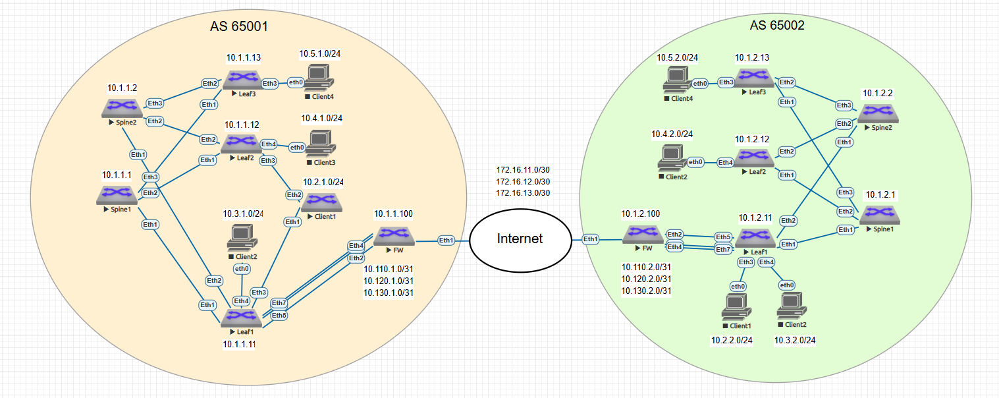

## Адресное пространство:

<details>
<summary> ЦОД 1 </summary>
  
|Device|Interface|IP Address|Subnet Mask
|---|---|---|---|
Spine1|lo1|10.1.1.1|255.255.255.255
Spine1|eth1|192.168.1.0|255.255.255.254
Spine1|eth2|192.168.1.2|255.255.255.254
Spine1|eth3|192.168.1.4|255.255.255.254
Spine2|lo1|10.1.1.2|255.255.255.255
Spine2|eth1|192.168.2.0|255.255.255.254
Spine2|eth2|192.168.2.2|255.255.255.254
Spine2|eth3|192.168.2.4|255.255.255.254
Leaf1|lo1|10.1.1.11|255.255.255.255
Leaf1|eth1|192.168.1.1|255.255.255.254
Leaf1|eth2|192.168.2.1|255.255.255.254
Leaf1|vlan2|10.2.1.201|255.255.255.0
Leaf1|vlan2_any|10.2.1.254|255.255.255.0
Leaf1|vlan3|10.3.1.201|255.255.255.0
Leaf1|vlan3_any|10.3.1.254|255.255.255.0
Leaf2|lo1|10.1.1.12|255.255.255.255
Leaf2|eth1|192.168.1.3|255.255.255.254
Leaf2|eth2|192.168.2.3|255.255.255.254
Leaf2|vlan2|10.2.1.202|255.255.255.0
Leaf2|vlan2_any|10.2.1.254|255.255.255.0
Leaf2|vlan4|10.4.1.202|255.255.255.0
Leaf2|vlan4_any|10.4.1.254|255.255.255.0
Leaf3|lo1|10.1.1.13|255.255.255.255
Leaf3|eth1|192.168.1.5|255.255.255.254
Leaf3|eth2|192.168.1.5|255.255.255.254
Leaf3|eth5|10.110.1.1|255.255.255.254
Leaf3|eth6|10.120.1.1|255.255.255.254
Leaf3|eth7|10.130.1.1|255.255.255.254
Leaf3|vlan5|10.5.1.203|255.255.255.0
Leaf3|vlan5_any|10.5.1.254|255.255.255.0
Client1|eth0|10.2.1.100|255.255.255.0
Client2|eth0|10.3.1.100|255.255.255.0
Client3|eth0|10.4.1.100|255.255.255.0
Client4|eth0|10.5.1.100|255.255.255.0
FW|lo1|10.1.1.100|255.255.255.252
FW|eth1|203.0.113.1|255.255.255.254
FW|eth2|10.110.1.0|255.255.255.254
FW|eth3|10.120.1.0|255.255.255.254
FW|eth4|10.130.1.0|255.255.255.254
FW|tunnel11|172.16.11.1|255.255.255.252
FW|tunnel12|172.16.12.1|255.255.255.252
FW|tunnel13|172.16.13.1|255.255.255.252
</details>

<details>
<summary> ЦОД 2 </summary>
  
|Device|Interface|IP Address|Subnet Mask
|---|---|---|---|
Spine1|lo1|10.1.2.1|255.255.255.255
Spine1|eth1|192.168.1.0|255.255.255.254
Spine1|eth2|192.168.1.2|255.255.255.254
Spine1|eth3|192.168.1.4|255.255.255.254
Spine2|lo1|10.1.2.2|255.255.255.255
Spine2|eth1|192.168.2.0|255.255.255.254
Spine2|eth2|192.168.2.2|255.255.255.254
Spine2|eth3|192.168.2.4|255.255.255.254
Leaf1|lo1|10.1.2.11|255.255.255.255
Leaf1|eth1|192.168.1.1|255.255.255.254
Leaf1|eth2|192.168.2.1|255.255.255.254
Leaf1|vlan2|10.2.2.201|255.255.255.0
Leaf1|vlan2_any|10.2.2.254|255.255.255.0
Leaf1|vlan3|10.3.2.201|255.255.255.0
Leaf1|vlan3_any|10.3.2.254|255.255.255.0
Leaf2|lo1|10.1.2.12|255.255.255.255
Leaf2|eth1|192.168.1.3|255.255.255.254
Leaf2|eth2|192.168.2.3|255.255.255.254
Leaf2|vlan2|10.2.2.202|255.255.255.0
Leaf2|vlan2_any|10.2.2.254|255.255.255.0
Leaf2|vlan4|10.4.2.202|255.255.255.0
Leaf2|vlan4_any|10.4.2.254|255.255.255.0
Leaf3|lo1|10.1.2.13|255.255.255.255
Leaf3|eth1|192.168.1.5|255.255.255.254
Leaf3|eth2|192.168.1.5|255.255.255.254
Leaf3|eth5|10.110.2.1|255.255.255.254
Leaf3|eth6|10.120.2.1|255.255.255.254
Leaf3|eth7|10.130.2.1|255.255.255.254
Leaf3|vlan5|10.5.2.203|255.255.255.0
Leaf3|vlan5_any|10.5.2.254|255.255.255.0
Client1|eth0|10.2.2.100|255.255.255.0
Client2|eth0|10.3.2.100|255.255.255.0
Client3|eth0|10.4.2.100|255.255.255.0
Client4|eth0|10.5.2.100|255.255.255.0
FW|lo1|10.1.2.100|255.255.255.252
FW|eth1|203.0.113.2|255.255.255.254
FW|eth2|10.110.2.0|255.255.255.254
FW|eth3|10.120.2.0|255.255.255.254
FW|eth4|10.130.2.0|255.255.255.254
FW|tunnel11|172.16.11.2|255.255.255.252
FW|tunnel12|172.16.12.2|255.255.255.252
FW|tunnel13|172.16.13.2|255.255.255.252
</details>

## Настройки сетевого оборудования:
### ЦОД 1
<details>
<summary> Spines </summary>
  
#### Spine 1
```
service routing protocols model multi-agent
!
no logging console
!
hostname Spine1_1
!
spanning-tree mode mstp
!
interface Ethernet1
   mtu 9000
   no switchport
   ip address 192.168.1.0/31
!
interface Ethernet2
   mtu 9000
   no switchport
   ip address 192.168.1.2/31
!
interface Ethernet3
   mtu 9000
   no switchport
   ip address 192.168.1.4/31
!
interface Ethernet4
!
interface Ethernet5
!
interface Ethernet6
!
interface Ethernet7
!
interface Ethernet8
!
interface Loopback0
   ip address 10.1.1.1/32
!
interface Management1
!
ip routing
!
peer-filter LEAF_PF
   10 match as-range 65001 result accept
!
router bgp 65001
   router-id 10.1.1.1
   maximum-paths 3 ecmp 3
   bgp listen range 192.168.1.0/28 peer-group LEAF_NEIGHBOR peer-filter LEAF_PF
   bgp listen range 10.1.1.0/28 peer-group LEAF_NEIGHBOR_VXLAN peer-filter LEAF_PF
   neighbor LEAF_NEIGHBOR peer group
   neighbor LEAF_NEIGHBOR next-hop-self
   neighbor LEAF_NEIGHBOR out-delay 0
   neighbor LEAF_NEIGHBOR route-reflector-client
   neighbor LEAF_NEIGHBOR timers 3 9
   neighbor LEAF_NEIGHBOR_VXLAN peer group
   neighbor LEAF_NEIGHBOR_VXLAN update-source Loopback0
   neighbor LEAF_NEIGHBOR_VXLAN ebgp-multihop 3
   neighbor LEAF_NEIGHBOR_VXLAN route-reflector-client
   neighbor LEAF_NEIGHBOR_VXLAN send-community extended
   !
   address-family evpn
      neighbor LEAF_NEIGHBOR_VXLAN activate
   !
   address-family ipv4
      neighbor LEAF_NEIGHBOR activate
      network 10.1.1.1/32
!
end

```
  
#### Spine 2
```
service routing protocols model multi-agent
!
no logging console
!
hostname Spine2_1
!
spanning-tree mode mstp
!
interface Ethernet1
   mtu 9000
   no switchport
   ip address 192.168.2.0/31
!
interface Ethernet2
   mtu 9000
   no switchport
   ip address 192.168.2.2/31
!
interface Ethernet3
   mtu 9000
   no switchport
   ip address 192.168.2.4/31
!
interface Ethernet4
!
interface Ethernet5
!
interface Ethernet6
!
interface Ethernet7
!
interface Ethernet8
!
interface Loopback0
   ip address 10.1.1.2/32
!
interface Management1
!
ip routing
!
peer-filter LEAF_PF
   10 match as-range 65001 result accept
!
router bgp 65001
   router-id 10.1.1.2
   maximum-paths 3 ecmp 3
   bgp listen range 192.168.2.0/28 peer-group LEAF_NEIGHBOR peer-filter LEAF_PF
   bgp listen range 10.1.1.0/28 peer-group LEAF_NEIGHBOR_VXLAN peer-filter LEAF_PF
   neighbor LEAF_NEIGHBOR peer group
   neighbor LEAF_NEIGHBOR next-hop-self
   neighbor LEAF_NEIGHBOR out-delay 0
   neighbor LEAF_NEIGHBOR route-reflector-client
   neighbor LEAF_NEIGHBOR timers 3 9
   neighbor LEAF_NEIGHBOR_VXLAN peer group
   neighbor LEAF_NEIGHBOR_VXLAN update-source Loopback0
   neighbor LEAF_NEIGHBOR_VXLAN ebgp-multihop 3
   neighbor LEAF_NEIGHBOR_VXLAN route-reflector-client
   neighbor LEAF_NEIGHBOR_VXLAN send-community extended
   neighbor SPINE_NEIGHBOR peer group
   !
   address-family evpn
      neighbor LEAF_NEIGHBOR_VXLAN activate
   !
   address-family ipv4
      neighbor LEAF_NEIGHBOR activate
      network 10.1.1.2/32
!
end

```
</details>

<details>
<summary> Leafs </summary>
  
#### Leaf 1
```
service routing protocols model multi-agent
!
no logging console
!
hostname Leaf1_1
!
spanning-tree mode mstp
!
vlan 2
   name SERVERS1
!
vlan 3
   name SERVERS2
!
vrf instance CON_VRF1
!
vrf instance CON_VRF2
!
vrf instance CON_VRF3
!
interface Port-Channel2
   switchport access vlan 2
   !
   evpn ethernet-segment
      identifier 0000:0000:0000:0000:0002
      route-target import 00:00:00:00:00:02
   lacp system-id 02aa.aaaa.0002
!
interface Ethernet1
   mtu 9000
   no switchport
   ip address 192.168.1.1/31
!
interface Ethernet2
   mtu 9000
   no switchport
   ip address 192.168.2.1/31
!
interface Ethernet3
   mtu 9000
   channel-group 2 mode active
!
interface Ethernet4
   mtu 9000
   switchport access vlan 3
!
interface Ethernet5
   mtu 9000
   no switchport
   vrf CON_VRF1
   ip address 10.110.1.1/31
!
interface Ethernet6
   mtu 9000
   no switchport
   vrf CON_VRF2
   ip address 10.120.1.1/31
!
interface Ethernet7
   mtu 9000
   no switchport
   vrf CON_VRF3
   ip address 10.130.1.1/31
!
interface Ethernet8
!
interface Loopback0
   ip address 10.1.1.11/32
!
interface Management1
!
interface Vlan2
   vrf CON_VRF1
   ip address 10.2.1.201/24
   ip virtual-router address 10.2.1.254/24
!
interface Vlan3
   vrf CON_VRF1
   ip address 10.3.1.201/24
   ip virtual-router address 10.3.1.254/24
!
interface Vxlan1
   vxlan source-interface Loopback0
   vxlan udp-port 4789
   vxlan vlan 2 vni 10002
   vxlan vlan 3 vni 10003
   vxlan vrf CON_VRF1 vni 10100
   vxlan vrf CON_VRF2 vni 10200
   vxlan vrf CON_VRF3 vni 10300
   vxlan learn-restrict any
!
ip virtual-router mac-address 12:00:00:00:00:00
!
ip routing
ip routing vrf CON_VRF1
ip routing vrf CON_VRF2
ip routing vrf CON_VRF3
!
ip prefix-list TYPE2_ROUTE
   seq 10 permit 0.0.0.0/0 ge 32
!
ip route vrf CON_VRF1 0.0.0.0/0 10.110.1.0
ip route vrf CON_VRF2 0.0.0.0/0 10.120.1.0
ip route vrf CON_VRF3 0.0.0.0/0 10.130.1.0
!
route-map FW_ROUTES deny 10
   match ip address prefix-list TYPE2_ROUTE
!
route-map FW_ROUTES permit 20
!
router bgp 65001
   router-id 10.1.1.11
   maximum-paths 2 ecmp 2
   neighbor FW peer group
   neighbor FW remote-as 65001
   neighbor FW allowas-in 3
   neighbor FW timers 3 9
   neighbor FW route-map FW_ROUTES out
   neighbor SPINE_NEIGHBOR peer group
   neighbor SPINE_NEIGHBOR remote-as 65001
   neighbor SPINE_NEIGHBOR out-delay 0
   neighbor SPINE_NEIGHBOR timers 3 9
   neighbor SPINE_NEIGHBOR_VXLAN peer group
   neighbor SPINE_NEIGHBOR_VXLAN remote-as 65001
   neighbor SPINE_NEIGHBOR_VXLAN update-source Loopback0
   neighbor SPINE_NEIGHBOR_VXLAN ebgp-multihop 3
   neighbor SPINE_NEIGHBOR_VXLAN send-community extended
   neighbor 10.1.1.1 peer group SPINE_NEIGHBOR_VXLAN
   neighbor 10.1.1.2 peer group SPINE_NEIGHBOR_VXLAN
   neighbor 192.168.1.0 peer group SPINE_NEIGHBOR
   neighbor 192.168.2.0 peer group SPINE_NEIGHBOR
   !
   vlan 2
      rd auto
      route-target both 2:10002
      redistribute learned
   !
   vlan 3
      rd auto
      route-target both 3:10003
      redistribute learned
   !
   address-family evpn
      neighbor SPINE_NEIGHBOR_VXLAN activate
   !
   address-family ipv4
      neighbor FW activate
      neighbor SPINE_NEIGHBOR activate
      network 10.1.1.11/32
   !
   vrf CON_VRF1
      rd 10.1.1.11:100
      route-target import evpn 100:10100
      route-target export evpn 100:10100
      router-id 10.1.1.11
      neighbor 10.110.1.0 peer group FW
      neighbor 10.110.1.0 route-reflector-client
      !
      address-family ipv4
         neighbor 10.110.1.0 activate
         redistribute connected
         redistribute static
   !
   vrf CON_VRF2
      rd 10.1.1.11:200
      route-target import evpn 200:10200
      route-target export evpn 200:10200
      router-id 10.1.1.11
      neighbor 10.120.1.0 peer group FW
      neighbor 10.120.1.0 route-reflector-client
      !
      address-family ipv4
         neighbor 10.120.1.0 activate
         redistribute connected
         redistribute static
   !
   vrf CON_VRF3
      rd 10.1.1.11:300
      route-target import evpn 300:10300
      route-target export evpn 300:10300
      router-id 10.1.1.11
      neighbor 10.130.1.0 peer group FW
      neighbor 10.130.1.0 route-reflector-client
      !
      address-family ipv4
         neighbor 10.130.1.0 activate
         redistribute connected
         redistribute static
!
end

```

#### Leaf 2
```
service routing protocols model multi-agent
!
no logging console
!
hostname Leaf2_1
!
spanning-tree mode mstp
!
vlan 2
   name SERVERS1
!
vlan 4
   name SERVERS_DMZ
!
vrf instance CON_VRF1
!
vrf instance CON_VRF2
!
interface Port-Channel2
   switchport access vlan 2
   !
   evpn ethernet-segment
      identifier 0000:0000:0000:0000:0002
      route-target import 00:00:00:00:00:02
   lacp system-id 02aa.aaaa.0002
!
interface Ethernet1
   mtu 9000
   no switchport
   ip address 192.168.1.3/31
!
interface Ethernet2
   mtu 9000
   no switchport
   ip address 192.168.2.3/31
!
interface Ethernet3
   mtu 9000
   channel-group 2 mode active
!
interface Ethernet4
   mtu 9000
   switchport access vlan 4
!
interface Ethernet5
!
interface Ethernet6
!
interface Ethernet7
!
interface Ethernet8
!
interface Loopback0
   ip address 10.1.1.12/32
!
interface Management1
!
interface Vlan2
   vrf CON_VRF1
   ip address 10.2.1.202/24
   ip virtual-router address 10.2.1.254/24
!
interface Vlan4
   vrf CON_VRF2
   ip address 10.4.1.202/24
   ip virtual-router address 10.4.1.254/24
!
interface Vxlan1
   vxlan source-interface Loopback0
   vxlan udp-port 4789
   vxlan vlan 2 vni 10002
   vxlan vlan 4 vni 10004
   vxlan vrf CON_VRF1 vni 10100
   vxlan vrf CON_VRF2 vni 10200
   vxlan learn-restrict any
!
ip virtual-router mac-address 12:00:00:00:00:00
!
ip routing
ip routing vrf CON_VRF1
ip routing vrf CON_VRF2
!
router bgp 65001
   router-id 10.1.1.12
   maximum-paths 2 ecmp 2
   neighbor SPINE_NEIGHBOR peer group
   neighbor SPINE_NEIGHBOR remote-as 65001
   neighbor SPINE_NEIGHBOR out-delay 0
   neighbor SPINE_NEIGHBOR bfd
   neighbor SPINE_NEIGHBOR timers 3 9
   neighbor SPINE_NEIGHBOR_VXLAN peer group
   neighbor SPINE_NEIGHBOR_VXLAN remote-as 65001
   neighbor SPINE_NEIGHBOR_VXLAN update-source Loopback0
   neighbor SPINE_NEIGHBOR_VXLAN ebgp-multihop 3
   neighbor SPINE_NEIGHBOR_VXLAN send-community extended
   neighbor 10.1.1.1 peer group SPINE_NEIGHBOR_VXLAN
   neighbor 10.1.1.2 peer group SPINE_NEIGHBOR_VXLAN
   neighbor 192.168.1.2 peer group SPINE_NEIGHBOR
   neighbor 192.168.2.2 peer group SPINE_NEIGHBOR
   !
   vlan 2
      rd auto
      route-target both 2:10002
      redistribute learned
   !
   vlan 4
      rd auto
      route-target both 4:10004
      redistribute learned
   !
   address-family evpn
      neighbor SPINE_NEIGHBOR_VXLAN activate
   !
   address-family ipv4
      neighbor SPINE_NEIGHBOR activate
      network 10.1.1.12/32
   !
   vrf CON_VRF1
      rd 10.1.1.12:100
      route-target import evpn 100:10100
      route-target export evpn 100:10100
      router-id 10.1.1.12
      !
      address-family ipv4
         redistribute connected
   !
   vrf CON_VRF2
      rd 10.1.1.12:200
      route-target import evpn 200:10200
      route-target export evpn 200:10200
      router-id 10.1.1.12
      !
      address-family ipv4
         redistribute connected
!
end

```

#### Leaf 3
```
service routing protocols model multi-agent
!
no logging console
!
hostname Leaf3_1
!
spanning-tree mode mstp
!
vlan 5
   name SERVERS_OUT
!
vrf instance CON_VRF3
!
interface Ethernet1
   mtu 9000
   no switchport
   ip address 192.168.1.5/31
!
interface Ethernet2
   mtu 9000
   no switchport
   ip address 192.168.2.5/31
!
interface Ethernet3
   mtu 9000
   switchport access vlan 5
!
interface Ethernet4
!
interface Ethernet5
!
interface Ethernet6
!
interface Ethernet7
!
interface Ethernet8
!
interface Loopback0
   ip address 10.1.1.13/32
!
interface Management1
!
interface Vlan5
   vrf CON_VRF3
   ip address 10.5.1.203/24
   ip virtual-router address 10.5.1.254/24
!
interface Vxlan1
   vxlan source-interface Loopback0
   vxlan udp-port 4789
   vxlan vlan 5 vni 10005
   vxlan vrf CON_VRF3 vni 10300
   vxlan learn-restrict any
!
ip virtual-router mac-address 12:00:00:00:00:00
!
ip routing
ip routing vrf CON_VRF3
!
router bgp 65001
   router-id 10.1.1.13
   maximum-paths 2 ecmp 2
   neighbor SPINE_NEIGHBOR peer group
   neighbor SPINE_NEIGHBOR remote-as 65001
   neighbor SPINE_NEIGHBOR out-delay 0
   neighbor SPINE_NEIGHBOR timers 3 9
   neighbor SPINE_NEIGHBOR_VXLAN peer group
   neighbor SPINE_NEIGHBOR_VXLAN remote-as 65001
   neighbor SPINE_NEIGHBOR_VXLAN update-source Loopback0
   neighbor SPINE_NEIGHBOR_VXLAN ebgp-multihop 3
   neighbor SPINE_NEIGHBOR_VXLAN send-community extended
   neighbor 10.1.1.1 peer group SPINE_NEIGHBOR_VXLAN
   neighbor 10.1.1.2 peer group SPINE_NEIGHBOR_VXLAN
   neighbor 192.168.1.4 peer group SPINE_NEIGHBOR
   neighbor 192.168.2.4 peer group SPINE_NEIGHBOR
   !
   vlan 5
      rd auto
      route-target both 5:10005
      redistribute learned
   !
   address-family evpn
      neighbor SPINE_NEIGHBOR_VXLAN activate
   !
   address-family ipv4
      neighbor SPINE_NEIGHBOR activate
      network 10.1.1.13/32
   !
   vrf CON_VRF3
      rd 10.1.1.13:300
      route-target import evpn 300:10300
      route-target export evpn 300:10300
      router-id 10.1.1.13
      !
      address-family ipv4
         redistribute connected
!
end

```
</details>

<details>
<summary> Firewall </summary>
  
#### FW
```
service routing protocols model multi-agent
!
no logging console
!
hostname FW-1_1
!
spanning-tree mode mstp
!
vrf instance CON_VRF1
!
vrf instance CON_VRF2
!
vrf instance CON_VRF3
!
ip security
   ike policy ike-vxlan
      encryption aes256
      dh-group 24
   !
   sa policy sa-vxlan
      sa lifetime 2 hours
      pfs dh-group 14
   !
   profile vxlan
      ike-policy ike-vxlan
      sa-policy sa-vxlan
      shared-key 7 053D3E232042
      dpd 10 50 clear
      mode transport
!
interface Ethernet1
   description OUTSIDE
   no switchport
   ip address 203.0.113.1/30
!
interface Ethernet2
   mtu 9000
   no switchport
   vrf CON_VRF1
   ip address 10.110.1.0/31
!
interface Ethernet3
   mtu 9000
   no switchport
   vrf CON_VRF2
   ip address 10.120.1.0/31
!
interface Ethernet4
   mtu 9000
   no switchport
   vrf CON_VRF3
   ip address 10.130.1.0/31
!
interface Ethernet5
!
interface Ethernet6
!
interface Ethernet7
!
interface Ethernet8
!
interface Loopback0
   ip address 10.1.1.100/32
!
interface Management1
!
interface Tunnel11
   mtu 1376
   vrf CON_VRF1
   ip address 172.16.11.1/30
   tunnel mode gre
   tunnel source 203.0.113.1
   tunnel destination 203.0.113.2
   tunnel key 11
   tunnel ipsec vxlan
!
interface Tunnel12
   mtu 1376
   vrf CON_VRF2
   ip address 172.16.12.1/30
   tunnel mode gre
   tunnel source 203.0.113.1
   tunnel destination 203.0.113.2
   tunnel key 12
   tunnel ipsec vxlan
!
interface Tunnel13
   mtu 1376
   vrf CON_VRF3
   ip address 172.16.13.1/30
   tunnel mode gre
   tunnel source 203.0.113.1
   tunnel destination 203.0.113.2
   tunnel key 13
   tunnel ipsec vxlan
!
interface Vlan2
!
ip access-list DMZ_TO_TRUSTED
   10 permit tcp 10.4.0.0/16 10.2.0.0/16 established
   20 permit tcp 10.4.0.0/16 10.3.0.0/16 established
   30 permit icmp 10.4.0.0/16 10.2.0.0/16 echo-reply
   40 permit icmp 10.4.0.0/16 10.3.0.0/16 echo-reply
   50 deny ip any any
!
ip routing
ip routing vrf CON_VRF1
ip routing vrf CON_VRF2
ip routing vrf CON_VRF3
!
ip route vrf CON_VRF1 10.4.1.0/24 egress-vrf CON_VRF2 10.120.1.1
ip route vrf CON_VRF1 10.4.2.0/24 egress-vrf CON_VRF2 10.120.1.1
ip route vrf CON_VRF2 10.2.1.0/24 egress-vrf CON_VRF1 10.110.1.1
ip route vrf CON_VRF2 10.2.2.0/24 egress-vrf CON_VRF1 10.110.1.1
ip route vrf CON_VRF2 10.3.2.0/24 egress-vrf CON_VRF1 10.110.1.1
!
router bgp 65001
   router-id 10.1.1.100
   neighbor FABRIC peer group
   neighbor FABRIC remote-as 65001
   neighbor FABRIC next-hop-self
   neighbor FABRIC allowas-in 3
   neighbor FABRIC timers 3 9
   !
   vrf CON_VRF1
      neighbor 10.110.1.1 peer group FABRIC
      neighbor 172.16.11.2 remote-as 65002
      neighbor 172.16.11.2 timers 3 9
      !
      address-family ipv4
         neighbor 10.110.1.1 activate
         neighbor 172.16.11.2 activate
         redistribute connected
   !
   vrf CON_VRF2
      neighbor 10.120.1.1 peer group FABRIC
      neighbor 172.16.12.2 remote-as 65002
      neighbor 172.16.12.2 timers 3 9
      !
      address-family ipv4
         neighbor 10.120.1.1 activate
         neighbor 172.16.12.2 activate
         redistribute connected
   !
   vrf CON_VRF3
      neighbor 10.130.1.1 peer group FABRIC
      neighbor 172.16.13.2 remote-as 65002
      neighbor 172.16.13.2 timers 3 9
      !
      address-family ipv4
         neighbor 10.130.1.1 activate
         neighbor 172.16.13.2 activate
         redistribute connected
!
end

```
</details>

<details>
<summary> Clients </summary>
  
#### Client 1
```
hostname Client1
!
spanning-tree mode mstp
!
vlan 2
!
interface Port-Channel2
   switchport access vlan 2
!
interface Ethernet1
   channel-group 2 mode active
!
interface Ethernet2
   channel-group 2 mode active
!
interface Ethernet3
!
interface Ethernet4
!
interface Ethernet5
!
interface Ethernet6
!
interface Ethernet7
!
interface Ethernet8
!
interface Management1
!
interface Vlan2
   ip address 10.2.1.100/24
!
no ip routing
!
ip route 0.0.0.0/0 10.2.1.254
!
end
```
#### Client 2
```
ip 10.3.1.100 255.255.255.0 10.3.1.254
```
#### Client 3
```
ip 10.4.1.100 255.255.255.0 10.4.1.254
```
#### Client 4
```
ip 10.5.1.100 255.255.255.0 10.5.1.254
```
</details>

### ЦОД 2
<details>
<summary> Spines </summary>
  
#### Spine 1
```
service routing protocols model multi-agent
!
no logging console
!
hostname Spine1_2
!
spanning-tree mode mstp
!
interface Ethernet1
   mtu 9000
   no switchport
   ip address 192.168.1.0/31
!
interface Ethernet2
   mtu 9000
   no switchport
   ip address 192.168.1.2/31
!
interface Ethernet3
   mtu 9000
   no switchport
   ip address 192.168.1.4/31
!
interface Ethernet4
!
interface Ethernet5
!
interface Ethernet6
!
interface Ethernet7
!
interface Ethernet8
!
interface Loopback0
   ip address 10.1.2.1/32
!
interface Management1
!
ip routing
!
peer-filter LEAF_PF
   10 match as-range 65002 result accept
!
router bgp 65002
   router-id 10.1.2.1
   maximum-paths 3 ecmp 3
   bgp listen range 192.168.1.0/28 peer-group LEAF_NEIGHBOR peer-filter LEAF_PF
   bgp listen range 10.1.2.0/28 peer-group LEAF_NEIGHBOR_VXLAN peer-filter LEAF_PF
   neighbor LEAF_NEIGHBOR peer group
   neighbor LEAF_NEIGHBOR next-hop-self
   neighbor LEAF_NEIGHBOR out-delay 0
   neighbor LEAF_NEIGHBOR route-reflector-client
   neighbor LEAF_NEIGHBOR timers 3 9
   neighbor LEAF_NEIGHBOR_VXLAN peer group
   neighbor LEAF_NEIGHBOR_VXLAN update-source Loopback0
   neighbor LEAF_NEIGHBOR_VXLAN ebgp-multihop 3
   neighbor LEAF_NEIGHBOR_VXLAN route-reflector-client
   neighbor LEAF_NEIGHBOR_VXLAN send-community extended
   !
   address-family evpn
      neighbor LEAF_NEIGHBOR_VXLAN activate
   !
   address-family ipv4
      neighbor LEAF_NEIGHBOR activate
      network 10.1.2.1/32
!
end

```
  
#### Spine 2
```
service routing protocols model multi-agent
!
no logging console
!
hostname Spine2_2
!
spanning-tree mode mstp
!
interface Ethernet1
   mtu 9000
   no switchport
   ip address 192.168.2.0/31
!
interface Ethernet2
   mtu 9000
   no switchport
   ip address 192.168.2.2/31
!
interface Ethernet3
   mtu 9000
   no switchport
   ip address 192.168.2.4/31
!
interface Ethernet4
!
interface Ethernet5
!
interface Ethernet6
!
interface Ethernet7
!
interface Ethernet8
!
interface Loopback0
   ip address 10.1.2.2/32
!
interface Management1
!
ip routing
!
peer-filter LEAF_PF
   10 match as-range 65002 result accept
!
router bgp 65002
   router-id 10.1.2.2
   maximum-paths 3 ecmp 3
   bgp listen range 192.168.2.0/28 peer-group LEAF_NEIGHBOR peer-filter LEAF_PF
   bgp listen range 10.1.2.0/28 peer-group LEAF_NEIGHBOR_VXLAN peer-filter LEAF_PF
   neighbor LEAF_NEIGHBOR peer group
   neighbor LEAF_NEIGHBOR next-hop-self
   neighbor LEAF_NEIGHBOR out-delay 0
   neighbor LEAF_NEIGHBOR route-reflector-client
   neighbor LEAF_NEIGHBOR timers 3 9
   neighbor LEAF_NEIGHBOR_VXLAN peer group
   neighbor LEAF_NEIGHBOR_VXLAN update-source Loopback0
   neighbor LEAF_NEIGHBOR_VXLAN ebgp-multihop 3
   neighbor LEAF_NEIGHBOR_VXLAN route-reflector-client
   neighbor LEAF_NEIGHBOR_VXLAN send-community extended
   !
   address-family evpn
      neighbor LEAF_NEIGHBOR_VXLAN activate
   !
   address-family ipv4
      neighbor LEAF_NEIGHBOR activate
      network 10.1.2.2/32
!
end

```
</details>

<details>
<summary> Leafs </summary>
  
#### Leaf 1
```
service routing protocols model multi-agent
!
no logging console
!
hostname Leaf1_2
!
spanning-tree mode mstp
!
vlan 2
   name SERVERS1
!
vlan 3
   name SERVERS2
!
vrf instance CON_VRF1
!
vrf instance CON_VRF2
!
vrf instance CON_VRF3
!
interface Ethernet1
   mtu 9000
   no switchport
   ip address 192.168.1.1/31
!
interface Ethernet2
   mtu 9000
   no switchport
   ip address 192.168.2.1/31
!
interface Ethernet3
   mtu 9000
   switchport access vlan 2
!
interface Ethernet4
   mtu 9000
   switchport access vlan 3
!
interface Ethernet5
   mtu 9000
   no switchport
   vrf CON_VRF1
   ip address 10.110.2.1/31
!
interface Ethernet6
   mtu 9000
   no switchport
   vrf CON_VRF2
   ip address 10.120.2.1/31
!
interface Ethernet7
   mtu 9000
   no switchport
   vrf CON_VRF3
   ip address 10.130.2.1/31
!
interface Ethernet8
!
interface Loopback0
   ip address 10.1.2.11/32
!
interface Management1
!
interface Vlan2
   vrf CON_VRF1
   ip address 10.2.2.201/24
   ip virtual-router address 10.2.2.254/24
!
interface Vlan3
   vrf CON_VRF1
   ip address 10.3.2.201/24
   ip virtual-router address 10.3.2.254/24
!
interface Vxlan1
   vxlan source-interface Loopback0
   vxlan udp-port 4789
   vxlan vlan 2 vni 10002
   vxlan vlan 3 vni 10003
   vxlan vrf CON_VRF1 vni 10100
   vxlan vrf CON_VRF2 vni 10200
   vxlan vrf CON_VRF3 vni 10300
   vxlan learn-restrict any
!
ip virtual-router mac-address 12:00:00:00:00:02
!
ip routing
ip routing vrf CON_VRF1
ip routing vrf CON_VRF2
ip routing vrf CON_VRF3
!
ip prefix-list TYPE2_ROUTE
   seq 10 permit 0.0.0.0/0 ge 32
!
ip route vrf CON_VRF1 0.0.0.0/0 10.110.2.0
ip route vrf CON_VRF2 0.0.0.0/0 10.120.2.0
ip route vrf CON_VRF3 0.0.0.0/0 10.130.2.0
!
route-map FW_ROUTES deny 10
   match ip address prefix-list TYPE2_ROUTE
!
route-map FW_ROUTES permit 20
!
router bgp 65002
   router-id 10.1.2.11
   maximum-paths 2 ecmp 2
   neighbor FW peer group
   neighbor FW remote-as 65002
   neighbor FW allowas-in 3
   neighbor FW timers 3 9
   neighbor FW route-map FW_ROUTES out
   neighbor SPINE_NEIGHBOR peer group
   neighbor SPINE_NEIGHBOR remote-as 65002
   neighbor SPINE_NEIGHBOR out-delay 0
   neighbor SPINE_NEIGHBOR timers 3 9
   neighbor SPINE_NEIGHBOR_VXLAN peer group
   neighbor SPINE_NEIGHBOR_VXLAN remote-as 65002
   neighbor SPINE_NEIGHBOR_VXLAN update-source Loopback0
   neighbor SPINE_NEIGHBOR_VXLAN ebgp-multihop 3
   neighbor SPINE_NEIGHBOR_VXLAN send-community extended
   neighbor 10.1.2.1 peer group SPINE_NEIGHBOR_VXLAN
   neighbor 10.1.2.2 peer group SPINE_NEIGHBOR_VXLAN
   neighbor 192.168.1.0 peer group SPINE_NEIGHBOR
   neighbor 192.168.2.0 peer group SPINE_NEIGHBOR
   !
   vlan 2
      rd auto
      route-target both 2:10002
      redistribute learned
   !
   vlan 3
      rd auto
      route-target both 3:10003
      redistribute learned
   !
   address-family evpn
      neighbor SPINE_NEIGHBOR_VXLAN activate
   !
   address-family ipv4
      neighbor FW activate
      neighbor SPINE_NEIGHBOR activate
      network 10.1.2.11/32
   !
   vrf CON_VRF1
      rd 10.1.2.11:100
      route-target import evpn 100:10100
      route-target export evpn 100:10100
      router-id 10.1.2.11
      neighbor 10.110.2.0 peer group FW
      neighbor 10.110.2.0 route-reflector-client
      !
      address-family ipv4
         neighbor 10.110.2.0 activate
         redistribute connected
         redistribute static
   !
   vrf CON_VRF2
      rd 10.1.2.11:200
      route-target import evpn 200:10200
      route-target export evpn 200:10200
      router-id 10.1.2.11
      neighbor 10.120.2.0 peer group FW
      neighbor 10.120.2.0 route-reflector-client
      !
      address-family ipv4
         neighbor 10.120.2.0 activate
         redistribute connected
         redistribute static
   !
   vrf CON_VRF3
      rd 10.1.2.11:300
      route-target import evpn 300:10300
      route-target export evpn 300:10300
      router-id 10.1.2.11
      neighbor 10.130.2.0 peer group FW
      neighbor 10.130.2.0 route-reflector-client
      !
      address-family ipv4
         neighbor 10.130.2.0 activate
         redistribute connected
         redistribute static
!
end


```

#### Leaf 2
```
service routing protocols model multi-agent
!
no logging console
!
hostname Leaf2_2
!
spanning-tree mode mstp
!
vlan 4
   name SERVERS_DMZ
!
vrf instance CON_VRF2
!
interface Ethernet1
   mtu 9000
   no switchport
   ip address 192.168.1.3/31
!
interface Ethernet2
   mtu 9000
   no switchport
   ip address 192.168.2.3/31
!
interface Ethernet3
   mtu 9000
   switchport access vlan 4
!
interface Ethernet4
   mtu 9000
   switchport access vlan 4
!
interface Ethernet5
!
interface Ethernet6
!
interface Ethernet7
!
interface Ethernet8
!
interface Loopback0
   ip address 10.1.2.12/32
!
interface Management1
!
interface Vlan4
   vrf CON_VRF2
   ip address 10.4.2.202/24
   ip virtual-router address 10.4.2.254/24
!
interface Vxlan1
   vxlan source-interface Loopback0
   vxlan udp-port 4789
   vxlan vlan 4 vni 10004
   vxlan vrf CON_VRF2 vni 10200
   vxlan learn-restrict any
!
ip virtual-router mac-address 12:00:00:00:00:02
!
ip routing
ip routing vrf CON_VRF2
!
router bgp 65002
   router-id 10.1.2.12
   maximum-paths 2 ecmp 2
   neighbor SPINE_NEIGHBOR peer group
   neighbor SPINE_NEIGHBOR remote-as 65002
   neighbor SPINE_NEIGHBOR out-delay 0
   neighbor SPINE_NEIGHBOR bfd
   neighbor SPINE_NEIGHBOR timers 3 9
   neighbor SPINE_NEIGHBOR_VXLAN peer group
   neighbor SPINE_NEIGHBOR_VXLAN remote-as 65002
   neighbor SPINE_NEIGHBOR_VXLAN update-source Loopback0
   neighbor SPINE_NEIGHBOR_VXLAN ebgp-multihop 3
   neighbor SPINE_NEIGHBOR_VXLAN send-community extended
   neighbor 10.1.2.1 peer group SPINE_NEIGHBOR_VXLAN
   neighbor 10.1.2.2 peer group SPINE_NEIGHBOR_VXLAN
   neighbor 192.168.1.2 peer group SPINE_NEIGHBOR
   neighbor 192.168.2.2 peer group SPINE_NEIGHBOR
   !
   vlan 4
      rd auto
      route-target both 4:10004
      redistribute learned
   !
   address-family evpn
      neighbor SPINE_NEIGHBOR_VXLAN activate
   !
   address-family ipv4
      neighbor SPINE_NEIGHBOR activate
      network 10.1.2.12/32
   !
   vrf CON_VRF2
      rd 10.1.2.12:200
      route-target import evpn 200:10200
      route-target export evpn 200:10200
      router-id 10.1.2.12
      !
      address-family ipv4
         redistribute connected
!
end

```

#### Leaf 3
```
service routing protocols model multi-agent
!
no logging console
!
hostname Leaf3_2
!
spanning-tree mode mstp
!
vlan 5
   name SERVERS_OUT
!
vrf instance CON_VRF3
!
interface Ethernet1
   mtu 9000
   no switchport
   ip address 192.168.1.5/31
!
interface Ethernet2
   mtu 9000
   no switchport
   ip address 192.168.2.5/31
!
interface Ethernet3
   mtu 9000
   switchport access vlan 5
!
interface Ethernet4
!
interface Ethernet5
!
interface Ethernet6
!
interface Ethernet7
!
interface Ethernet8
!
interface Loopback0
   ip address 10.1.2.13/32
!
interface Management1
!
interface Vlan5
   vrf CON_VRF3
   ip address 10.5.2.203/24
   ip virtual-router address 10.5.2.254/24
!
interface Vxlan1
   vxlan source-interface Loopback0
   vxlan udp-port 4789
   vxlan vlan 5 vni 10005
   vxlan vrf CON_VRF3 vni 10300
   vxlan learn-restrict any
!
ip virtual-router mac-address 12:00:00:00:00:02
!
ip routing
ip routing vrf CON_VRF3
!
router bgp 65002
   router-id 10.1.2.13
   maximum-paths 2 ecmp 2
   neighbor SPINE_NEIGHBOR peer group
   neighbor SPINE_NEIGHBOR remote-as 65002
   neighbor SPINE_NEIGHBOR out-delay 0
   neighbor SPINE_NEIGHBOR timers 3 9
   neighbor SPINE_NEIGHBOR_VXLAN peer group
   neighbor SPINE_NEIGHBOR_VXLAN remote-as 65002
   neighbor SPINE_NEIGHBOR_VXLAN update-source Loopback0
   neighbor SPINE_NEIGHBOR_VXLAN ebgp-multihop 3
   neighbor SPINE_NEIGHBOR_VXLAN send-community extended
   neighbor 10.1.2.1 peer group SPINE_NEIGHBOR_VXLAN
   neighbor 10.1.2.2 peer group SPINE_NEIGHBOR_VXLAN
   neighbor 192.168.1.4 peer group SPINE_NEIGHBOR
   neighbor 192.168.2.4 peer group SPINE_NEIGHBOR
   !
   vlan 5
      rd auto
      route-target both 5:10005
      redistribute learned
   !
   address-family evpn
      neighbor SPINE_NEIGHBOR_VXLAN activate
   !
   address-family ipv4
      neighbor SPINE_NEIGHBOR activate
      network 10.1.2.13/32
   !
   vrf CON_VRF3
      rd 10.1.2.13:300
      route-target import evpn 300:10300
      route-target export evpn 300:10300
      router-id 10.1.2.13
      !
      address-family ipv4
         redistribute connected
!
end

```
</details>

<details>
<summary> Firewall </summary>
  
#### FW
```
service routing protocols model multi-agent
!
no logging console
!
hostname FW-1_2
!
spanning-tree mode mstp
!
vrf instance CON_VRF1
!
vrf instance CON_VRF2
!
vrf instance CON_VRF3
!
ip security
   ike policy ike-vxlan
      encryption aes256
      dh-group 24
   !
   sa policy sa-vxlan
      sa lifetime 2 hours
      pfs dh-group 14
   !
   profile vxlan
      ike-policy ike-vxlan
      sa-policy sa-vxlan
      shared-key 7 053D3E232042
      dpd 10 50 clear
      mode transport
!
interface Ethernet1
   description OUTSIDE
   no switchport
   ip address 203.0.113.2/30
!
interface Ethernet2
   mtu 9000
   no switchport
   vrf CON_VRF1
   ip address 10.110.2.0/31
!
interface Ethernet3
   mtu 9000
   no switchport
   vrf CON_VRF2
   ip address 10.120.2.0/31
!
interface Ethernet4
   mtu 9000
   no switchport
   vrf CON_VRF3
   ip address 10.130.2.0/31
!
interface Ethernet5
!
interface Ethernet6
!
interface Ethernet7
!
interface Ethernet8
!
interface Loopback0
   ip address 10.1.2.100/32
!
interface Management1
!
interface Tunnel11
   mtu 1376
   vrf CON_VRF1
   ip address 172.16.11.2/30
   tunnel mode gre
   tunnel source 203.0.113.2
   tunnel destination 203.0.113.1
   tunnel key 11
   tunnel ipsec vxlan
!
interface Tunnel12
   mtu 1376
   vrf CON_VRF2
   ip address 172.16.12.2/30
   tunnel mode gre
   tunnel source 203.0.113.2
   tunnel destination 203.0.113.1
   tunnel key 12
   tunnel ipsec vxlan
!
interface Tunnel13
   mtu 1376
   vrf CON_VRF3
   ip address 172.16.13.2/30
   no mpls ip
   tunnel mode gre
   tunnel source 203.0.113.2
   tunnel destination 203.0.113.1
   tunnel key 13
   tunnel ipsec vxlan
!
ip access-list DMZ_TO_TRUSTED
   10 permit tcp 10.4.0.0/16 10.2.0.0/16 established
   20 permit tcp 10.4.0.0/16 10.3.0.0/16 established
   30 permit icmp 10.4.0.0/16 10.2.0.0/16 echo-reply
   40 permit icmp 10.4.0.0/16 10.3.0.0/16 echo-reply
   50 deny ip any any
!
ip routing
ip routing vrf CON_VRF1
ip routing vrf CON_VRF2
ip routing vrf CON_VRF3
!
ip route vrf CON_VRF1 10.4.1.0/24 egress-vrf CON_VRF2 10.120.2.1
ip route vrf CON_VRF1 10.4.2.0/24 egress-vrf CON_VRF2 10.120.2.1
ip route vrf CON_VRF2 10.2.1.0/24 egress-vrf CON_VRF1 10.110.2.1
ip route vrf CON_VRF2 10.2.2.0/24 egress-vrf CON_VRF1 10.110.2.1
ip route vrf CON_VRF2 10.3.1.0/24 egress-vrf CON_VRF1 10.110.2.1
ip route vrf CON_VRF2 10.3.2.0/24 egress-vrf CON_VRF1 10.110.2.1
!
mpls ip
!
router bgp 65002
   router-id 10.1.2.100
   neighbor FABRIC peer group
   neighbor FABRIC remote-as 65002
   neighbor FABRIC next-hop-self
   neighbor FABRIC allowas-in 3
   neighbor FABRIC timers 3 9
   !
   vrf CON_VRF1
      neighbor 10.110.2.1 peer group FABRIC
      neighbor 172.16.11.1 remote-as 65001
      neighbor 172.16.11.1 timers 3 9
      !
      address-family ipv4
         neighbor 10.110.2.1 activate
         neighbor 172.16.11.1 activate
         redistribute connected
   !
   vrf CON_VRF2
      neighbor 10.120.2.1 peer group FABRIC
      neighbor 172.16.12.1 remote-as 65001
      neighbor 172.16.12.1 timers 3 9
      !
      address-family ipv4
         neighbor 10.120.2.1 activate
         neighbor 172.16.12.1 activate
         redistribute connected
   !
   vrf CON_VRF3
      neighbor 10.130.2.1 peer group FABRIC
      neighbor 172.16.13.1 remote-as 65001
      neighbor 172.16.13.1 timers 3 9
      !
      address-family ipv4
         neighbor 10.130.2.1 activate
         neighbor 172.16.13.1 activate
         redistribute connected
!
end


```
</details>

<details>
<summary> Clients </summary>
  
#### Client 1
```
ip 10.2.1.100 255.255.255.0 10.2.1.254
```
#### Client 2
```
ip 10.3.1.100 255.255.255.0 10.3.1.254
```
#### Client 3
```
ip 10.4.1.100 255.255.255.0 10.4.1.254
```
#### Client 4
```
ip 10.5.1.100 255.255.255.0 10.5.1.254
```
</details>


## Пояснения к работе:


Целью проекта является объединение нескольких территориально разнесённых центров обработки данных в единый распределённый ЦОД с общей логикой адресации, сегментации и маршрутизации сервисов.
С учётом того, что объём межплощадочного трафика предполагается относительно небольшим, в качестве транспортной среды между площадками используется сеть Интернет. Для обеспечения конфиденциальности и целостности передаваемых данных межплощадочные соединения защищаются с помощью IPsec.

Основные требования к решению</br>
1.	Необходимо обеспечить связность между несколькими независимыми фабриками ЦОД с сохранением единой логики работы сервисных сегментов.</br>
2.	Требуется сохранить строгую изоляцию сетей разных классов доверия.</br>
3.	В каждом ЦОД размещаются:</br>
•	доверенные серверные сети компании;</br>
•	ДМЗ сети;</br>
•	сети сторонней компании.</br>
4.	Серверы сторонней компании должны быть полностью изолированы от внутренних сетей организации на уровне VRF и маршрутизации.</br>
5.	Обмен трафиком между доверенными сегментами и сегментами ДМЗ должен осуществляться только через межсетевой экран.</br>
6.	Для критически важного сервера в первом ЦОД необходимо обеспечить отказоустойчивое подключение с использованием EVPN multihoming.</br>

Каждый ЦОД реализован как отдельная leaf-spine VXLAN EVPN фабрика.

Внутри каждой фабрики используются:</br>
- underlay-сеть для транспортной IP-связности между leaf и spine;</br>
- overlay-сеть VXLAN EVPN для переноса L2 и L3 сервисов между leaf-коммутаторами.</br>

Между площадками ЦОД связь организована через Интернет с использованием GRE over IPsec tunnel transport mode. Для каждой пользовательской VRF построен отдельный защищённый туннель между межсетевыми экранами площадок:</br>
- CON_VRF1 — Tunnel11,</br>
- CON_VRF2 — Tunnel12,</br>
- CON_VRF3 — Tunnel13.</br>
Такой подход позволяет сохранить логическую изоляцию трафика разных VRF и упростить межплощадочную маршрутизацию.</br>

Преимущества underlay-решения:</br>
- Простая и масштабируемая L3-фабрика без зависимости от L2 в транспортном слое.</br>
- Отсутствие широковещательных доменов в underlay.</br>
- Быстрая сходимость при отказах.</br>
- Поддержка ECMP и эффективного использования всех uplink.</br>
- Удобная масштабируемость при добавлении новых leaf- или spine-коммутаторов.</br>

Преимущества overlay-решения:</br>
- Возможность логически объединять серверные сегменты поверх L3 underlay.</br>
- Поддержка распределённого шлюза по умолчанию (anycast gateway).</br>
- Независимость L2/L3 сервисов от физической топологии.</br>
- Удобная микросегментация за счёт VRF и VNI.</br>
- Масштабируемость по сравнению с классическими VLAN-растяжками.</br>
- Возможность распространения как L2-сегментов, так и L3-маршрутов между leaf-коммутаторами.</br>
- Упрощение интеграции с межсетевыми экранами и внешними площадками через border leaf 1.</br>

Особенности межплощадочного соединения.
Соединение двух ЦОД реализовано не через единый L2 stretch между площадками, а на уровне L3 через межсетевые экраны.</br>
Для каждой VRF используется отдельный GRE over IPsec туннель. Это даёт следующие преимущества:
- Сохраняется изоляция VRF между площадками.
- Упрощается контроль маршрутизации и политик безопасности.
- Исключается растягивание отказов и широковещательных доменов между ЦОД.
- Обеспечивается защищённая передача данных по сети Интернет.
- Архитектура остаётся пригодной для масштабирования при добавлении новых площадок.


## Проверка работоспособности:

Проверка BGP сессий на spain:

ЦОД 1</br>
 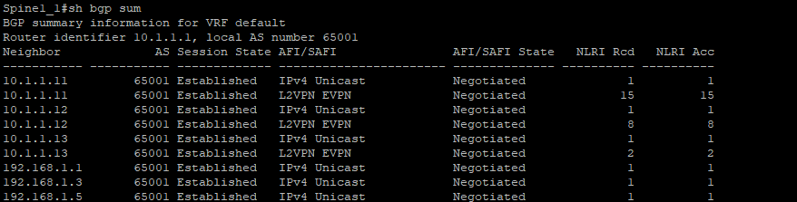
ЦОД 2</br>
 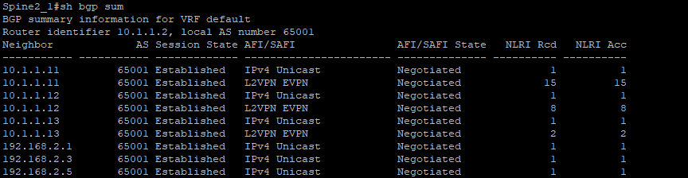

Проверка routes-2 и протокола ECMP на одном из leaf:

ЦОД 1</br>
 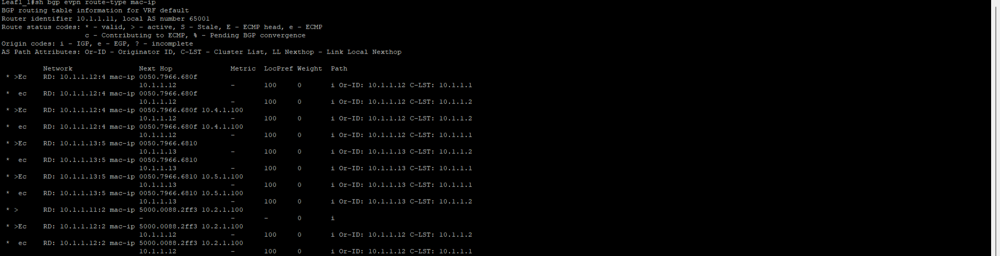
ЦОД 2</br>
 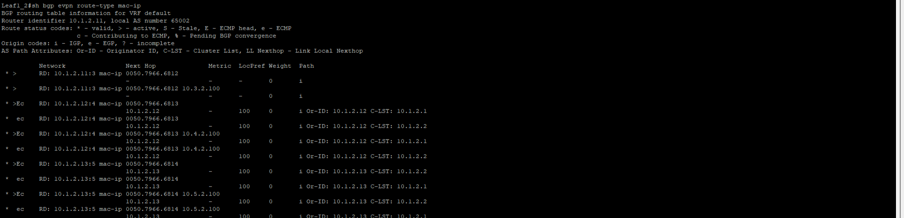
 
Проверка routes-3 на одном из leaf:

ЦОД 1</br>
 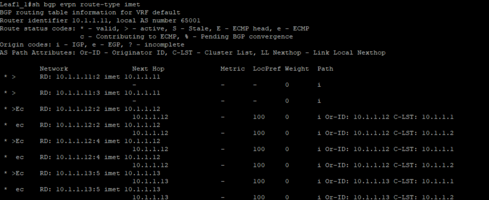
ЦОД 2</br>
 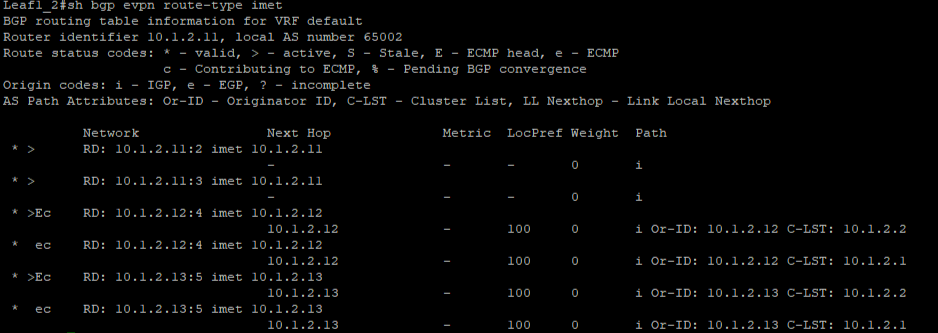

Проверка routes-5 на leaf1. Как видно, все маршруты приходят:</br>

ЦОД 1</br>
 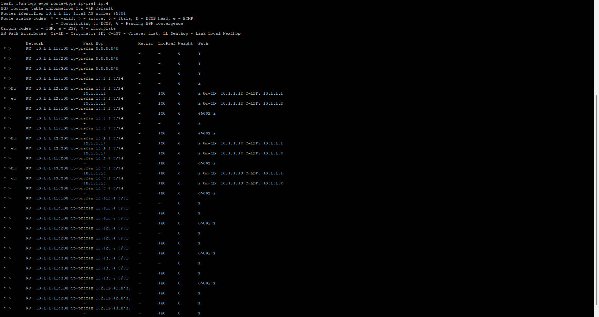
ЦОД 2</br>
 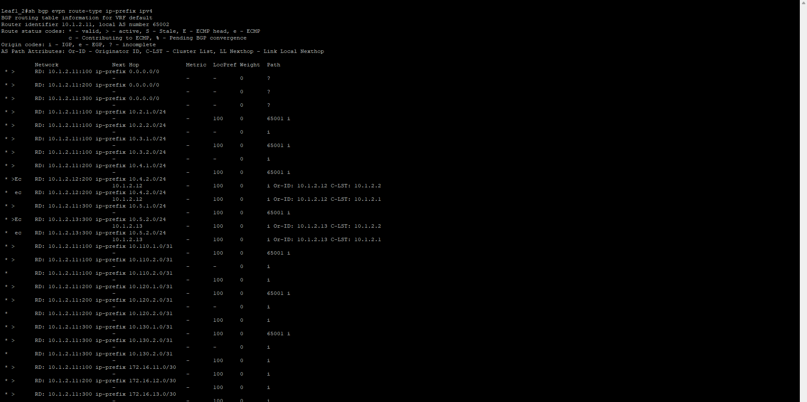

 Проверка multihoming. Как видно routes-4 корректны и трассирвка после "падения" линка меняется
  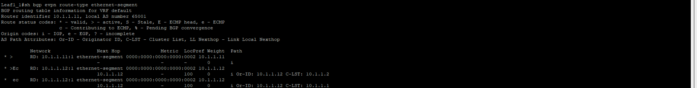
  
  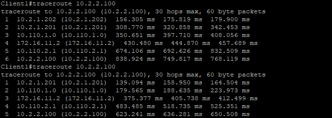

 Проверка связности между клиентами разных тенантов разных ЦОДов.</br>
 Как видно, клиент CON_VRF1 видит клиентов CON_VRF1 и CON_VRF2, но не видит клиентов CON_VRF3. Клиент CON_VRF3 одного ЦОД види клиента CON_VRF3 второго ЦОД:
 
 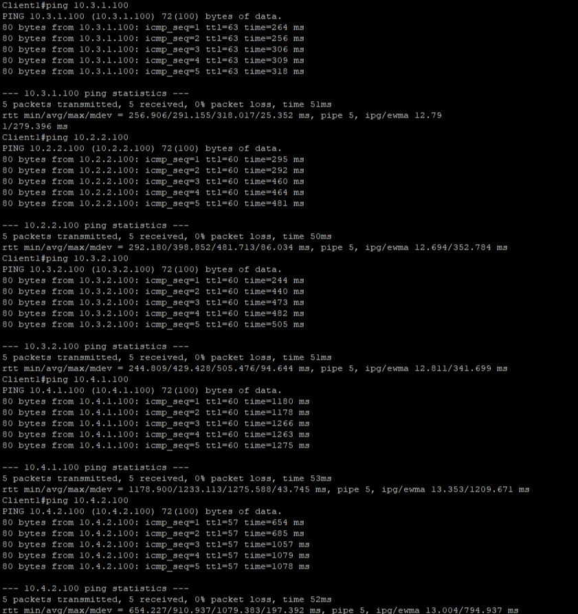
 
 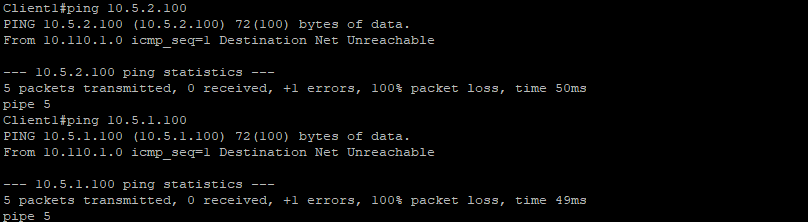
 
 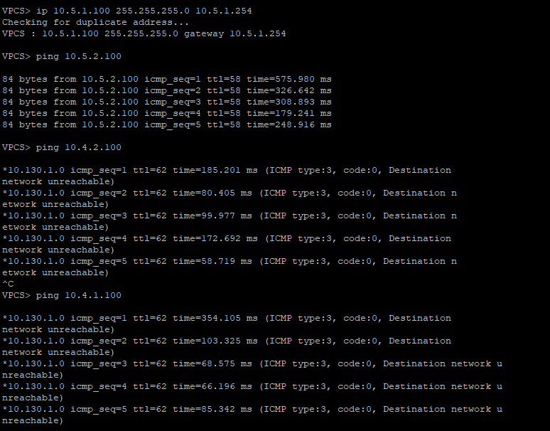

## Что не получилось: 

- Не получилось внедрить протокол bfd. При его использовании начиналось "дрожание" линков. 
- Не удалось применить Access lists для разграничения доступа клиентов сетей из CON_VRF2(ДМЗ) к клиентам сетей CON_VRF1. Это так же связано с тем,
- Не удалось заменить три GRE туннеля одним с применением bgp/mpls vpn. Не присваивалась сервисная метка.
  
Скорее всего, это связано с тем, что проект настраивался на эмуляторе eve-ng.
 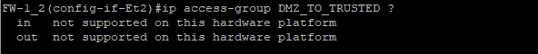

## Выводы: 

В ходе выполнения работы была спроектирована и реализована архитектура распределённого центра обработки данных, объединяющая две территориально разнесённые leaf-spine VXLAN EVPN фабрики в единое логическое пространство.

Внутри каждой площадки обеспечены сегментация, отказоустойчивость и масштабируемая маршрутизация, а межплощадочная связность организована через защищённые GRE over IPsec туннели поверх сети Интернет.

В результате была получена архитектура, обеспечивающая:
- объединение нескольких площадок в распределённый ЦОД;
- изоляцию сетей различных уровней доверия;
- безопасную передачу данных по общедоступной транспортной среде;
- возможность централизованного контроля межсегментного взаимодействия;
- масштабируемость и отказоустойчивость сетевой фабрики.
  
Таким образом, поставленная цель работы достигнута. Разработанное решение подтверждает, что использование VXLAN EVPN в сочетании с BGP, VRF и GRE over IPsec позволяет эффективно строить распределённую инфраструктуру ЦОД, сочетающую гибкость, безопасность и устойчивость к отказам.

